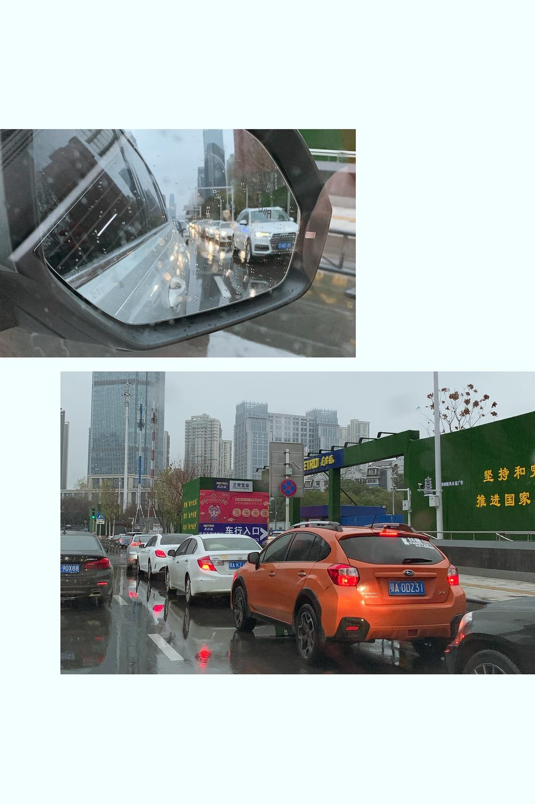

已获得作者转载授权。

作者：[JoyceCheng（来自豆瓣）](https://www.douban.com/people/30298116/)

来源：https://www.douban.com/note/750025907/

2020-01-25 20:34:14

消息传来的时候，我正在假装岁月静好地烤胡萝卜马芬杯。自从我公婆来武汉陪我们过年，每天的早餐就显得异彩纷呈。我妈有糖尿病，一般的馒头包子她不能吃，经过许久的血糖观察，她指定我烤的蛋糕为她的唯一御用早餐，因为我将配方里的一切糖替换为了木糖醇。  

关于木糖醇是否真的不会造成升糖反应，我不确定，但是既然我妈一天扎N次手指得到的结论是如此，我就尽管烤蛋糕给她就好了。谁知SK君八十多岁的老爸一来，也相中了这款胡萝卜蛋糕，对其赞不绝口，要求早餐不吃包子，改吃这个蛋糕。  

天哪！曾经在腐国Sainsbury's二楼Cafe迫不得已才来一块的CarrotCake如今居然成了香饽饽！  

今天是封城第三天，我爸照常开车上班，我们其余五大两小继续宅在家里。上午投影播放了《囧妈》给两个妈看，下午睡觉起来，我拿出冰箱里最后一根胡萝卜以及一个橙子，开始为明早烤蛋糕。  

当我把胡萝卜泥倒进橄榄油中奋力搅拌时，SK君在客厅说：卧槽！  

**从今夜零点开始，所有私家车不允许上路了。**  

肺炎指挥部干巴巴地丢出这样一则通知，真的让人无名怒火上升。私家车不准上路了，那么一切就要靠走。补充物资看样子是要人肉搬运了，更糟糕的是，如果身体出了问题需要求诊，看来也是只能步行前往咯（否则只能叫救护车）。理智上我们明白，轻微的头疼脑热应该在家自我隔离，不要去医院寻求交叉感染，但是家有八十岁老人有两岁小孩，私家车的意义不就是应急出行吗？现在连车都不能开了，让人懵圈。  

我们八成也并没有打算在封城期间开车出门，但是不打算开车出门跟不被允许开车出门，这绝对是两个概念。  

我的大脑还在努力消化这则通知，并且开始朦胧揣测这是否意味着发生了什么更恐怖的事情，我婆婆突然冲进厨房问我：你把胡萝卜用了？
我说：对啊。需要170克胡萝卜，这个胡萝卜有160克，凑合着用吧。
婆婆：冰箱里没有了？
我说：是的，最后一根。阳台上还有一袋子专门给宝宝吃的有机胡萝卜。我没有用那种。
婆婆：可是你把冰箱里的胡萝卜用完了。
我说：就剩这一根了嘛。
婆婆：你不应该都用完的。应该少用一点。
我：.....（我没有另外切一根把克数补齐就已经是考虑了物资紧张。）
婆婆：我们大人无所谓的。要给小娃留足够的胡萝卜吃。
我：.....（那为啥前两天您的奇异果吃完了着忙急慌地让SK君冒险去超市给您买奇异果！）
婆婆：天哪，必须去超市买些胡萝卜了！  

SK君劝说我婆婆，现在去超市的话，一定是全城私家车出动四处抢购，能不能抢到东西是个问题，在通风不良的超市漫长的结账时间也是个问题，也许我们应该对政府有信心，相信千万级城市的民生是能得到保障的。我婆婆立即讥讽我和SK君是怕死，声称自己不怕死，要步行去离家最近的沃尔玛。  

没办法，我只好放下做到一半的蛋糕糊，蒙上保鲜膜，祈祷它不要在我离开的时间里干裂了。换上许多天没穿的外出服，戴上口罩与眼镜，穿上便于抢东西的运动鞋，我跟SK君出门了。希望可以补充一些蔬菜和鸡蛋，主要是胡萝卜、红薯、南瓜。  

前几天据说空得可以跳广场舞的街道上，行驶着不少匆匆前行的私家车辆。大家的目的地跟我们一样，附近的大超市（因为家门口的中百超市早在封城那天就已经米面油蛋断货了，这两天也不知道补货没有）。我们的第一目的地是徐东大街的沃尔玛。沃尔玛楼上的销品茂一片死寂，看来是没有营业，而地面停车场却挤到爆炸，想要停车购物的车辆与往常一样，排到了道路上。  

放弃掉这个目标，我们顺着徐东大街往南，看看麦德龙有无希望。路过群星城，也没有营业，它楼下的北京华联超市没开门。过了一个路口，我们发现排队进麦德龙的车辆把徐东大街高架桥下的两车道占满了。再次放弃，我们掉头随后上了梨园小路，打算去欢乐大道上的武商量贩碰碰运气。 

 

途中，我们进到一家中百罗森，试图买些泡面，可是货架全空了。好死不死，杨园南路上有一家不起眼的水果副食店，居然还有许多水果卖，我们买了猕猴桃、鸡蛋、柚子、苹果、沃柑，也没多少，一共花了291元。把这些东西装上车，我看到喜笑颜开的水果店老板娘并没有戴口罩。之后，我们在欢乐大道的武商量贩门前，再次一睹哄抢的场景，于是拐弯回家。  

SK君打算拜托小区门口的中百超市职员，帮忙进一点蔬菜。我最欣赏他的一点，就是他的乐观吧。  

回到家，我才知道我妈，一个糖尿病患者，全副武装冲去小区门口的水果店，也买了几大袋子水果回来，并且把店里零卖的方便面一扫而空。也好，实在没吃的，我们就水果加方便面充饥好了。  

现在我家阳台上堆满了蔬菜水果，4：6的样子。没有人知道情况什么时候会好转。我默默进厨房接着烤完我的蛋糕，还好面糊没有放干。  

晚饭后，我爸打电话说，让我妈帮忙准备一下两三套换洗衣物，他待会儿开车回来取了，就直接去单位住宿，疫情结束之前，估计都很难再回家。  

武汉肺炎封城第2天：一首朋克救地球  

武汉肺炎封城第4天：超市又有余粮了  

武汉肺炎封城第9天：勤洗手戴口罩  

武汉肺炎封城第10天：活着只是靠运气  

武汉肺炎封城第11天：化力气为浆糊  

