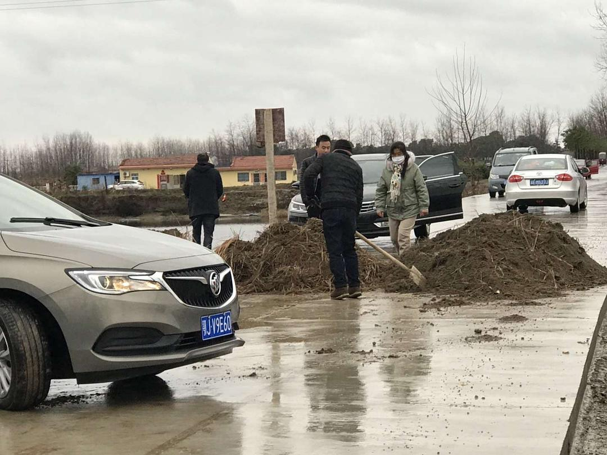

版权归作者所有，任何形式转载请联系作者。
作者：[涵子（来自豆瓣）](https://www.douban.com/people/2029166/)
来源：https://www.douban.com/note/750122500/

2020-01-27 02:19:02

**人生第一次经历这样的恐慌，不想再有这样的经历，从21号到今天短短的五天，用一个词语来形容就是恍如隔世，我想把这些经历与心路历程记录下来，若干年后再看看，不知道会是怎么样的一种心境。**

26日，7点，天刚蒙蒙亮，到毛列接上毛大师，准备从昨晚看好的路线347国道出发，只要能出湖北境到宿松就可以上高速离开了，7点钟，村里还没有人，路上偶尔看到一两辆车，主要是湖北的车牌，刚刚转到347国道，在刘佐乡地界，路被堵了，用的是砂石，不少车折返，高德导航给了一条经过刘佐乡的县道，走了几公里，在村子里封道，这个时候好几辆车都在折返，有浙江的车也有江苏的车，村子里转了几圈，都没能找到上347国道的路，担心回去的路也被封了，只好折返。回去的路果然被封，一辆大卡车横在347国道入口处。有那么一刻内心是绝望的，但是看到旁边好几辆车，又稍稍安心了点，打了110，110说这个事情他们不管，然后就挂了电话，内心一万个草泥马，但问题还是得解决。几辆外面的车，从马路牙子上开过来了，我犹豫再三，横下心开过去了，幸好毛大师在，指挥着我小心翼翼的开到马路上，大卡车再大一点点车子都过不去，毛大师说虽然没有跑出去，但是这个车技又有一次质的飞跃，（第一次是在张北草原，走天路的那个山路，一车道，三十度以上盘山路。）

给大家看一下村民们的智慧堵路方法。

在回程的途中，毛毛的妈妈发来信息叫我们快回，因为村里也要堵路了，再不回去可能村子也进不去了。十点回到家，有点沮丧，看了会儿电视剧，发现电视剧也没什么好看的，爬床上睡了一觉。中午起来喝了杯黄酒，海燕寄到杭州再从杭州带过来的，只一杯，就有醉意了。然后在抱着手机看各种疫情新闻，官方公布感染人数增加到2071例，数字还在增加，再看群里的信息，然后又睡了一觉。

下午四点左右妈妈微信里跟我说，村里的路也封了，让我从后面阳台看看屋后的路是不是也封封了。我不想看，继续窝在床上，此时电视剧已经没什么吸引力了。虽然我嘴上说出不去，呆在家里也挺好，关上院门，院子里还有种的新鲜的蔬菜，但是内心深知这只是阿Q式的自我安慰，主动选择呆在家里与被迫呆在家里心理上的感受完全不一样。

一个久未联系的朋友开玩笑说封锁期间正好搞搞网恋，在这种封锁的情况下，如果有个人陪，其实挺好，可惜没有。

五点，天色微暗，雨已经不怎么下了，从阳台上看过去，屋后出村子的那条路果然被封，这是物理方法隔绝与外界的一切往来，一辆白色的小车进不来，一辆三轮车出不去，两两对视。这种做法，万一村子里有人生病，救护车都进来来，然而，在隔离面前，其它的都是浮云。

毛毛说要来我家装点黄酒去喝，因为她家只有白云边，但是两个村子间的道路都被封了，如果要拿，只能走路过来抗，王记调侃说，可以隔着路障对酌，一杯敬过往一坏敬月光。我说，滚。

晚上情况又有了变化，毛大师村里通知大家呆在家里，不能外出，麻将铺子不许营业，否则拘留，所以过来拿酒这件事情就黄了，同时我也高兴起来，终于村里人不能聚众打麻将了。

十点，无聊的在翻看微博，看到了武汉的新闻发布会，网友们在下面喷市长的口罩戴反了，我觉得不可思议，然后顺便看了下发布回的回放，真是废话连篇，大概是知道自己要下台了，一个多小时的发布会对他们也是煎熬，整个大意就是我们做了很多工作，给人的感觉是物资不缺，估计下面的医院听到了要吐血，因为医院已经自己的向社会要捐助了。

我不知道在接下来的岁月里，武汉的这些高官们，会不会为他们曾经的的作为而内疚，但是全国人民正在为他们的失误买单，这不是天灾，这是人祸。无数工厂因为这次疫情而延时开工，这给本就低迷的中国经济带来什么样的负面影响，同时在国际上，好不容易因为军运会而增加一点正向影响力，又被打入谷底。我自己被困在老家的村子里。

疫情平定之后，我想知道，这帮官员会知处理，全国人民需要一个交待。

总结下来就是，这一天，真是过的惊险刺激。