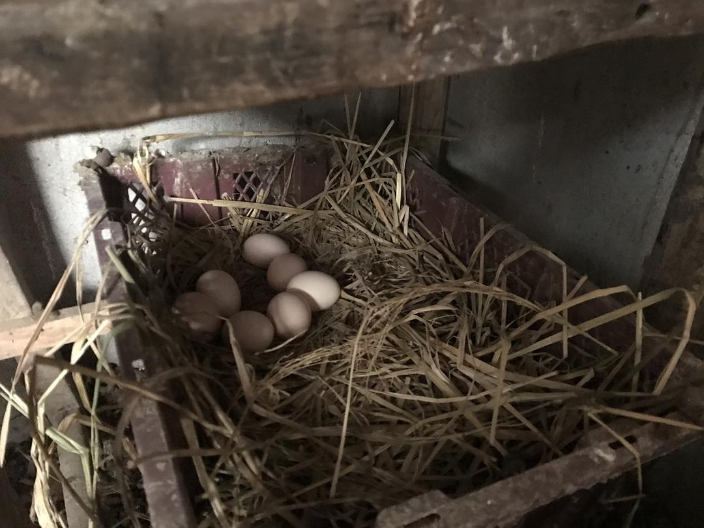

已获得作者转载授权。
作者：[涵子（来自豆瓣）](https://www.douban.com/people/2029166/)
来源：https://www.douban.com/note/750479108/

2020-01-31 01:06:49

1月30日睛。已经五天没有出门了。

今年起的比较早，还在被窝的时候照例先看了下数字，湖北新增1032，，武汉356，黄冈172。与武汉新增的下降相比，是下面的市里的增涨，然而我知道，其实远不止这个数字，因为我所在的黄梅县已经连续三天没有新增，怎么可能。后来我得到解释，因为县里不具备检测资质，所以确诊只能送到上级单位，而上级单位的黄冈与武汉，自顾尚且无瑕，哪有空管下面的医院呀，实际情况是，尽管黄梅县医务人员与物资也缺，但还是被抽调了6个医生去市里面支援，黄梅县新增了一百多个隔离病房，一天时间就住满了，那些住院的疑似患者，只差一个确诊而已。

妈妈好像已经接受了封锁的现状，生活开始变的规律起来，八点开始做饭，九点钟我起来的时候，饭菜已经做好，早餐做了牛肉与青菜，吃完饭，打牌，12点开始准备午饭，下午休息了一会儿继续打牌，4点钟院子里的太阳没有了，收工做晚饭。下午发了一个朋友圈，配文是假装岁月静好，是的，如果不是疫情，这样一家人关起门来，打牌，喝茶聊天的日子确实是岁月静好呀。

可是，不是，杭州的同事发来图片，他们村的通知，不许把房子租给湖北人，租给湖北人的商铺被贴上封条禁止入内，这件事情让我觉得，虽然我在这个城市居住了十几年，我纳税，交社保，遵纪守法，给每一个朋友说这个城市的好，但我，依然是外乡人。这种感觉与看到河南村子里拉的条幅“这户有武汉人”的感觉完全不一样。我不知道看到这些图片，有多少人会跟我一样被这种这种充满敌意的对待深深的伤害了。

公司发来表格，说是物业要求登记所有的在职员工曾经到过的城市，回乡的时间，反城的时间，我的身份证地址是武汉，这个信息，足以让社区的人紧张半天，然而我最近半年都没有去过武汉。

下午消协的人放出来说有一批口罩供应，因为一级响应的原因，口罩被行政征用，各厂家都必须优先供给政府采购，所以市面能买到的口罩都是进口货，这一批，来自贵州。我想起何同学昨天问口罩的事情，要帮一家被政府征用安排湖北人居住的酒店使用。（我心理就在吐槽，为什么政府只管征用就不管物资配备呢？）我把这个信息发到群里，后来才知道，这种平时十几块钱一盒50只的口罩，现在价格竟然涨到两块一片，这些人趁机哄抬物价，但是还是得订啊。虽然贵，可是那些企业都几万几万的定，在生命安全面前，两块钱，算什么。

唐主任突然就红了，毛大师跟我讲这事的时候我还一脸懵圈，然后唐主任的采访视频就满天飞了。起因1月29日督查组赴黄冈检查工作，在约谈黄冈卫健委主任唐志红以及黄冈疾控中心陈明星，整个过程让人目瞪口呆。这两个人既不知道定点医院的收治患者人数，也不知道核酸盒子的检测能力。所以黄冈的锅非这二位来背不可了，而且就他们这业务水平，这个锅背的不冤。姑姑说这个唐主任早就该换了，因为曾经唐主任搞医保改革，就是蕲春市的医保只报蕲春县级医院，而我姑姑所在的医院是黄冈市级医院，结果就是设施配备更好的市经医院门可罗雀，因为效益不好，职工们只能发70%的工资，而县级医院人满为患。

下午消息放出来这两位都被免职，姑姑第一时间告诉我，这个消息是真的，与此同时唐主任同款尼克服被疯转，价格是5K多，如果是这样这位前唐主任还将被调查。

晚上去院子里收鸡蛋，一共九个，毛毛说家里鸡蛋吃完了，我问她要不要来拿一些。海燕怀疑自己得感染了，在群里问我们感染的症状，我告诉他是发烧，咳嗽与肌肉酸痛，她症状是头痛，其实我也一度怀疑自己，因为我觉得累，随即又仔细回忆最近的行程，21号开车从杭州回，回来后没有与武汉回来的人接触过，25号开始关了院门，再没有接触过外面的人，如果我中奖了，我就可以去买六合彩了。

说不紧张是不可能的，我们所在的县城，本身医疗资源就差，而且县里医院已经住满了人，如果要去检查，还有可能交叉感染，没病都要有病了，想想都很吓人。

这几天我一直在想生与死的问题，人在天灾面前，个人真的很脆弱。还有一点就是你以为自己无所不能，在强大的政府决策面前，比如封路，你还是无能为力。

明天，不知道黄冈确诊的数字会是多少。