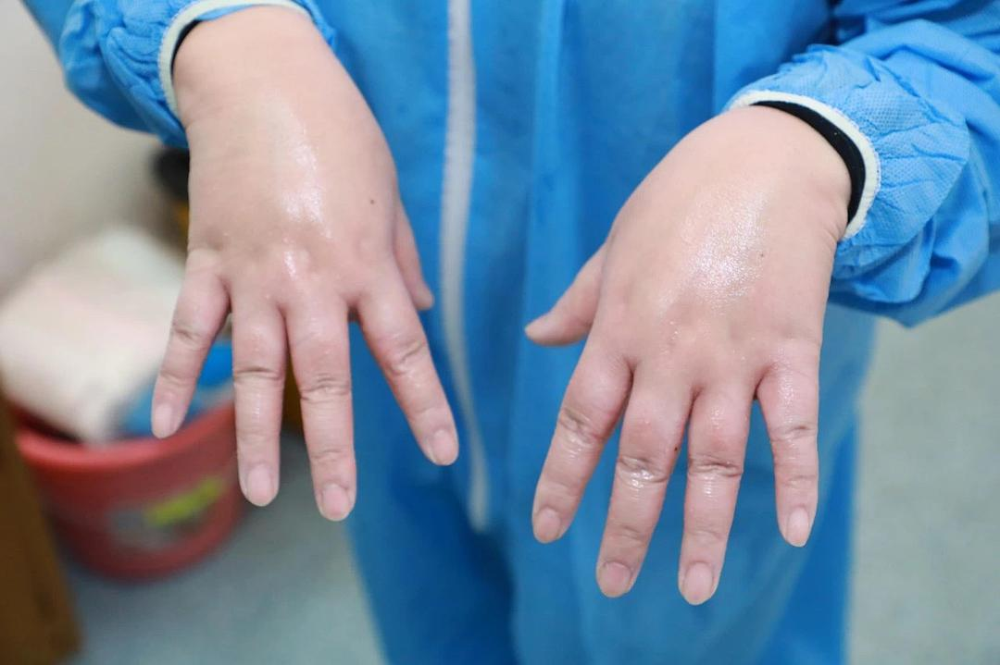
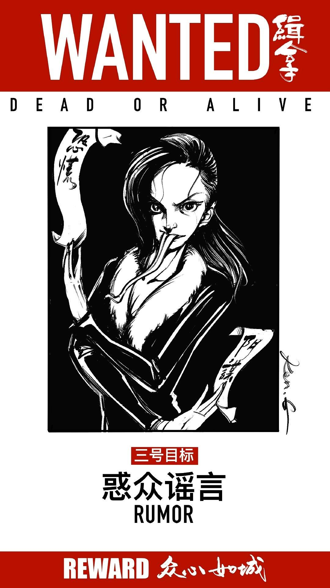

已获得作者转载授权。
作者：[啊哈哈（来自豆瓣）](https://www.douban.com/people/88997445/)
来源：https://www.douban.com/note/750783553/

2020-02-02 21:11:01

自23号封城以来，我们全家已经11天没有出过门了（除了晚上下楼倒垃圾）。21号的时候参加了一次家庭聚会，到场16个人，在武汉的亢龙太子。当时亢龙的食客依旧不少。聚餐的时候，病毒还不是主要话题，大家虽然都戴着口罩到达酒店，戴着口罩离开，但是总是有一种不理智的乐观。彼此提醒防范的肺炎注意事项，交换着最新信息，但是说话的时候表情是放松的，春节团圆的氛围依旧浓厚。聚餐结束的时候，大家全部戴着口罩在亢龙大厅拍了一张合照，想来这是今年春节有且仅有的合照了。

那大概是全家唯一有年味的回忆了。之后，轻松的状态快速远离，所有人都陷入了惶恐的深渊。

1月24日，武汉一位穿防护服的医生打电话情绪崩溃，大喊“我们不想活？”一个小时后，他又回到紧张高压的救援中。

1月25日，魔女小稀发微博指责三具尸体在医院躺了一上午没有人认领，引起了新一轮的讨论和恐慌，之后被官方辟谣。

1月26号，中国疾控中心开始研发新型冠状病毒疫苗。

1月27号，全国确认病例4515例，教育部宣布2020春季延迟开学。

1月28号，新增病例1459例，新增确诊人数爆发以来首次下降。钟南山在采访中表示：一周或十天左右到达高峰，不会大规模增加了。

1月29号，首例重症高龄治愈患者出现。

1月30号，高福论文和武汉P4同时上热搜。各国开始限制面向中国的往来航班。

1月31号，双黄连口服液可抑制病毒的谣言出现，全国双黄连售罄。湖北红十字公开明细上热搜，莆田系医院领走大量物资。WHO将中国定义为PHEIC，中国外贸、出境进一步受到限制。黄冈一问三不知卫健委上热搜。

2月1号，美东禁止中国护照入境。红十字会在直播中拒绝央视采访。

2月2号，病毒粪口传播风险引起注意。

这场突发的疫情就好像一场引子，所有的魑魅魍魉都跑了出来。在疫区中心的我是分裂的，一方面忍不住去关注疫情的发展，一方面读到了痛失亲人的真人真事又痛苦无比。一个丈夫21天送走了自己正在怀孕的妻子，因为治病身负三十多万的债务，完整的家庭在一个月不到的时间里翻天覆地；比我大不了多少的女孩一个月内送走了爸爸和奶奶，妈妈在ICU；有人在医院眼看自己的母亲熬不住了，痛哭着喊着“救救我的妈妈吧”；有个姑娘追着救护车边哭边跑，喊着“妈妈你不要离开我”，车里是她病重的母亲；患病双亲在医院要等二十多个小时才能等到检查；医生护士每天超负荷工作，取下手套全是浮肿，口罩在脸上印下深深的印子。

每每读到类似文章总是难过又害怕，只觉世事无常，天灾人祸瞬间就可以将普通人的生活搅的翻天覆地，让人毫无还手之力。

> “灾难它像一块大铁板呀，它从高空中落下，哐当一声就砸到你头上了，由不得你做丝毫的准备。”（苏童《菩萨蛮》）

我的朋友圈和微信群已经出现了因为没有床位而求助的消息，更让我感受到了自己距离灾祸是如此的接近。我的小区和马路对面的小区都已经出现确诊的病例，现在下楼扔垃圾都不再敢乘坐电梯。

无比庆幸目前为止我的家人和朋友都没有人感染。除了医护救援支援捐款捐赠，就只能感谢上天给予的好运。被感染就好像抽签，无论你是一个道德多么高尚的人，平常多么努力的生活，只要被抽中，除了听天由命别无二法。有的人大半辈子都在和慢性疾病作斗争，好不容易学习适应与慢性疾病共处，感染上病毒，一病呜呼。

另一边，读到协和医院自己去hsz抢物资的新闻，读到hsz阻止央视记者直播的新闻，读到留学生虚假宣传物资捐赠导致物资涨价的新闻，读到公务人员开着官牌车直接进仓库领口罩的新闻，感到愤怒又悲哀。大部人永远是自私的，事情不涉及到自己身上，永远想的是损人利己的事情。更不要提那些收购二手口罩的商家，医疗物资坐地起价的店铺，利用疫情蹭热点的营销号，高价转手捐赠物资的商人，为了热点或者为了散播恐惧制造谣言的个人，不顾疫情依旧串门聚餐不戴口罩的群体，办事效率低下、制定规定鲁莽的组织与zf，还有在网上对疫区对武汉对湖北的地域黑。只要自己不生病，就想方设法的从这场灾难中获利，不顾他人的利益，只求自己的所得。若是自己生病了，才急急忙忙的跑去医院，因为长时间的排队抱怨医院责骂护士，若是治不好还要对主治医生拳打脚踢。完全没有想到医疗物资紧张就是他们的自私自利没有底线造成的。

在微博中看到了一组讽刺漫画：

在这场战斗中，除了病毒，还有更可怕的东西：

官僚主义，惑众谣言，欺上瞒下，见利忘义，无能嗔怒，同室操戈，无知无畏，玩忽职守。

因为危机，人性的恶被无限放大。现在，每一个新爆发的事件我都不敢深入探究，只因我会更加惶恐。就好像一群人站在了悬崖口，每个人都以为身后的人在将自己拼命往回拉，但是回身一看，才发现其实自己被用力向外推。被推的感觉和推人者的狰狞都令我毛骨悚然。身处疫区，我必须努力将自己从新闻微博豆瓣中抽离出来，才能保持平常的心态正常生活。每看到一条新的求助信息、新的病人或者病人家属采访、新的丑闻，都将我向绝望和崩溃推进一步。

白天，道路上空无一人。晚上，对面小区又亮起了一盏盏灯。想着有这样多的武汉人和我一起默默忍受着恐惧与孤单，我又感到释然。

每一个亮光处都是活生生的人。有人在忍受着病痛，有人在忍受着失去亲人的痛苦，有人在工作岗位上多日没有休息，有人在外地为了征集物资到处奔波。在这场疫情中，有的人失去，有的人收获，有的人感到颓废和绝望，有的人感到生命的宝贵，有的人开始重视亲情，有的人深陷丧亲之痛。绝大部分人都是无辜的被迫承受着灾难这块大铁板。我是迷茫惶恐痛苦的，很多人也是迷茫惶恐痛苦的。但是我们一起努力，我们没有放弃，也没有被放弃。感谢所有帮助武汉的个人团体企业政府医院部队，风雨终究会过去。因为每个人都在共同努力，胜利将会无比珍贵。