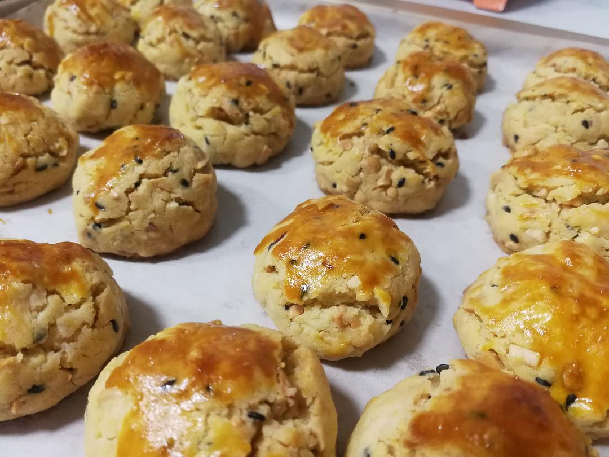
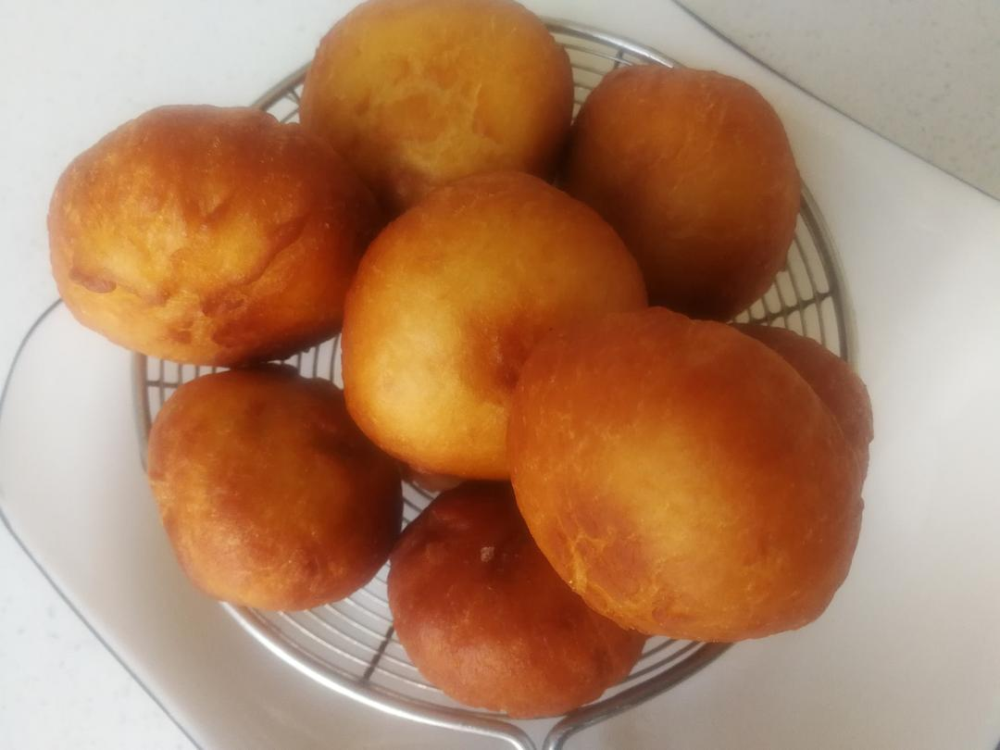
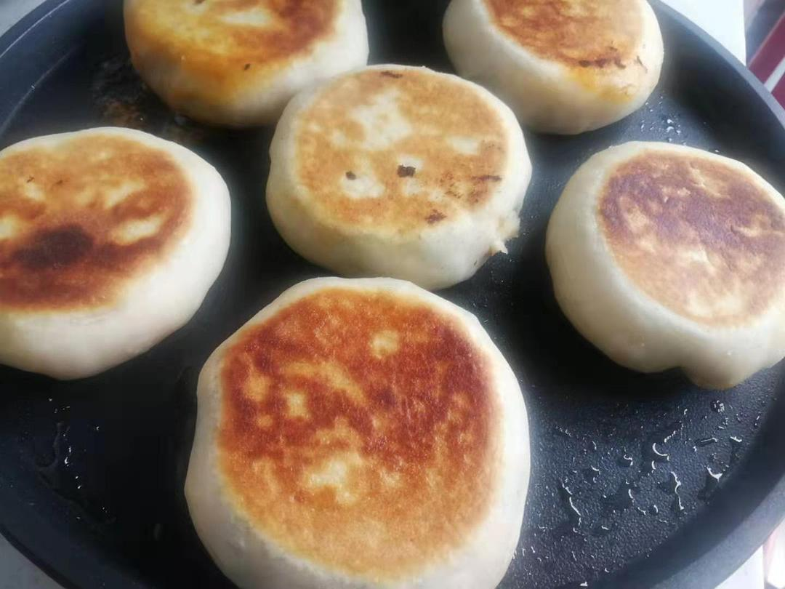

已获得作者转载授权。

作者：[小样麻麻（来自豆瓣）](https://www.douban.com/people/maxiaofan/)

来源：https://www.douban.com/note/750768584/

2020-02-02 18:55:35

其实我们家隔离应该是在21号，20号公司放假，一家老小还去买春联、灯笼、花草、鱼啥的增加一些过年氛围，然后公婆考虑过年可能会有亲戚来家里，多买了些菜，就是这些菜，足足支撑我们宅在家里的13天，从开始的焦虑、无奈、无所事事到……平静的考虑每天的生活，无论如何，全家人都是健康的隔离在自己家中，这已经是最好的安排，那就好好享受无奈的隔离生活吧！（早上收到消息，物业说小区封了，估计是疑似病例增加了吧，本来想着这几天出门采购来的，索性再等等吧，公公原本要去地铁站执勤，这下也出不去了，全家达成共识，家里只要有口吃的，咱们就不出门，垃圾就先丢楼上的露台上，反正就是不出门！！！）  

宅在家里的日子，最最主要的是开发了自己的烘焙和作为一个陕西的人面食天赋，我真的是做出了好几样连自己都震惊的好吃的啊，现在就稍稍记录一下吧，以此纪念，武汉封城的这些天！  

第一个美食，要属花生酥，这个真的是绝了，烤出来酥到落泪！  

用料：  

花生油：130克（其实其他油也是可以的呢，家里没有花生油，就普通食用油代替了，一样很OK）  

低筋面粉：280克 糖霜：60克 泡打粉：3克 鸡蛋：1个  

花生碎：90克 黑芝麻：10克 蛋黄液：1个 盐：1克  

步骤：  

1.花生碎——家里有熟花生，拨了一堆，装进保鲜袋里擀面杖压碎备用/生花生炒熟放/烤箱烤熟凉压碎  

2.油里面加鸡蛋、糖分、泡打粉、盐搅拌均匀  

3.分批加入面粉，搅拌均匀  

4.加入花生碎和芝麻搅拌均匀  

5.搅拌好捏成一个一个20克的小球，然后铺好油纸，放上去，刷蛋黄液  

6.烤箱上下火180度，20分钟左右，我家里烤箱15分钟左右就好了，酥到爆！  

第二个是陕西的炸油糕，这个东东可能很多叫法，糖角，反正我们陕西渭南叫炸油糕，小时候家里来客人妈妈好像才会做的样子，可能以前油和糖还是金贵的，下面直接说做法吧，我没有称重，作为一个地道的陕西人，面食重量都是靠感觉的好吧，这叫骨子里的自信哈哈哈  

用料：面粉、开水、糖、油  

做法：  

1.开水烫面，不粘手就行，凉一点就揉成团子，再小团子，然后擀成小饼饼；  

2.白糖里面加一点面粉，大概是2：1的比例吧，我面粉放多了感觉（这个应该是第一步哈哈）  

3.调好的糖分包进小饼里面，不要露出来，要不然炸的时候就惨了  

4.油加热炸，不要太热哦，慢慢小火炸，漂浮起来就好了  

第三个杂菜盒子，原本是想做韭菜盒子，可是没有韭菜，那就有什么菜就做什么吧  

配料：萝卜、木耳、豆腐、鸡蛋、粉条、腊肉、泡菜，真的是有什么就放什么了  

步骤：  

1.所有配料的菜切碎，萝卜可以擦成细丝，腊肉切丁，粉条和木耳都需要开水泡发，我做了辣和不辣的，辣的是之前做的韩式泡菜，赞！然后加盐、香油、五香粉啥的，味道可以调稍稍重一点  

2.开水烫面，揉成团，一个一个小剂子，包就对了，饺子形状的是不辣的，包子形状的是辣的  

3.电饼档双面烤，这个随时留意就好，一般不会烤焦  

还有蛮多的，这里就不具体写步骤了，感兴趣的我后面再补充吧，这里就晒晒图哈哈哈  

作为一个被封在武汉的普通老百姓，可能我们唯一能做的就是不给国家添乱，不给自己添堵，安心在家里，不是每天僵尸躺，不是每天刷新闻苦恼忧愁，不是无所事事的大吼大叫，而是尽可能找到一种方式，享受这一段时光，我们家的故事平淡无奇，只是静下心来，让自己和家人过得开心一点！  

愿疫情早日远去，让我们回归正常的生活！  

