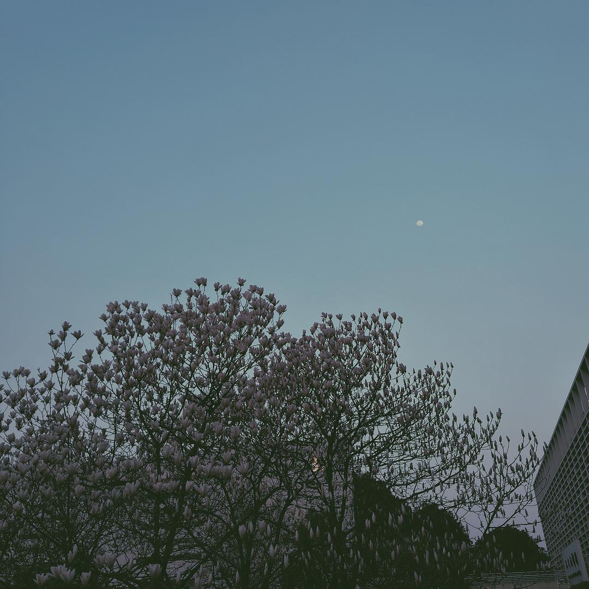
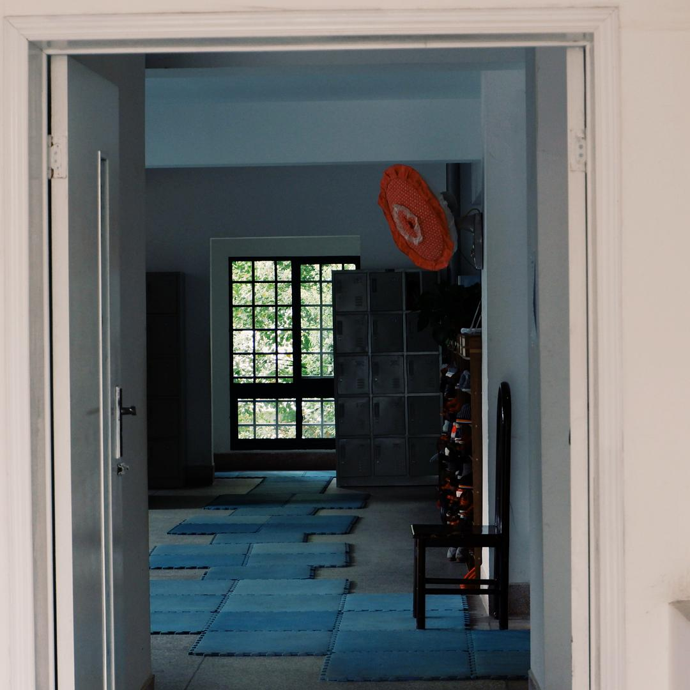
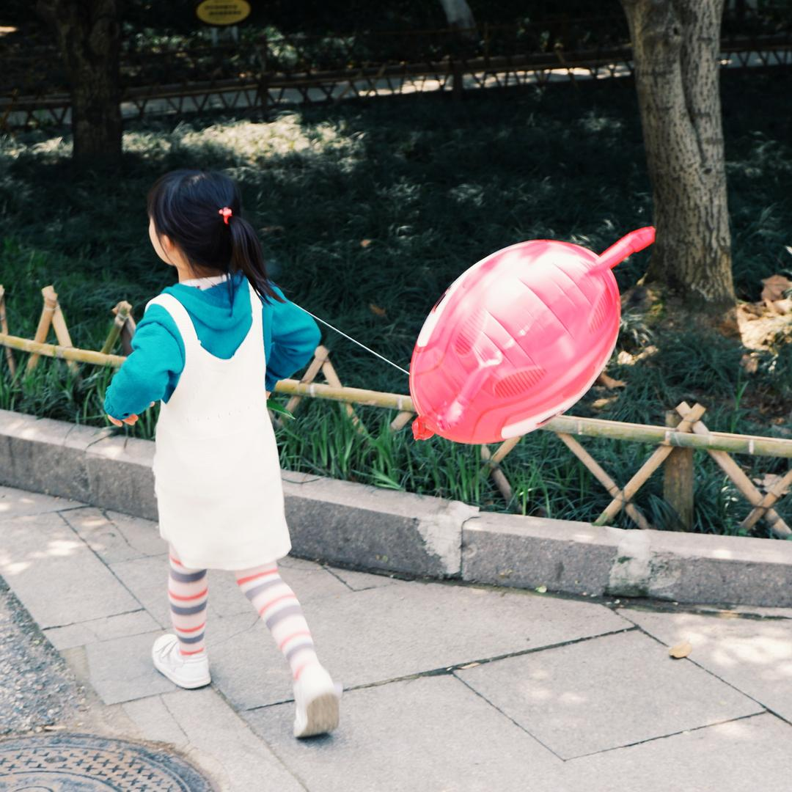
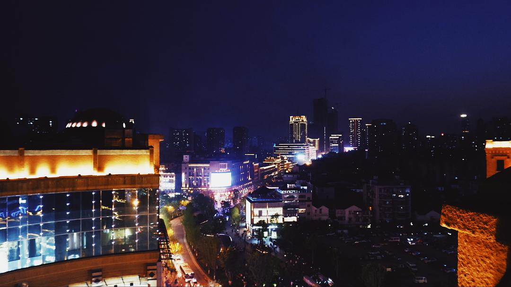
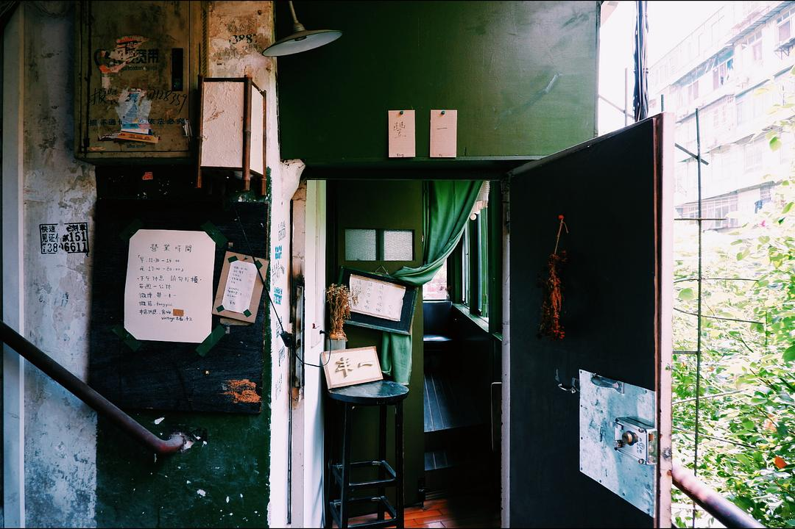
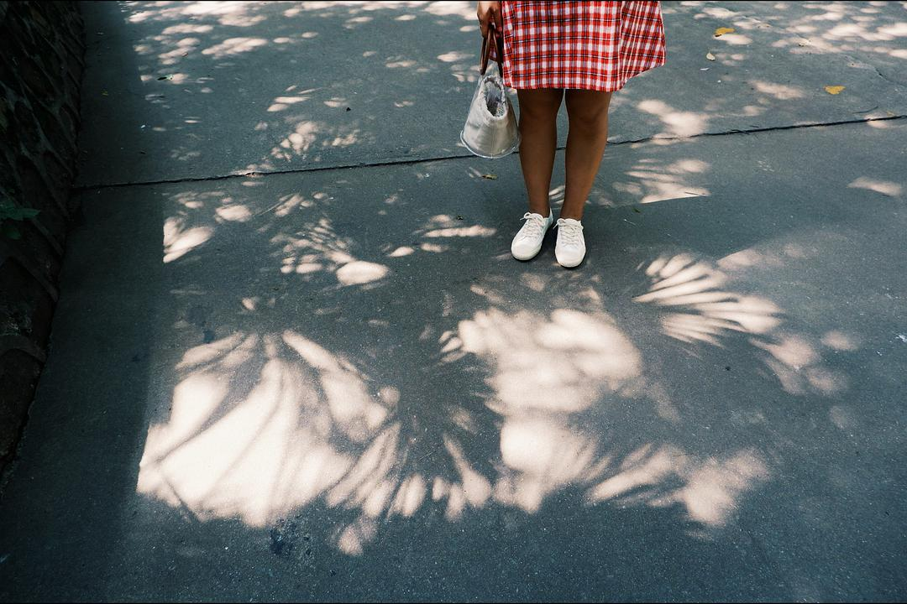
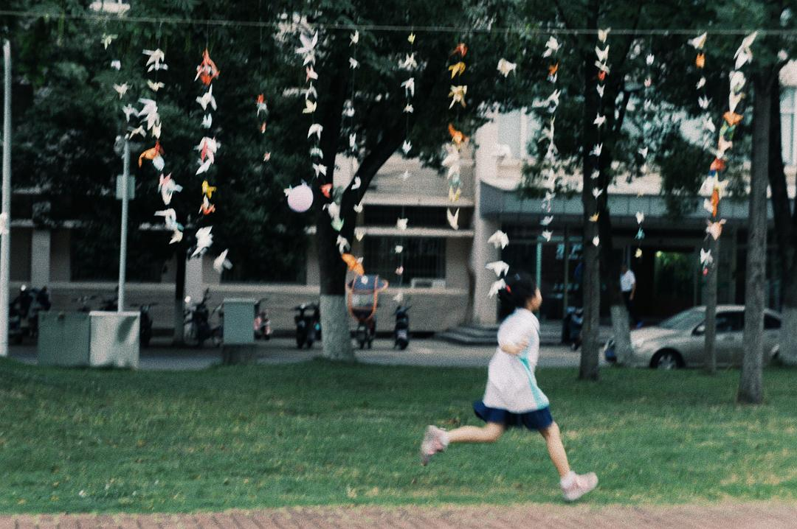
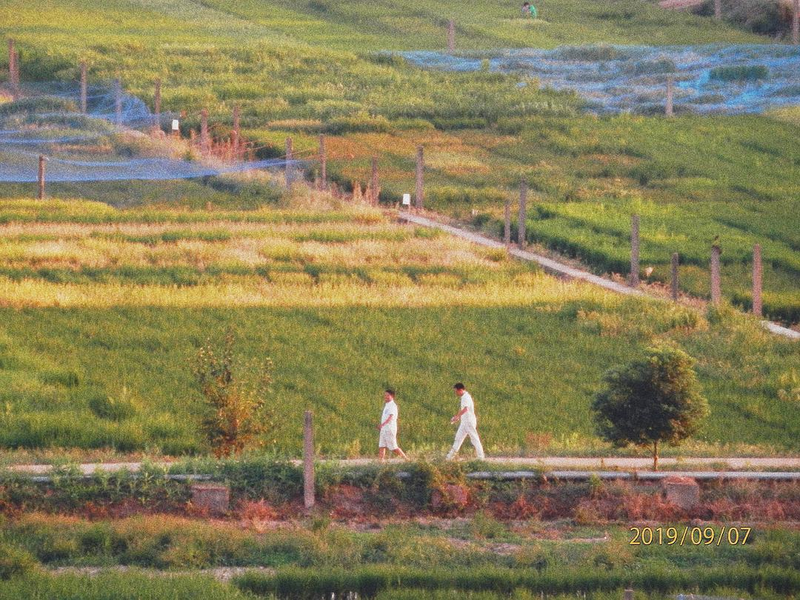

已获得作者转载授权。

作者：[金树树（来自豆瓣）](https://www.douban.com/people/147024697/)

来源：https://www.douban.com/note/750747711/

2020-02-02 15:40:28

## 春

湖美有一颗k

c

春天，油菜花也开了。

## 夏

## 秋

## 冬

　  

　  

　  

　  

