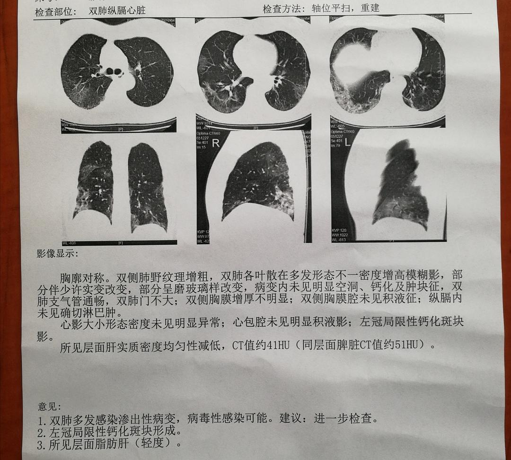

来源：[他们叫我涂老师](https://www.douban.com/people/funnyton2000/)的[广播](https://www.douban.com/group/topic/164654173/)

今年注定是不平凡的一年，武汉市湖北省乃至全国人民因为新冠肺炎的原因，一起过了史上最安静，最紧张，最长的一个春节。都说年关难过，但是我想应该从来没有这么难过吧😫😫因为目前我姥爷，我妈，我爸确诊为新型冠状病毒感染。我，我男朋友，三代五口，分隔五地，住院的住院，隔离的隔离。今天隔离点的医生告诉我我第一次核酸检测结果为阴性，虽然我知道这顶多能说明我的病情发现比较早，病毒量比较小，但好歹也算是个好消息，现在才有心情做下来写写这段时间的经过。 

首先，我们家是如何这么倒霉全部感染上的呢？那就要从大年初一说起。今年本来跟男友准备在我家过三十，初一跟他回京山老家过年，然而一场突如其来疫情和封城令让我男友只能老老实实呆在了我家过年。三十之前一家四口其乐融融，包饺子，包春卷，炸藕夹。

因为疫情的关系，知道要尽量少出门，所以家里备的水果蔬菜足足的，虽然从腊月二十七明显武汉市疫情开始变得严重，大家变得忧心忡忡，但总体来说还比较平稳。大年三十上午我妈还出去药店囤了一波酒精口罩。说过两天就宅家，不出门，因为我们住在江岸，属于疫情比较严重的地方。然而初一上午我妈接到了我小舅打来的电话，打乱了我们宅家七天的决心。电话说因为疫情的关系，四医院要关停老年病房等慢性病科室，腾出人手全力支持发热病房。我86岁的姥爷因为失能失智一直住在四医院的老年病病区，这次必须出院。特殊时期，可以理解，毕竟慢性病病人一时办半会没有医疗支持也没那么容易死，肺炎病人可等不起。但是问题在于，我姥爷已经卧床三年，大小便失禁，突然说要出院回家，家里什么都没有，完全没有准备。我妈退休以前一直在医院工作，医疗系统熟人比较多这个时候也就只能她来想想办法了。但是疫情这么严重，大多数医院都是一床难求，医疗资源严重不足，我妈用了各种关系最后在她退休前供职的医院肿瘤科给我姥爷协调出了一张床位。接下来就有一个问题了，怎么转运，我姥爷卧床之前可是个230斤的胖老头，虽然已经床上躺了三年，但是家里每天好吃好喝伺候的，也没瘦多少，感觉应该至少也有200斤。120热线是打不通的，全市的发热病人都快把120打爆了。没办法，找不到救护车只好自己上了，200斤抬不动，只能让几个舅舅一起去帮忙。就这样用轮椅和自己的小轿车把我姥爷艰难的从四医院转到了我妈医院。知道这个时期医院肯定挤满了发热病人，非常危险。我爸妈去帮忙的时候可以说已经从头武装到了脚，帽子，双层口罩，手套。回来后，也是从头到脚喷洒酒精消毒，然后脱衣脱帽脱鞋，衣物丢洗衣机高温煮洗，鞋子帽子全部用紫外线灯照射消毒。

我们以为虽然过程很艰难，但是姥爷有地方住了，等这段时间过去，应该一切又会恢复正常。我们就继续安心宅在家里过年。期间我妈有点咳嗽，我们都非常紧张，因为当时说新冠肺特征就是咳嗽和发烧。开始每天检测体温，发现我们家四个人体温都很正常，除了我妈偶尔咳嗽。而我因为年前就有感冒，流鼻涕，咳痰，所以一直有在咳嗽，忽略了最早的症状。现在仔细想想，我年前感冒的症状其实在腊月二十九就已经消失得差不多了，但是咳嗽却断断续续，到初六以后反而有加强的趋势。 

单位通知初七上班，我还犹豫了下，要不要去，因为一直在咳嗽，但是想到年前已经因为感冒请了三天假，现在好的差不多，单位好几个同事又被封城堵在外地回不来，再跟领导请假有些不好意思。我妈说要不做个ct看看再去上班，保险一点，我觉得有道理。一起去了她们医院，平时热闹的马路今天只有全副武装形色匆匆的几个行人。

因为她们医院不是定点医院，所以门诊病人并不多，空旷的大厅，全副武装的医务人员，让医院气氛变得非常可怕。然而找他们同事开检查单的时候，她同事提醒他，现在ct拍片的十个里有六七个都是肺炎，感觉我们俩又没发烧，咳嗽又不厉害，不要本来没事，做个ct感染上了，劝我们仔细考虑下。如果我们非要做，他想办法给我们搞两套防护服再去做。我妈看他说得这么吓人，又考虑防护服现在这么紧缺还是不要浪费了，于是只开了几盒消炎药，说回家先吃吃看再说。

然而事实证明，人真的不能有侥幸心理，要是初六我们拍了ct是不是就能早点发现，早点隔离，也许那时候我爸和我男友还没被传染上。我也不会初七去单位上班，让单位一圈人到现在都跟着担惊受怕。

初七第一天上班，一切正常，没啥问题。初八，上着班我妈突然打来电话，说我姥爷发烧，他有点担心。医院做了ct说他肺部感染，要把他转到传染科去。当时就想初二转院时我妈他们都接触了我姥爷，会不会有问题啊！提醒我妈也赶快去检查下。我妈还说明早再去，一大早ct室相对人少，干净点。我想我挨都没挨我姥爷，应该不会有太大问题。初九轮到我下社区帮扶疫情宣导，我还在街上站了大半天。路上在逛的基本都是社区街道的工作人员。头顶时不时有军用飞机飞过，估计是在忙碌的运送物资和人员。

中午突然接到我妈电话说她做了ct，结果不好，已经在医院打针。我就知道大事不妙了，赶快跟领导说明情况，请假回家。同时微信叮嘱同事我办公室暂时不要使用，全单位一定大消毒。晚上拖上我男朋友跟我爸一起去医院拍了ct，果然全部中标🤦

从ct片子上来看，病情排序：我姥爷最重，我妈次之，我第三，我男友第四，我爸最轻，肺部只有单边一点点感染。五人情况是我姥爷发烧，我妈咳嗽，我偶尔咳嗽，我男友说只有点肌肉酸痛以为是没睡好，我爸啥症状没有。这时候也多亏好友的姑父，正好是一医院呼吸科医生，已经在抗击疫情的一线战斗了一个月，紧急远程微信求助，将我们家情况发给他，远程问诊后他建议我们全部分开隔离。我妈由于年纪较大，病情也相对严重，有条件住院最好住院，以防病情突然恶化，说他手上见过好多老年人突然病情恶化的情况。把我们吓得够呛。也是到这个时候我们才体会到了武汉市的医疗资源已经紧张到什么程度了！我妈在医院干了一辈子，可以说各大医院多少有两个熟人，然而一样一床难求。只能上报社区排队等待床位分配。社区说住院需要核酸检测结果，我妈医院不是定点，无法检查，只能第二天再去定点医院排队。

我们轻的几个就只能开点口服药回家隔离，说有条件最好吃7-10天。然而这时候阿比多尔已然是紧俏货，找了几个医院的熟人，最终才弄来八盒，勉强够五天一个疗程的用量。但是这个已经比绝大多数患病后求医购药无门的患者好太多了！！

分好药，我们听从医生建议。我回了我自己在东西湖的房子，我男友去了古田我们准备用来结婚刚装好的新房，我爸照顾我妈在家里分两个房间居家隔离。同时养精蓄锐，等待第二天一早去排队做核酸。其实医生有跟我们说看片子基本上就能确定，但是因为只有核酸阳性的社区才能上报，才有希望进入定点医院。

第二天我爸陪着我妈去协和排队等待做核酸，本来他也想做，但是因为他之前没有办过协和的就诊卡，这个时候这个发热门诊已经非常多人，不再新办就诊卡，所以他没能做成核酸测试，只给我妈做了。协和的检测要去四楼找医生开单子，我妈这个时候才发现爬楼已经开始有点吃力。爬一下就气喘吁吁。检测结果果然没有意外，两项阳性。将结果报给社区，社区说她们会尽快联系住院。在这里也必须说一下目前社区的状况，工作人员真的很辛苦，大多数社区工作人员都只有自备的简单防护，我们可以躲在家里不出门，她们却必须从早忙到晚。因为平时工作中经常会接触到他们，微信好友里也有不少社区工作者，对他们的工作状态还是比较了解的。这是昨天一个社区工作者发的朋友圈，可能看起来像抱怨，但这真的就是他们工作的现状。

报上社区后，社区也相当重视，但是确实确诊的人太多，有空的病床太少。确诊后两天仍然没有床位，家里亲戚也都比较着急，甚至打电话建议我们去社区闹。我妈跟我也都在劝他们，社区也不容易，可能这就是体制内人员才能明白的，很多事情表面上看起来很简单，让你找谁谁谁解决，实际上呢，很多事人家不是不想给你解决，而是手中只有这么大的资源，只有这么点的精力，根本没法解决。我妈想说反正家里住的离医院近，目前症状也不太重，不如在家好好修养，安心等床。然而这个计划又被第二天要建方舱医院的消息给打乱了。社区得到消息，本着应收尽收的原则，我妈作为65岁以下确诊阳性患者，很有可能要被送到方舱医院😭。对于购药无门，缺少隔离和医疗条件的病人来说，去方舱医院至少有吃有喝有药，虽然条件艰苦点，但是至少可以防止传染家人。但对于我妈这种情况，有医疗资源和基本护理常识，明显在家修养条件更好。这个时候我妈才开始着急，动用一切资源开始为自己联系床位，争取能在方舱建起来之前进入正规医院。社区也多次打电话过来关心有没有找到床位。最后经过两天努力，才终于想办法把自己安排进了她们自己医院呼吸科，虽然是多人病房，但是再怎么样生活条件应该还是比方舱千人病房好些。也到了这个时候，我才真的松了一口气。

回想整个过程，我们家的感染路径应该是我姥爷在四医院住院被感染，毕竟那几天网络有“谣言”武汉市四医院院内医护人员感染严重。然后因为潜伏期，没有发烧。加上老人失智，抗拒带口罩，我妈他们虽然戴了口罩，但是我姥爷全程没戴，一戴他会摘，没办法。而且当时也没护目镜，我妈只带了一普通眼镜。我妈估计就是在协助我姥爷转院过程中感染，回家后我们一直四人住在一起，导致都被传染。

接下来就是操心我自己和男朋友了。这个帖子太长了，我再专门开个隔离日记吧，写写被隔离的生活。