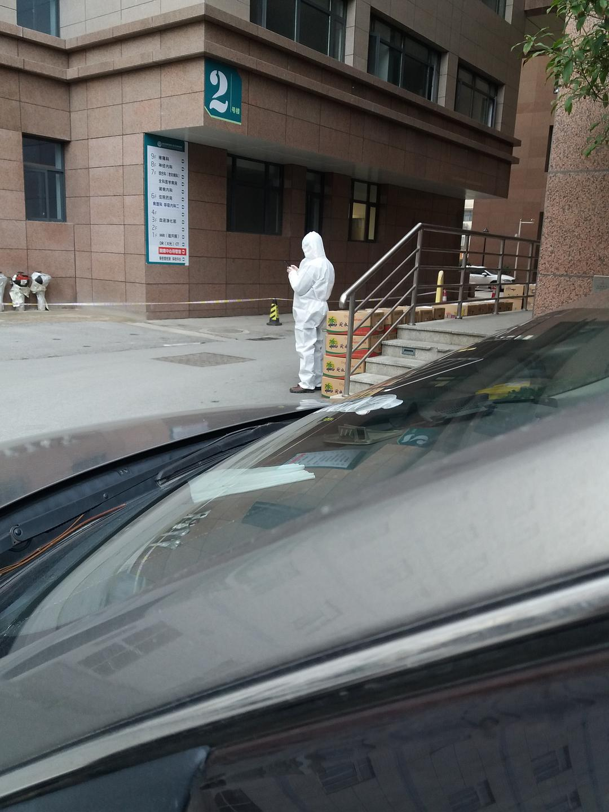

来源：[邓莹（来自豆瓣）](https://www.douban.com/people/1502959/)的[广播](https://www.douban.com/people/1502959/status/2777905268/)

2020-01-28_19:49:13

1月28日散步游记：今天我们穿过江汉路步行街，沿着中山大道一路向西，往武汉市一医院和四医院行进。今天天气不错，有阳光，路上的人较之几天前多一点，还看到了三个拉开网打羽毛球的人，看见我正在拍摄，感觉那一局他们打得格外卖力，宝丽金沿街的水果摊在做活动，一只大喇叭对着空旷的街道喊：水果做活动了啊，全场八折!其实对于这些做小生意的人来说，一无医保，二无工资，现在还只是困难的开始，等到春天，染病人数开始暴增时，那才是饥吞毡渴饮雪的时候。药店仍然是有的开有的关，有两家较大的药店门口排着队，聚集了很多市民在抢购，走近一看，才知道是这家的口罩刚刚到货了，一个老人正在跟穿着防护服的工作人员吵架，涉及的主题包括地域，贫富，老人不断的在说：嫌我是外地人，我可是买了房的，你只是个打工的!

武汉的新疆烧烤老字号东来顺仍在营业，放着节奏感十足的维吾尔音乐，几个从巷子里面窜出来穿着睡衣的老杆（老年人）正随着音乐欢乐的吃着羊肉串，再往前走，就是没有桥的六渡桥，这里的几座铜人都被热心的市民戴上了口罩，分别是一个等着吃四季美包子的小姑娘，和一个郎中先生，想起街道上的绿墙标语：加强思想道德建设，促进未成年人健康成长。

往前直走，就到了武汉市一医院，发热门诊人比较多，一个患者家属在门口打电话，说，检测一个人真的好慢，40多个人从一大早一直到现在都没有检测完。一个护士拿着扫把在清理发热门诊院内的垃圾，不时的向一个领导模样的人抱怨：垃圾该往哪里倒?可能对于这些特殊垃圾，武汉市政府还没有很好的对策。

从一医院出来，接着沿着中山大道往前走，就是武汉市四医院的东院区，这个院区并不是肺炎的主战区，医院里很安静，一个刚刚领了物资的医生正在发微信，我穿过走廊顺着发热门诊的箭头去，首先是看到了一辆印有“往生之舟”的殡葬车，上面写有八个大字：往生极乐，轮回安好。顺着箭头的指示方向，就看到了隐蔽在一个刁钻角落里的发热门诊，虽然不是主力战场，但是里面依然有病患在就医。回过头来又看到刚才那个发微信的医生，正在和一个护士打招呼：科室里面有几个人被感染了，老张也被感染了，老刘就跑了，现在只剩下我一个人了。。。。

走出医院，有两个网友穿着防护服在街头采访，问一个坐在自行车上的少年，你为什么不戴口罩呀？然而最终，他们并没有走进医院，而是开着私家车离开了

今天路上的时间比我想象的要长，居然也花了三个小时，没有东西吃了，只好在中百罗森买了几个面包，密封袋内的蒸汽让这些面包看起来很有感情，但是它们依然很难吃。一个店铺的卷闸门上，被人涂鸦了一个愁脸的表情，不知道是谁，在眼睛下又补充了一个笑脸的表情，在疯子当王的时代，这真是几家欢喜几家愁。
  

  

  

  

  

  

  

  

  

