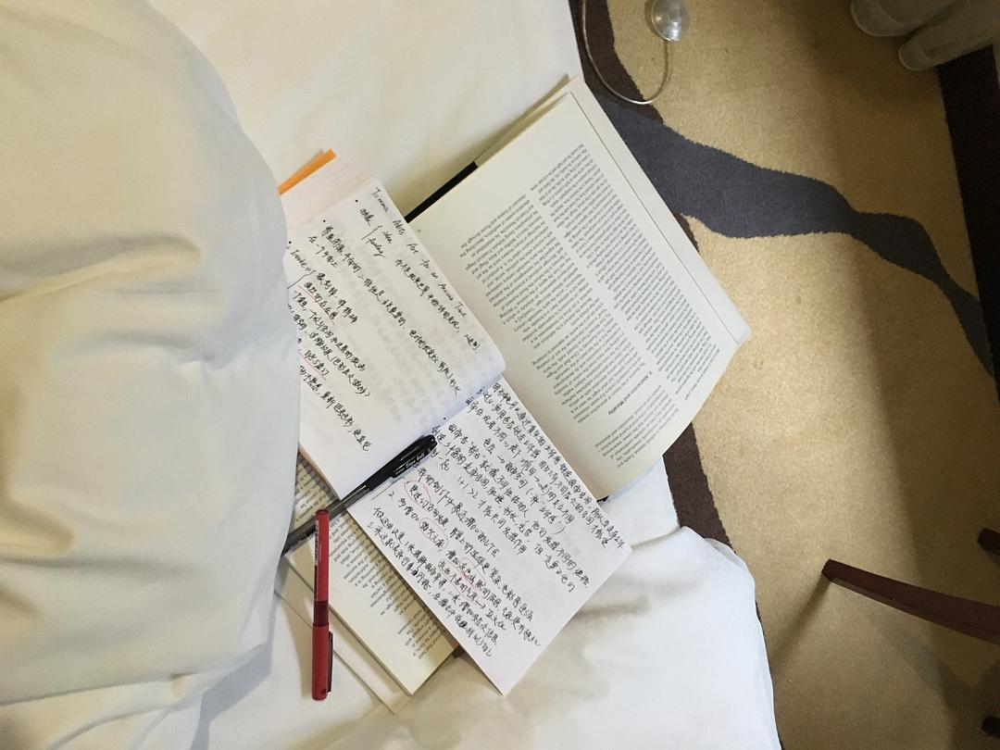

来源：[陈维佳（来自豆瓣）](https://www.douban.com/people/58149581/)的[广播](https://www.douban.com/people/58149581/status/2778337140/)

2020-01-28_23:32:45

记录：被强制集中隔离的第一天。整天都在持续不断的头疼，晚上加剧。本来计划早上睡到11点左右，所以提前拉好了遮光窗帘，谁知早上9点就有穿着全套白色防护服和防毒面具的医护人员敲门送早餐。迷迷糊糊打开门仿佛来到了异世界。拉开窗帘外面是山林，这个宾馆建于山上。早中晚的饭菜是基本的学校食堂标准，也算过得去。头疼的主要原因就是3、4次不同人员通过电话或者敲门问我的体温，每当困得睡着了又火速被叫醒。下午有几个小孩在走廊拼命比赛跑步被工作人员制止了，他们和父母住在同一间。在此期间活动也就是翻译下画册，做点笔记，玩玩消消乐，睡觉，被吵醒，头疼，吃饭，做点笔记如此循环往复。另外我想说此次集中隔离我有几个疑点：第一，既然来接人的大巴都是密切接触者，那么我们的感染机率岂不是在这次接送的大巴上是最高的？本来我在家自行隔离了6天，如果大巴有人确诊，我又要从大巴接送的这一天算隔离期？这样一来我总共隔离的天数有20天了？且感染机率比高铁上还要高很多倍。第二，我的隔离信息和每天体温不是共享的，每天都会接到很多不同部门的电话问我情况，叫我如何好好休息？第三，宾馆为了不交叉感染把我们的热空调关掉了，但一开始我们并不知道就打开了，后来才发现并没有暖气，只是我们这一层的通风，那么是否又存在交叉感染呢？并且室内温度只有10度。第四，穿着防护服的医护人员给十几个潜在感染的密切关注者送饭送水果，是否也存在交叉感染？如此一来是否在家自行隔离才是最节省政府开支又安全卫生，环境舒适适合休息的最佳方案呢？
  

  

  

  

  

  

  

  

