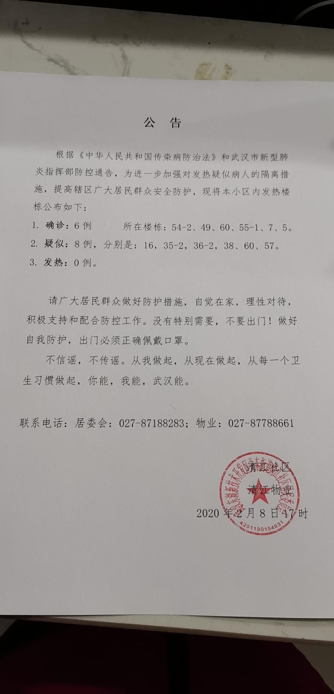
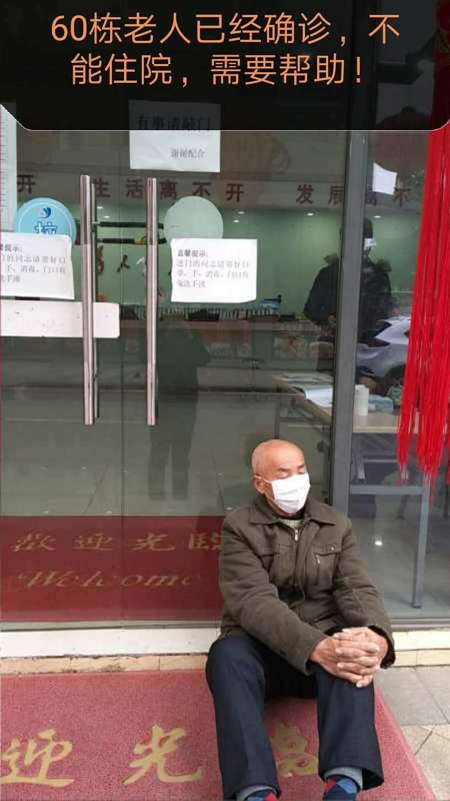

来源：[小钻风（来自豆瓣）](https://www.douban.com/people/58982367/)的[广播](https://www.douban.com/people/58982367/status/2798931965/)

2020-02-08_22:46:53

2020年武汉因新冠状病毒肺炎封城day17

首先更新周边小区学校超市的数据：

光谷天地沃尔玛 确诊3个

光谷天地坐标城 数字不详

曙光星城王c区 确诊3个

中南民族大学 数字不详

光谷保利时代4栋 确诊一个
巴比伦堡 数字不详

另外分析本小区的数据变化：

2月3号 ：确诊1,疑似3,发热10

2月7号：确诊5+1,疑似3,发热8-1
2月8号：确诊6+1,疑似8-1,发热 0
今天上午突发事件就是一位确诊多日而无法分到床位的患者坐在了未开门的居委会大门口，是一位60多岁的老人。居委会的分辨是此人自己拒绝去酒店隔离点隔离，现在的行为属于胡闹。其他邻居，特别是靠居委会近的邻居纷纷忧心忡忡，在wx群里不断的询问情况，这里居委会对患者的指责暴露了他们前几天统计数据的不详亦或失真，已经确诊的患者到底是被列为疑似呢还是确诊呢，反正最后病人只有通过这种闹的方式来解决自己的问题。
然而据说是将确诊病人接走了，以及确诊病人的家属和密切接触者集中隔离了，还有疑似病人也接走了5个，但具体接到了哪里，我还没得到细节。。。
不过今天轰轰烈烈的征用大学宿舍作为隔离点的背景下，小区几百米远的如家酒店也被征用了，不妨联想到是这样的路径。。。小区到酒店。。。因为医院床位已经饱和了，而方舱医院与酒店隔离点的区别值也是一个随机数吧。。。
管tmd谁来指挥，实际医疗资源就那么多，空房子倒是一大堆，可对付一个未知病毒有用吗？
  

  

  

