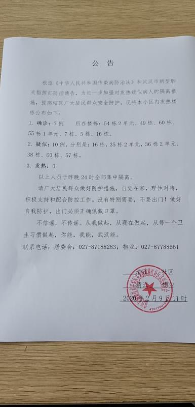
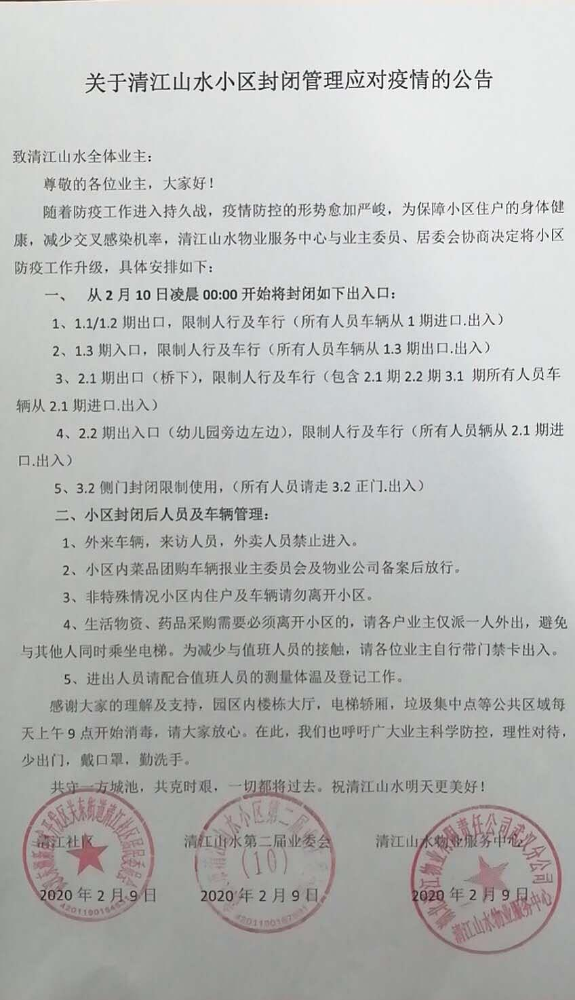
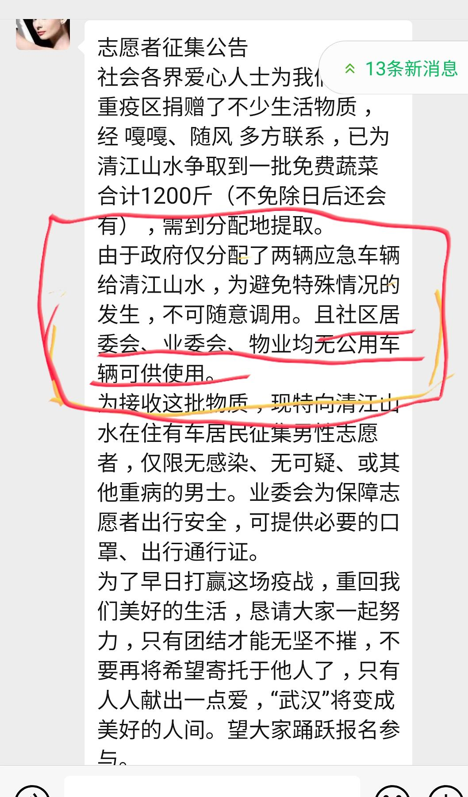

来源：[小钻风（来自豆瓣）](https://www.douban.com/people/58982367/)的[广播](https://www.douban.com/people/58982367/status/2800867814/)

2020-02-09_22:09:11

2020年武汉因新冠状病毒肺炎封城day18

早上物业给了一段话：

请各位业主知晓，截止2月9日公布的确诊和疑似病例，政府已全部统一安排入院及隔离。

确诊数字增加了一位，而社区公布的通告里对患者及家属这段时间去过的地方，一无所述，流行病学史什么的用不到基层治疗和防护，对这些患者一家在封城若干天中的生活物资也是毫无过问的，所以周边中百超市之类的他们一定去过。。。

结果到了下午2点47分，有业主拍到了救护车来到小区的照片，

：去2.2期的救护车，跑错到1期

：不是，去2.2期带人走了，然后我回来的时候在1.2期大概六栋的方向带了人上车，物业人员向医护人员询问几栋的叫什么，疑是还确诊，医护人员回答的是这是别人的隐私，不能告知。

所以说至少又带走了两位病人，具体细节仍然不清楚，社区的统计根本就不准确是一定的。别指望什么社区的一户不漏了。。。讲这种话的人应该是没有在现实中生活过。。。

居委会，业委会，物业均无公共车辆可用，所以任何的爱心都到不了社区，然后应该是迫于感染数字的压力，物业又发了一份文件表示要封闭小区，措施几乎和几天前差不多吧，进门量体温之类的，明天又是什么情况呢？Will the sun rise?
  

  

  

  

  

  

  

  

  

