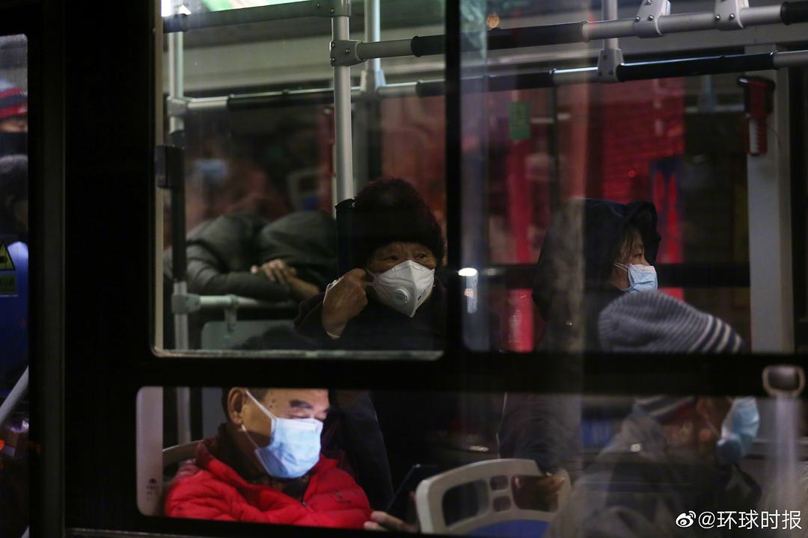

来源：[陈星宇作词（来自豆瓣）](https://www.douban.com/people/chenxingyu2009/)的[广播](https://www.douban.com/people/chenxingyu2009/status/2801756842/)

2020-02-10_11:49:57

【星星日记：20200210武汉封城第十九天】
今天一起床就看到很多坏消息。。。真是让人恼火。
百步亭的事情从昨天到今天，持续发酵，炸浪管理热搜也是很勤快，很快就下去了。不仅仅百步亭，武汉很多社区，包括我这边的，虽然采取了网格化管理，但管得深度和仔细程度，相差甚远，很多都是形式主义大于实际，尤其是在查核疫情数字与居民生活支援方面。。。
环球时报今天发了下面这些图，老人们孤独地沉默着坐公车离开家和家人，去隔离。。。可以想象在这沉默之前他们和家人经历了怎样的“生离死别”，这绝对不是夸张，抵抗力差的老人是这次疫情的易感染群体，去隔离治疗后，明天将会如何，是否一去不再归还。。。没有人会知道。。。
除了武汉社区一些糟心的事情外，武汉软件职业学校粗暴丢弃清理学生寝室的事，四川又出现禽流感的事。。。。等等。
武汉这座城市的人事之问题，这次真是暴露无遗。好事，还是坏事？只有未来再来评述了。。。
今天是奥斯卡颁奖礼的日子，但无心去细看了
  

  

  

