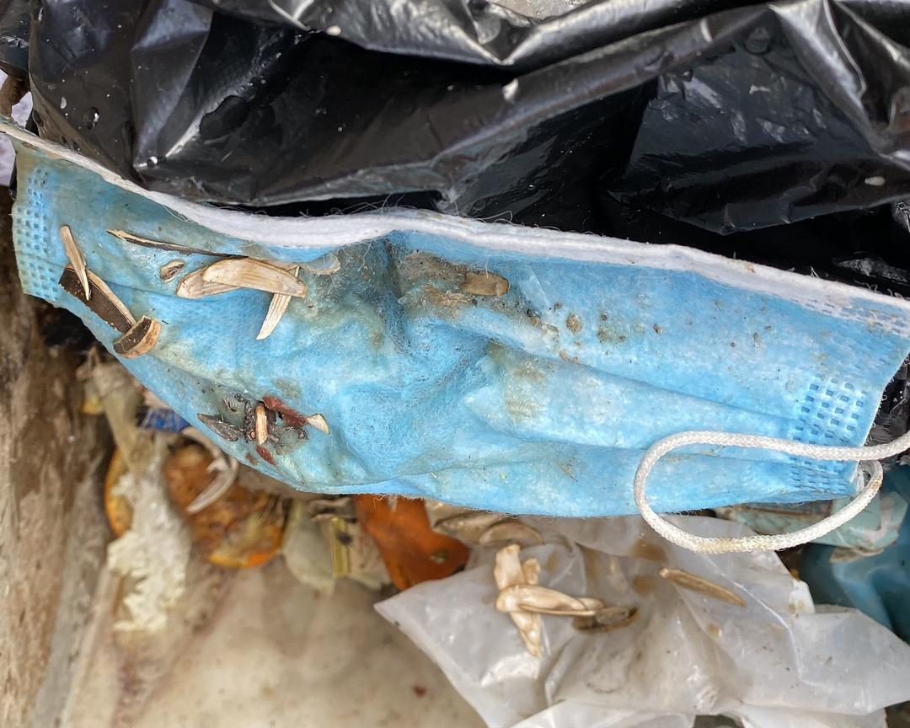

来源：[约伯爱面包（来自豆瓣）](https://www.douban.com/people/210893750/)的[广播](https://www.douban.com/people/210893750/status/2806359078/)

2020-02-12_15:51:26

【匿名投稿】下午出来巡逻在社区遇到的清洁工人。图1是她刚刚戴的口罩，可以看见内层都破了。她说这个口罩戴了很久，因为没有口罩就一直没拿下来。她的工作时长为8小时: 6am-10am，1pm-5pm。按照佩戴口罩的标准，物业公司或者相关机构至少应该给她发放2个口罩/1天，然而阿姨说：“没有人给我发口罩”。社区和大街的保洁工作，是在为谁服务？谁应该来保障这些人的生命安全？
她佩戴的白色口罩，是我和同事带去的，我们用信封包了两个，拿出来一个给她现场佩戴（并且示范了如何戴口罩给阿姨看），剩下一个连同信封装好给她。然而我们知道，这没什么用，给她一个只能一个，而她每天都要出来工作。谁最应该给这些工作者发放口罩？不是我们这些义务帮忙的人，而是聘用他们的机构与部门。它们在哪里？记者和媒体又去哪儿了？
  

  

