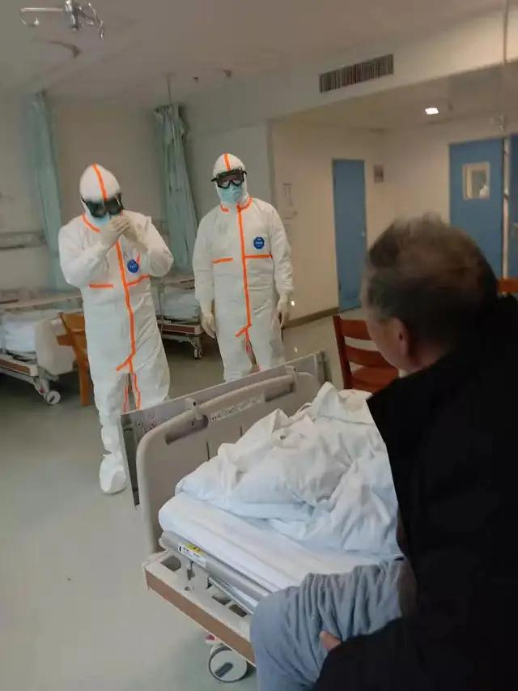

来源：[沙丘（来自豆瓣）](https://www.douban.com/people/54876686/)的[广播](https://www.douban.com/people/54876686/status/2806532094/)

2020-02-12_17:28:31

哎，又白白浪费了几套防护服……图一，公交车运老人事件后续：武昌区政府组织对重症病人逐一道歉；图二，据说在江汉区常青一路某小区门口，每天穿防护服摆拍，然后丢掉。
  

  

