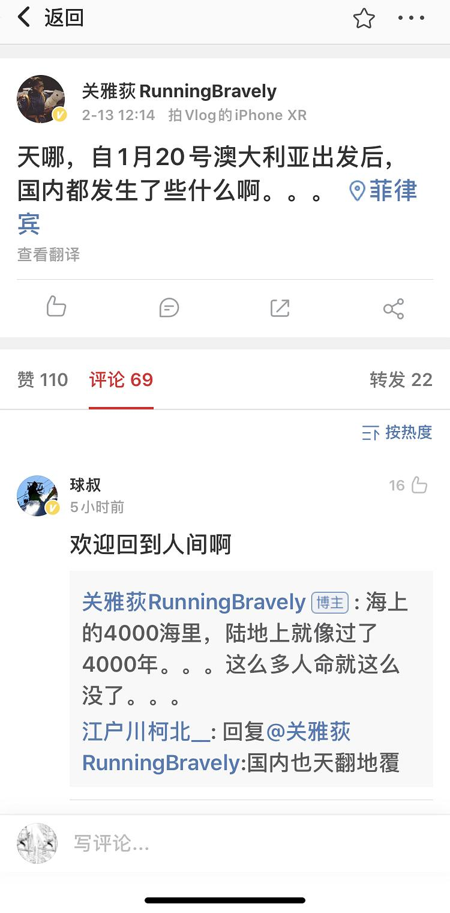

来源：[redhousepainter（来自豆瓣）](https://www.douban.com/people/redhousepainter/)的[广播](https://www.douban.com/people/redhousepainter/status/2808653195/)

2020-02-13_17:53:15

大家在今天豆瓣的开屏广告里可能会看到电影产业破壁课这条豆瓣时间的广告，主持人关雅荻也算是国内知名的影评人和电影制作人，去年年末他参加了克利伯环球帆船赛，1月20日他开始了第六赛段的征程，出发点是澳洲，终点是三亚，他在出发前并没看到钟南山的采访……今天中午他快到终点，在近海岸终于有了手机信号，然后发现春节档没有了，武汉×××，这真是天上一日，地上一年😓
  

  

  

