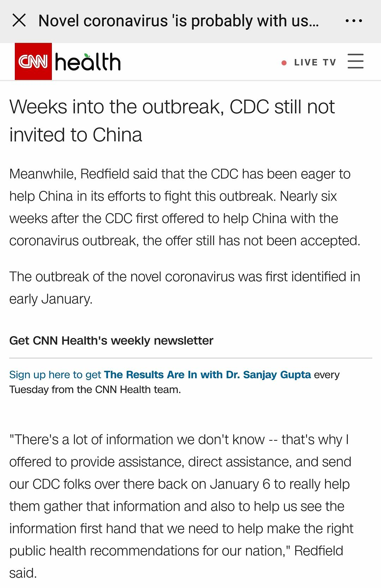

来源：[查克同志（来自豆瓣）](https://www.douban.com/people/zachzhou/)的[广播](https://www.douban.com/people/zachzhou/status/2810117431/)

2020-02-14_12:28:15

今天美国CDC局长和白宫经济顾问Kudlow分别在CNN和记者会上表示，X国政府至今没有同意美国CDC专家进入X国。
  

  

