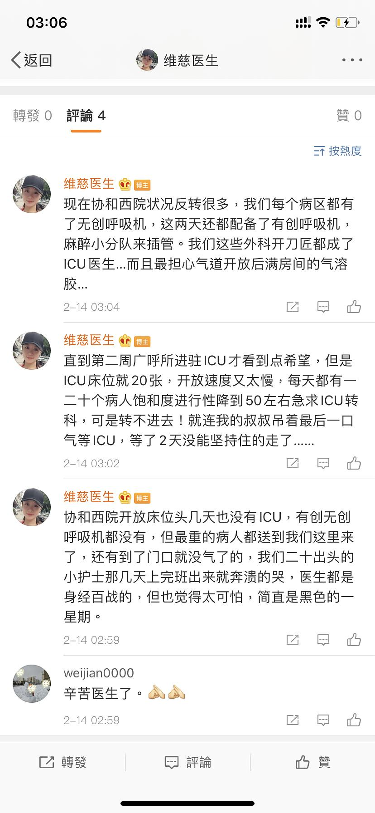

来源：[冷水浴缸（来自豆瓣）](https://www.douban.com/people/sherry106/)的[广播](https://www.douban.com/people/sherry106/status/2810666608/)

2020-02-14_17:52:49

图一是协和西院的女医生，血管外科教授，凌晨三点下班发的微博。本来这个科室甚至这个分院和传染病完全没关系，没有这件事的话女医生的微博按照以前都是分享自己家三个小孩和给病人开刀的经验，各种血管疾病的实验。去看了她的简历，培养一个上手术台的外科医生真的太难了，现在什么科都在治疗这个病，麻醉师都在现学怎么写病历，能薅的人都给薅走了。
图二是九医院的护士，九医院附近也是重灾区，所有医护里95%都是女护士。
这么看图三真是臭不要脸。
  

  

  

