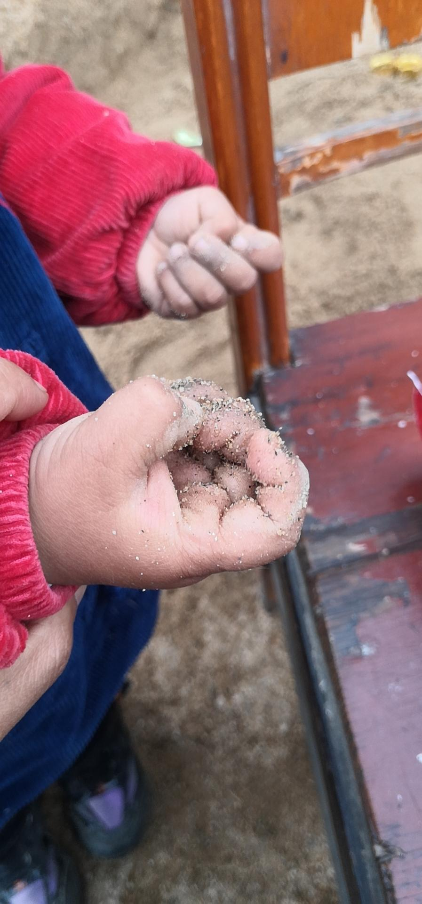

来源：[☂（来自豆瓣）](https://www.douban.com/people/64903057/)的[广播](https://www.douban.com/people/64903057/status/2810799230/)

2020-02-14_19:09:44

图一图二是用捡的泡沫和砍的竹子给豆瓣做的油罐车玩具～图三是我开会记录内容的笔记本～😂
图四是猪豆瓣的脏爪子，图五，他只带了冬天的厚帽子，现在天气热了，稍微有点风，得戴帽子，我就，找了块布，给他做了个薄帽子，只能是这个颜色，将就戴吧……😂
图六，豆瓣憋得喊siri，说让siri给他放段鞭炮～最后几张图，是豆瓣在来农村前，在家里门口小饭馆吃饭，嫌弃的表情～哈哈，你小子肯定想不到，曾经你嫌弃，现在一听到有吃的，嗷嗷叫就冲过来的，高兴的蹦哒～

感谢大家对猪豆瓣子的关心，前段时间还有豆友给我发豆油，问豆瓣的情况。孩子的适应能力确实比大人要强。那天豆瓣蹦起来高兴的说，等外面那个人的病好了，豆瓣就可以出去玩啦～我看着他开心和懂事的样子，笑着笑着就哭了。
现在国家有难，我这些困难，和战斗在一线的医护人员相比，和生病的人相比，和困在高速的那位无助的大叔相比，已经幸运多了。我现在的泪点啊，低到极限，只要看到疫情的相关信息，分分钟落泪。
有的人，只是被困了一段时间，而有的人，被永远的困在了2020。且行且珍惜……
每晚豆瓣和我互道晚安，对我说，“妈妈，我爱你。”就是我坚强的理由。
  

  

  

  

  

  

  

  

  

