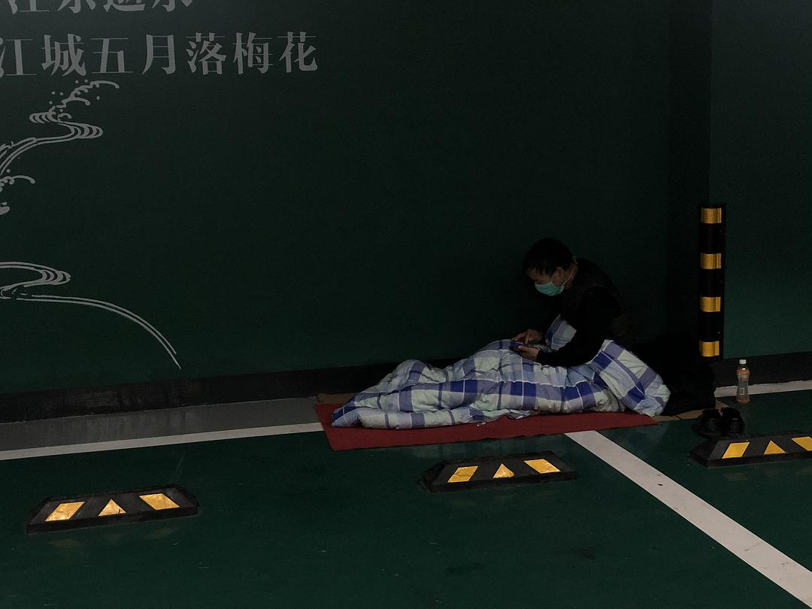

来源：[孟藻（来自豆瓣）](https://www.douban.com/people/58493958/)的[广播](https://www.douban.com/people/58493958/status/2813151227/)

2020-02-15_20:18:32

武汉今天雪很大，也很冷。我和同事去了一个滞留武汉的外地人的“集中地”。
民政局和城管送了一些被子过去，泡面一人一箱，这样的日子他们过了快二十天了，没有热水洗澡，宾馆还在想办法协调。好在这儿不冷，也还算干净，这里的人情绪都还行，最大的苦恼还是不知道封城到什么时候，着急复工挣钱。
最让我难过的是一个叔叔，他为了给儿子挣买房钱到武汉打工。他说自己之前都不知道新冠肺炎这回事，是打算回家了，去了火车站，被告知封城了才知道这个病。
他只用老人机，家没回去成，想老伴和儿子了都没法视频。“反正也没水洗脸。”他苦笑着说。
  

  

  

  

