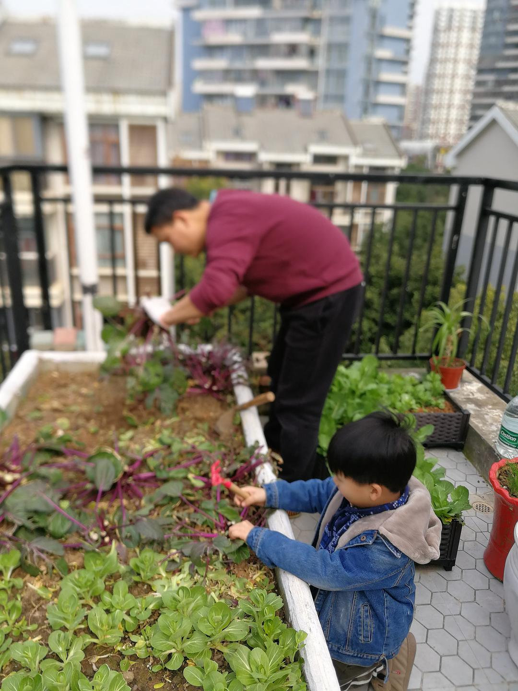

来源：[小样麻麻（来自豆瓣）](https://www.douban.com/people/maxiaofan/)的[广播](https://www.douban.com/people/maxiaofan/status/2828432444/)

2020-02-23_12:38:14

收割了最后一批紫菜苔，地翻了一遍，种上了生菜，好庆幸家里还有点菜补给，也让全家有点好玩的事情消磨时光。刚种生菜让我想到小时候在家里干农活，当时真的讨厌得不得了的农活，现在却觉得是一件多么幸福的事情，手抚摸土地得欣慰感，我的宝贝，愿你也能够学会感受和感恩这普通的生活。
  

  

  

  

  

  

  

  

  

