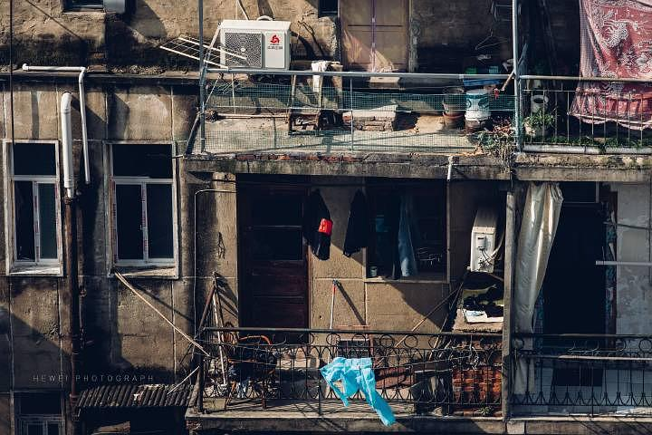

来源：[邓莹（来自豆瓣）](https://www.douban.com/people/1502959/)的[广播](https://www.douban.com/people/1502959/status/2828831749/)

2020-02-23_16:20:55

网上很多骂爹爹婆婆聊天的，我就不评价了，爹爹婆婆不上网，子女不在身边，电视新闻都是假的，他们找谁聊天发泄不满?而且很多老城区的老年人确实在家待不住，我原来民众乐园开店的时候，里面很多爹爹婆婆聚集聊天吹空调，那是他们的生活方式，人家过自己的生活，并没有碍到你什么。这位网友的角度我很喜欢，换一个角度看世界，会更美好。
  

  

  

  

  

  

  

  

  

