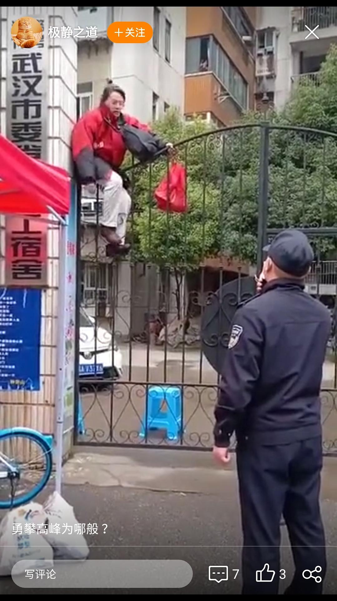

来源：[邓莹（来自豆瓣）](https://www.douban.com/people/1502959/)的[广播](https://www.douban.com/people/1502959/status/2830752112/)

2020-02-24_15:43:48

一位试图越狱的老年人，警察让他下来，他说“你开枪打我撒！”

视频里这个嫂子就是现在年轻人口中的“不守规矩的老年人”，但是要注意她说的话，她说“我要克逛解放公园，我要吃面包，我要喝牛奶，我们武汉人都是吃面包喝牛奶。。。。”70-80后应该可以从这段话中推算出，这个嫂子年轻的时候绝对非常时髦，一点都不会亚于现在00后的潮人。所以不存在了是老人变坏了，还是坏人变老了这种问题，一场瘟疫都可以让现在的年轻人瑟瑟发抖，把时间倒退40年，你能不能潇洒的说一句“吃面包喝牛奶脱了裤子跳摇摆”?
  

  

  

  

  

  

  

  

  

