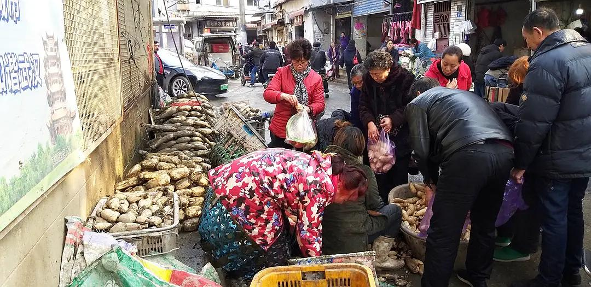

已获得作者转载授权。

作者：[突然要改名（来自豆瓣）](https://www.douban.com/people/zhaocc1128/)

来源：https://www.douban.com/note/749701924/

2020-01-21 11:18:34

作为飓风中心，武汉表现得一如往常。  

昨天和朋友在昙华林闲逛的时候，不小心误入沿街的批发市场。闻到生肉味儿，踩上泥泞的路面，我们都不由得警惕起来，戴上了口罩。人群熙熙攘攘，前行缓慢，两边也没有岔路离开。城管的卡车停在路口，几个人把非法占道的共享单车扔进后斗。一转弯，三家卖莲藕的摊子挤在一起。摊主用水枪冲洗着莲藕上的淤泥，大妈们围过来询价。我们终于借此岔路拐离了市场。  

晚上从江汉路地铁站C口出来，还是一头扎进促销的海洋。店员站在门口的凳子上，手拿扩音器喊着折扣。隔壁也毫不示弱，直接把人往店里拽。卖假鞋的穿梭期间，托着一只鞋，同时把价目表往人鼻子底下塞。我攥紧手机，匆匆赶路。被冷风一吹，打了个哆嗦。  

今早出门时，宾馆前台在热热闹闹地挂彩灯；透过玻璃门，可以看到街上一个大爷吃着热干面悠闲地走过。过早的店里人们聊着天，只有一个姑娘进来时戴了口罩。我吃完最后一口酸豆角，去旁边的便利店买零食。结账时问了句：“卖口罩不卖？”收银大姐笑道：“早卖光了。”周围的人听了也都笑起来，全是亲切熟悉的味道，就好像全世界人民担心的事离武汉还好遥远。  

