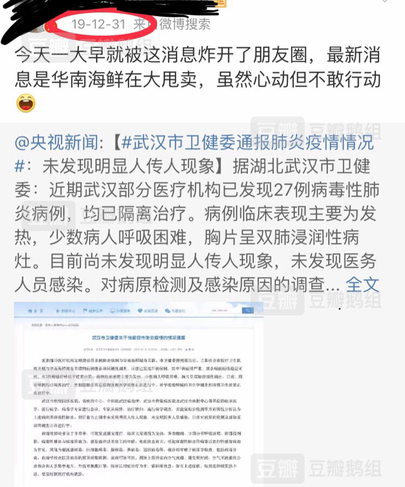
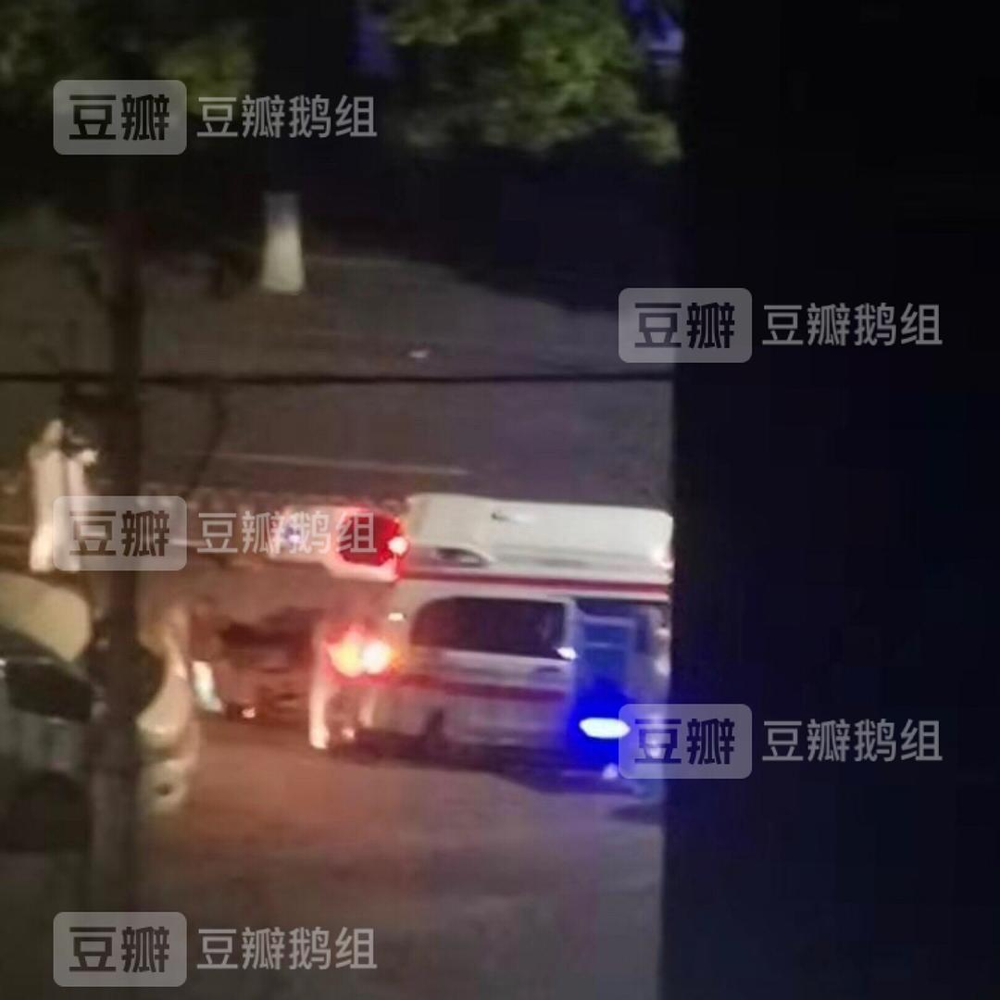

已获得作者转载授权。

来源：[Mr.Cancer](https://www.douban.com/people/craner/)的[话题](https://www.douban.com/group/topic/163716290/) 

2020-01-23 00:32:14

离华南海鲜有多近呢？大概百来米吧……走路两分钟就到了……

已经闭门不出三天了…今年中午鼓起勇气带了口罩+护目镜，飞奔去超市买了足够一个月的速冻饺子、八宝粥、汤圆和挂面，又飞奔回家…开始闭关…

街上几乎没有人…超市也只有大概十来个顾客（是类似于家乐福那种大小的，一整层楼）…基本上都带了口罩，只有一个老人没带，在超市被工作人员怼了，“我们在核心（地带）还不戴口罩，莫出来害人了”…

现在我四周全部是消毒水的味道，三天前我们小区还只是用消毒水拖地，现在我感觉只要是封闭空间，六个面都被喷了消毒水…

好了，我要去闭关了，祝愿大家都平安健康！等我出关再向大家报告最新情况…

================================

我来更新叻……

一早起来公交停了、地铁停了、长途客运停了……啥啥都停了……

说个事，华南海鲜市场还没有关闭的时候（年底开张的最后一天），已经接到了通知说1月1号要全部关闭，然后我们业主微信群就传，说今天买海鲜特便宜，很多老板为了减少损失，急于出货，很多水产都打一、两折卖。我当时都有点小心动了，我还想着去买点生蚝（那个时候不知道会有这么大危险）…但是我没有去，为什么呢？因为我看到这个消息的时候已经晚上八点多了…我估摸着隔壁差不多都打烊了…

所以，迟钝有迟钝的好处……

\* 有鹅提醒我注意，所以我把坐标照片删去了。还有我带的不是啥正规护目镜，就是夏天的泳镜，像个铁憨憨……

================================

2.3更新

来报平安了…已经十一天没有出门了，某巢的快递提醒催了我足足十天…

大概三天前，我亲眼看到我对面楼栋有两个重症被救护车接走…这两天业主群说已经确诊了…本来冲下楼取快递的计划也搁浅了，因为听说坐电梯也有风险。

还有，我爸工作的医院有几个医生都确诊了，我妈采取了紧急隔离措施：和我爸分开住。所以现在我妈占据了我的房，我被赶到了书房...

昨天有关烧伤宝的帖子也被豆娘删掉了，心疼自己两秒钟...

================================

2.5更新

来报平安……

说个事： 我妈是高校的老师。因为120的接线员不够，我妈昨天收到一个任务，要从大学招募一些志愿者，24小时三班倒，白班女生，夜班男生，在大学临时改的救护信息中心接求助电话。刚刚有一波人下班，我妈打电话去问其中一个女生的情况，那个女生情绪立刻崩溃了…哭到不能自已的那种…

太苦了… 现在只希望事情平息之后，社会能重视一线人员的心理疏导…

================================

2.7更新

平安。

家中的速冻食品已经吃完了，弹尽粮绝了。在饿了么叫了小哥送菜，菜场买了五样菜（胡萝卜，鸡蛋，洪菜薹，小白菜，西红柿，菜场已经没有任何形式的活禽了，猪牛羊也没有，据说武汉现在只有超市有）。每样三斤左右，花了250+RMB，比平时贵，但是小哥说多少就给了多少，毕竟太不容易了。

昨天有姓俞的老人在我爸工作的医院离世，楚天都市报的微博有报道，按照我爸的说法，老人去世的时候几乎所有医护人员都哭了。考虑到手机可能会携带病毒，医院本来要没收老人的手机，后来实在是不忍心，消了几遍毒之后还给了老人的家人。毕竟这是家人的最后的一点念想了…… 

此外，一个高中同学的外公也因疫离世了……

每天听闻这些故事，只有唉声叹气默默流泪。惟愿疫情赶快结束！祈福！

================================

2.10更新

平安。

本来今年六月毕业，结果现在知网也打不开，书和资料也沦陷在武昌宿舍，无心学习……

前几天我爸说，有机构最近开始去基层医院“视察”了。然而名义上是视察，实际上是甩锅：有的领导一到医院就指责医院“瞒报”病情。但事实上，医院在疾病扩散的早期连确诊权利都没有，因为根本就没有试剂盒。而且从常识判断，医院为什么要瞒报？新型病毒又不是医院发明出来的……我看是有些人觉得自己的未来保不住了，能拖一个下水就拖。

转发我爸同事的一句话：医生已经流汗又流血了，不能再让他们流泪了！