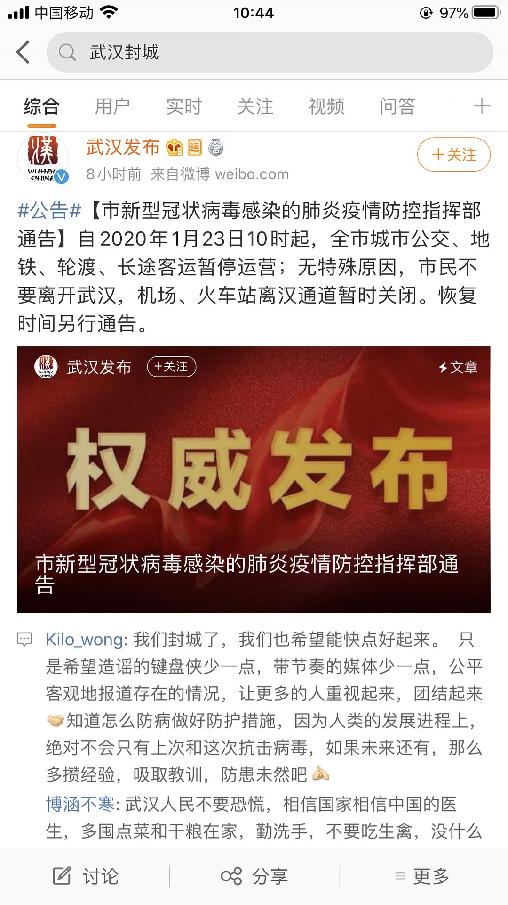

已获得作者转载授权。  
作者：[陈星宇作词（来自豆瓣）](https://www.douban.com/people/chenxingyu2009/)  
来源：https://www.douban.com/note/749862753/

2020-01-23 11:07:57

2020年01月23日

武汉，记住这一天

每个人管好自己🙏

武汉人相信武汉🙏

今天早上8点醒来翻看手机，就看到武汉今天十点全部公共交通封锁，进城出城管制了。

紧张氛围油然而生。

起床后打开电台听了听，没有特别报道。

随后打开电视机看了看，央视新闻没特别播，湖北卫视依然在正常放动画片和水浒传。

还是手机微博微信朋友圈消息快。及时看到了很多武汉火车站和机场的现场封闭视频，超市和菜场里物资抢购的图文视频。

远方的家人和朋友早上发来消息询问，一一回复。告知武汉暂时平稳。

中午开始，网上陆续出现了一些传闻，有些明显是谣言，有些令人疑问。虽然官方辟谣反应快了一些，但导致整个氛围更敏感。

这个非常时期，我有幸和家人们守在一起，一起在家里度过。我算幸运的。

相信还有很多此时此刻无法回老家跟家人团聚的儿子女儿们，可能他们的父母家人在整个春节都要心心念着，担心着身在武汉的孩子。

我家里这几天已经囤了一些吃的，也能开火做饭。就算外面餐饮店都不开门，我也有父母陪身边，吃上做好的热乎饭。我是幸运的。

可能有些无法回家的人是一个人租房子住，有些人是平日都不开火做饭的，可能冰箱炉子都没有。封城这些日子，他们可能将是孤单一人，可能都没法三餐热乎的饭菜吃到口。哎。

总之

武汉封城，理解

相信武汉，加油