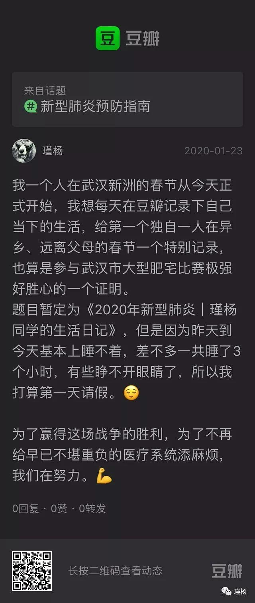
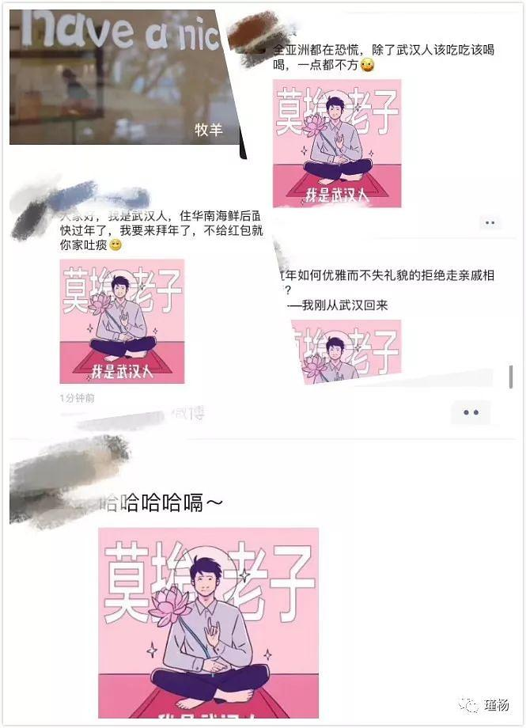
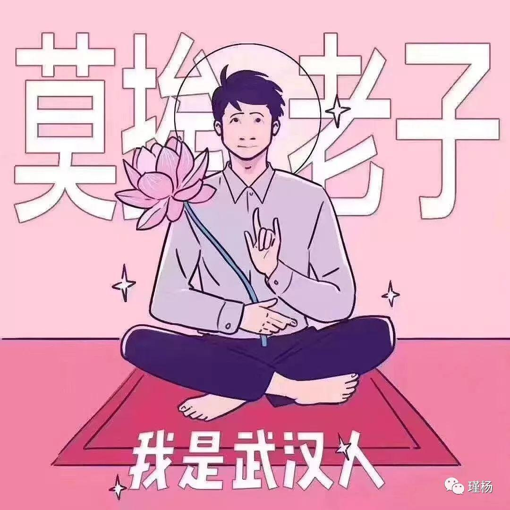
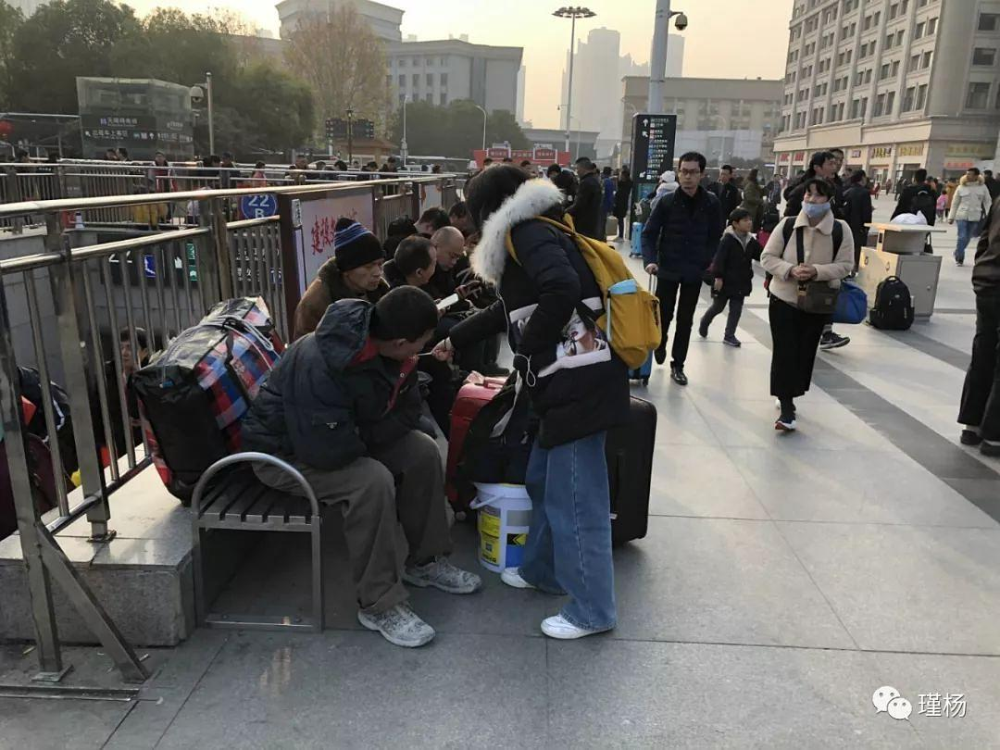
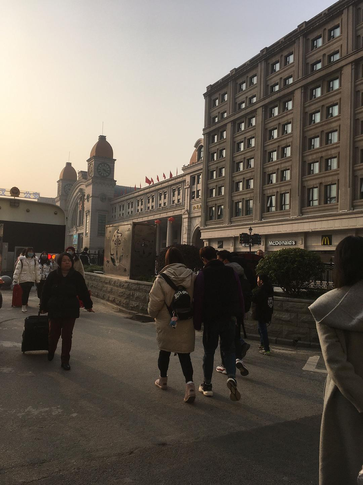

已获得作者转载授权。

作者：[瑾杨（来自豆瓣）](https://www.douban.com/people/158501795/)

来源：https://www.douban.com/note/750044155/

2020-01-25 23:51:38

2020年1月25日夜，农历大年初一，武汉，雨。  

看着外面淅淅沥沥的雨，我在担心蔡甸在建隔离医院的工人们是否能吃上热饭菜，衣服是否防雨且保暖，工程是否能如期完成。距离我在某瓣上宣布要开始纪录这一段特别的时光已经过去了48个小时，在这48小时里，我在认真地学习生存。写这条广播之前我正在往小煮锅里面下速冻水饺，水开始沸腾的时候我忽然意识到：“如果把当下记录下来，这就是历史”。而当我开始写这个记录时，浏览了一下音乐列表，第一个想听的就是苏打绿的《当我们一起走过》。  

寒假前学校开始通知准备毕业实习，只要各自找到接收单位并提供证明，明年就不用来学校了。在某东园区实习是我在结束期末考试之后自己去找的，当时面了很有几家公司最后比较中意这里，并且园区还包住宿，整体来说比较满意，我就打包被褥，拖着行李箱来这里上班了。我住两人间，室友很忙基本不照面，平时工作比较轻松，虽然中间有些波折但也很快就适应了，我就安心在这里安顿下来上班。公司按法定节假日通知的是腊月二十九放假，于是我买了腊月三十一早回家的火车票，幻想着拿到工资后可以回家给亲人们发红包。  

情况是从1月18号开始变化的，那天之前的朋友圈里全部都是调侃的话，例如“全世界都在担心武汉人，只有武汉人觉得自己挺好”，“过年不用走亲戚了，要是逼我相亲，那我就亲你”，以及一张“莫挨老子”的图片。  

那天开始，朋友圈里有一些人开始提醒人们要戴口罩了，我旁边的小姐姐们不以为意，依然说说笑笑并没有在意。我在1月19号（腊月二十五）的时候因为工作原因去了汉口火车站的发传单，为公司年后返岗做准备。走的时候父亲和男朋友都叮嘱我了要戴口罩，于是我问了这里的小超市，店员说一次性口罩也许卖完了，目前没有。我看了看剩下的粉色或黑色的布口罩，想了想并没有买。乘坐一系列公共交通，直到我出了汉口火车站地铁站，才在地下的一个小超市里买到了两个口罩，价格是3元/个。

在火车站外面的广场上发传单的时候，我们的同事基本上都戴了口罩，不过目之所及的大部分人只是坐在台阶前等自己的列车，在下面图片里可以明显看到戴了口罩的人只有一个，还有一个是背对着的我。这个黄书包蓝水杯正在递小卡片（什么嘛）的人，就是我。  

从那天回园区开始，只要是在公共场所我就都戴口罩，第二天也就是20号（腊月二十六），我所在的办公室物业开始撒消毒水，开窗通风。冬天不开空调的武汉，办公室是很冷的，我觉得脚下和腿都很冷，可是想到必须要开窗通风，也就忍忍把自己的电热水袋从宿舍拿到了办公室。当天晚上看到钟南山院士的新闻，说这个病毒可以人传人，目前的病例达到了136例，也有死亡病例。那个时候我只是很明确地知道要戴口罩，却不是很明确“疫情”二字到底代表什么，甚至隐隐有一种看热闹的心情——我倒要看看这个数字到底会涨到多少。  

21号（腊月二十七）我退了腊月三十的票，改成二十九号走，和上级反映后我想尽早回家。中午看到稳健的护理口罩就足够普通人使用了，在某东上买了，也分享给男朋友让他也赶紧买，再晚可能就没了。晚上我觉得脸有些烫，请同事帮我量了一下，37.3℃。我有些茫然，因为电视上都说有发热症状要高度警惕，可是多少度算发热呢？它并没有告诉我。同事笑我说：“完了，你这37度3，有问题啊”。虽然是这么说但是也都觉得并没有很高，所以当晚我一直很慌，害怕自己也被传染了。晚上和男朋友视频的时候他说他也有些头痛，甚至觉得有些呼吸不过来。我们互相安慰了一番，猜测说也许是戴口罩一天不习惯，闷的。最后我和他商量，明天早上第一件事是起床量体温，有异常就直接去医院。  

我还和父亲打了电话，他让我回忆一下近来有没有受累受凉的情况，我仔细一想：“啊，昨天在办公室冷的不行可不就是受凉嘛。”再一想最近几年每年一次的感冒发烧症状，每次都是二话不说直接开始发烧，第二天才开始有流鼻涕的症状，和这次的反应也高度吻合。我和父亲开玩笑：“按每年一次算，今年的指标还没用呢”。这样想着，稍微安心一些，迷迷糊糊睡着了。  

22号（腊月二十八）早上醒的时候感觉自己脸还是烫烫的，简单洗漱了之后我赶紧下楼下宿管阿姨那里去量体温，并且紧张地想：“如果超过37.5我就直接打120”。  

把体温表拿出来一看，才36.9。  

中午口罩就到了，打电话叫我去外面派送的面包车上拿，我看到给我派送的某丰快递员没有戴口罩，旁边某东的面包车上，快递员一样没有任何防护。报了自己的名字拿到了口罩，我和他们多说了两句，“你们也要注意安全”。下午在宿舍收拾，穿插着处理工作。我还和一位男同事约好，请他明天早上送送我去最近的地铁站，因为火车站挺远的，14：30的车早上11：30出发比较合适。下午6：00正式下班，晚上我一直在看相关的消息，看新增了多少确诊病例。  

直到晚上两点多，我忽然刷到一条消息：“武汉将于明天早上10点封城。”我心中一凉：  

“坏了，回不去了。”  

