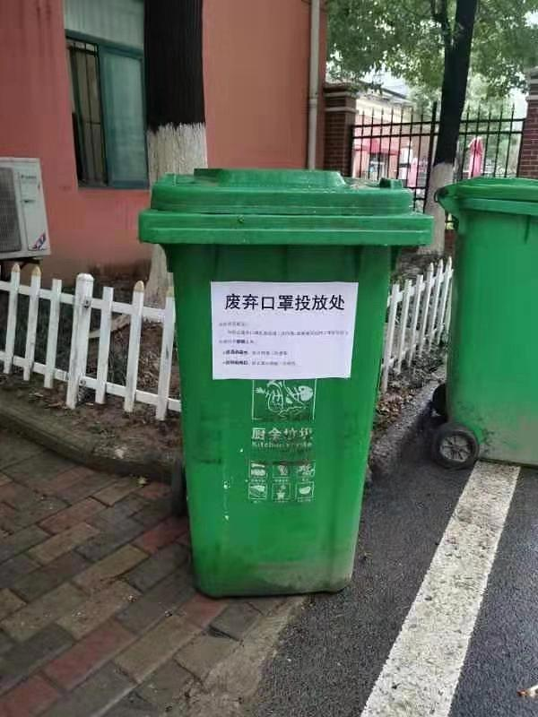

已获得作者转载授权。

作者：[JoyceCheng（来自豆瓣）](https://www.douban.com/people/30298116/)

来源：https://www.douban.com/note/750071163/

2020-01-26 13:37:37

上个月底我复盘2019年新年愿景完成情况后，[@η阿青](https://www.douban.com/people/JeanCellNia/)老师友情推荐我的日志，祝福我早日达成理想中的粉丝数。这两天随手记录了一下在武汉的生活情况，理想粉丝数居然达成了。真是无心插柳柳成荫。感恩感恩，我到底何德何能啊。当然我知道大家这是出于对疫区人民的关心，仍是感恩。  

昨天禁车令一出，我跟SK君出门探险，进行了一番惊魂采购。老爸不再能开私家车上班，于是索性回家拿了换洗衣物，在单位值守住下。到了昨天夜里，SK君说，看到禁车令有了进一步的复杂后续：没有接到短信通知禁止出行的车主，可以出行。  

根据我们浅薄有限的语文知识（毕竟都没当过语文课代表），我们觉得，这应该是表示，没收到短信的话，自家的车就可以开。但是，会不会开车上路之后，又突然收到短信呢？又或者，何不干脆发条短信告诉我们“你家的车可以上路”呢？反正截至我写这篇日志，我们还没收到短信，今天也没有开车上路。  

那边我爸在单位，苦苦思索如果不能开车的话，遇到外勤任务要怎么赶赴现场。好在系统运转并没有完全失灵，很快他们单位就被分配了几个“中心城区通行证”，值守人员的私家车，大约三到四部的样子，可以持证通行。  

但是小朋友们的胡萝卜没有补到货的重担，依然压在我婆婆心头。上午十点半，SK君全副武装，出门去小区门口的中百超市一探究竟。他行至超市门口，正好碰见货运卡车给超市送货，送的都是粮油米面等基本食物。今天是封城第4天，封城首天出现的粮油断货情况已经消解。超市职员告诉SK君，今晚超市将会接到蔬菜瓜果的配送。Bravo!尽管主张不囤货，但是为了向老妈以及丈母娘交差，SK君还是买了五斤小麦粉、二十斤大米、4瓶1L装鲜牛奶回家。  

封城首日我在网上下单了几样日用百货，包括烘焙原料和香皂。烘焙原料一直都没有动静，香皂倒是被拆分出来，昨天下午被快递员丢到快递柜里了....也好，快递员辛苦，以及，不见面也挺好。  

我们所居住的小区向来以物业糟糕而出名，小区门禁一坏再坏，谁知遇到此次疫情，大家几乎都闭门不出，小区门禁倒是一本正经夜以继日地用上了。以致于大家进小区时，需要费劲地放下手中的重物，摘下手套，扯下口罩，点击触摸屏，进行人脸识别。不知道有多少人打了物业电话投诉，到中午时分，物业就矫枉过正地取消了出入门禁，行人与电瓶车道的门全部洞开。另外，小区将厨余垃圾桶征用为专门丢弃口罩的垃圾桶了。Anyway，虽然有时候笨笨的，但是大家都在努力地解决着问题吧。  

说到解决问题，有件小事倒是有些值得玩味。封城的第二天，肺炎指挥部发通知说大年初一过江隧道关闭，车辆都由桥梁过江，且上桥之前要测体温。但是，我爸昨天早上七点四十行至长江二桥，连个人影儿都没有，更别说有人测体温控制通行了。再结合扑朔迷离的禁车令，不禁让人想问问，这些控制举措到底是不是真的在实施，以及颁布这些政令，究竟是给谁看的。普通市民好难搞懂啊。  

普通市民更擅长地是在家庭微信群里发各种消息。我那远在郑州从事法务工作的大表姐，过年压根儿没回来，突然在家庭群里连发两条“信阳封城了”，各种数据说得像模像样，力证信阳是重灾区。话说家族里面现在也并没有人生活在信阳啊，不知道她为何对信阳如此上心。SK君最见不得同龄人传播谣言，于是八万年不在家庭群里吭声的他，往群里推送了腾讯新闻的“较真查证平台”链接，并且截图证明信阳封城是谣言，友好地请大家关注官方辟谣渠道，不要恐慌。过了半分钟，我大表姐铿锵有力地回复：“原来是假的，更吓人了，不封还等什么哦”。浆糊逻辑，死也要赢得战争，有这样的表姐，我还需要什么敌人呢。  

武汉肺炎封城第2天：一首朋克救地球  

武汉肺炎封城第3天：当车辆不能再上路  

武汉肺炎封城第9天：勤洗手戴口罩  

武汉肺炎封城第10天：活着只是靠运气  

武汉肺炎封城第11天：化力气为浆糊  

