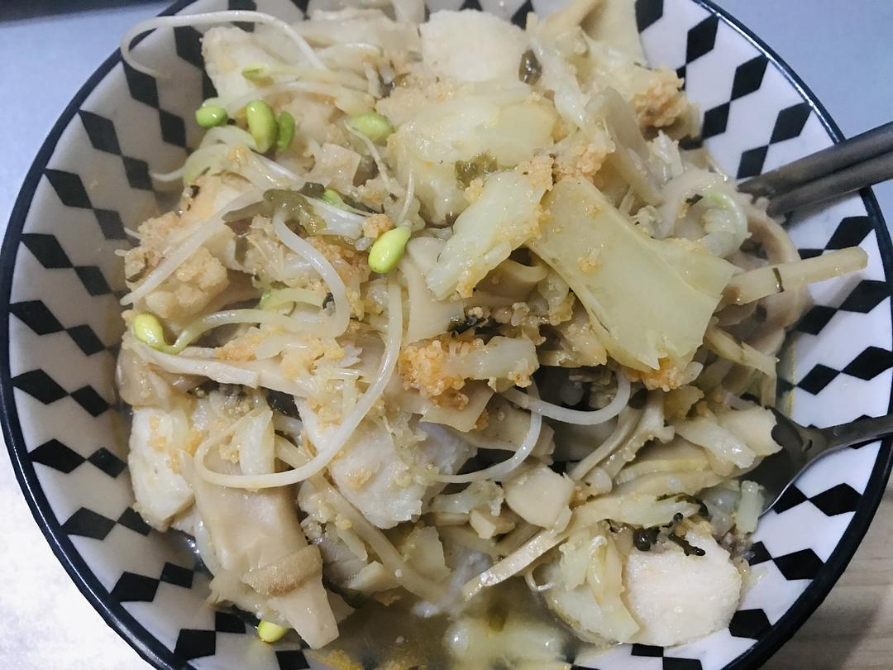
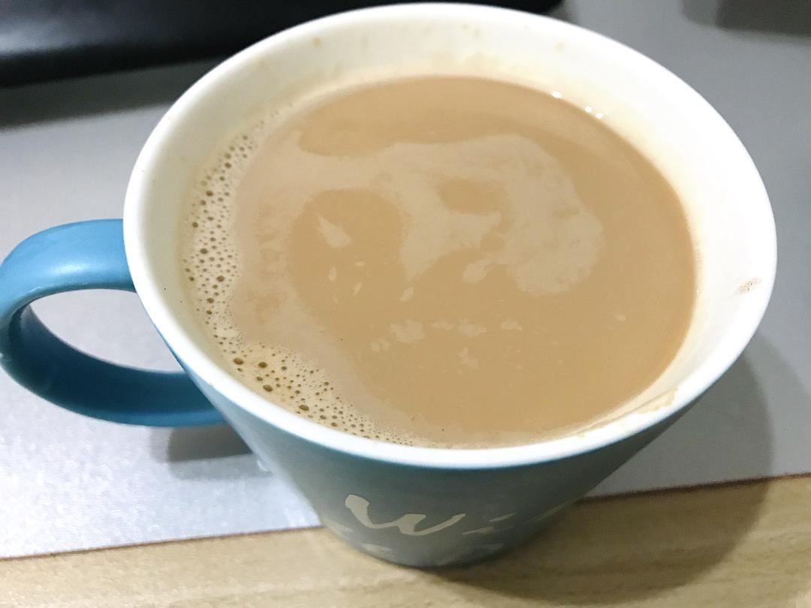

来源：[地味鸭](https://www.douban.com/people/47513232/status/2774467334/)的[广播](https://www.douban.com/people/47513232/status/2774467334/)

2020-01-26 16:13:25

Day4.除了少数几家外卖，已经很难买到制成食品了，只能自力更生。罗森买的盒饭要省着吃，很可能哪天罗森也供应不上了。橙子是@[巫山六月雪](https://www.douban.com/people/160537893/) 店里买的，当时想不妨助人，现下围城之中却是难得珍品了。每日测体温，测血氧，一切安好。 部队和民间救助好像都已走上正轨，井井有序起来。城中和周边的事帮不上忙，我还是减少上网的时间，认真做好手头的事，过好自己的生活。

