已获得作者转载授权。
作者：[kaiba（来自豆瓣）](https://www.douban.com/people/137612465/)
来源：https://www.douban.com/note/750230129/

2020-01-28 13:41:51

1月19日离开武汉的时候我是完全没有预料到情况会发展到这么严重的。

今天是在家自我隔离的第9天，暂没有任何发热咳嗽等不适，我终于渐渐从担心、惶恐、甚至焦虑的情绪中走了出来。

最早知道武汉肺炎的消息是1月3日，当时元旦前一天才刚从武汉离开去到深圳，借宿在朋友小林家里并和几个好朋友一起跨了年，然后约好周末再去一个小海岛玩两天。

消息在微博上热搜时我正在小林家里撸猫，一只他室友养的肥肥的蓝猫，性格又好又黏人。小林刷着手机突然喊“猫猫，武汉出病毒肺炎了，我还要不要跟你去啊！”小林刚辞了深圳的工作，准备去武汉待一段时间并在过年期间顺便帮忙照顾我的猫。

我打开微博看热搜——44例、隔离治疗、海鲜市场、可防可控、无明显人传人，这些关键词由视野进入脑海并形成判断。

我对小林说:“看起来不严重，已经控制住了，应该没有问题。”然后就随便刷了刷微博评论，没有把这件事放在心上。

4号5号两天在珠海的外伶仃岛上玩，和朋友一起在海边扔石头，散步，拍照，爬山，而后晚上热热闹闹地吃火锅。期间似乎也有聊一两句武汉肺炎上热搜的事情，毕竟我刚从那边过来，但大家都不觉得有什么严重的。5号晚上和小林回到了武汉，此后小林忙自己的事几乎每天早出晚归，而我除了去小区门口菜市场买菜买水果，几乎没有出过门，至于肺炎的事情则早就忘得一干二净。10号的时候还跟朋友去楚河汉街溜达然后吃日料，期间也完全没有谈过这个话题。

直到11号才又看到了一些相关消息，但“无医务人员感染，未发现明确人传人证据”这样的关键词让我仍然没有把这件事放在心上。

12号小林嚷着武汉太冷，决定回深圳不留在武汉过年了，然后买了第二天飞深圳的机票，我又开始为过年期间回家后猫要怎么办的问题头疼。家里一共两只猫，我养的扣子和室友养的小猫十一，本来是都打算托小林帮忙照顾的，但计划赶不上变化。

13号小林走后我和好友去吃海底捞，她17号的车票去广东，年前最后一次小聚，吃了很多也聊了很多，但肺炎的事情仍然没在讨论范围内。然后又是回家窝着看电影撸猫，并考虑着要不要让邻居奶奶过年期间帮忙照顾两只小猫。

直到15号，一个朋友聊天时提起武汉肺炎最近似乎有点严重，他说室友的女友在医院工作，前几天室友从上海出差回到武汉时，女友电话里多次强调要求他一到家就立马更换衣物消毒杀菌并且洗澡。后来室友又告诉他尽量少出门，万一出门一定戴口罩。我开始意识到事情可能有点严重，又上网查到了几个境外病例的确诊信息，但国内的相关报道总让我觉得似乎又不至于到达出趟门就要消毒杀菌的程度。当时还很笃定的跟朋友讲，戴口罩这种基本的防护是应该的，但消毒杀菌感觉是有几分医学工作者反应过度的意思。朋友略有无奈，只是又多强调了几次出门一定戴好口罩。

至此才终于把肺炎这件事真的放在心上，开始网上频繁搜索有关肺炎的事情，并跟17号要走的好友谈起相关信息。但我们那时仍相信事态不严重，政府为了维稳做出适当的信息保密也完全理解，只要出门稍作注意就不会有什么问题。

好友买了N95的口罩，而我因为家里还有几个医用外科口罩，且考虑19号就要回家就没有再多买。而也是在16号左右，网上有一些关于肺炎的讨论开始发酵，大家针对疾病的爱国式“传外不传内”，针对一些医疗人员内部消息，针对华南海鲜市场等问题做出了诸多质疑，情绪里不安与不信任的比例在逐渐增加。

17号好友离开武汉时戴上了口罩，那时地铁上火车站里几乎没有人戴口罩，而武汉的大多数人对此毫不知情也更不会有所防范，我把一些情况说给其他几个在武汉的好友听，得到的也大都是云淡风轻的回应。

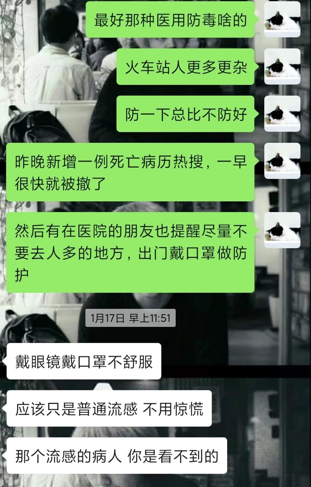

而两只小猫的事情也终于确定，虽然觉得很不好意思，但还是委托了邻居奶奶过年期间帮忙照顾。室友与我都是19号离开武汉，而室友28号就计划返回，这9天内只好麻烦奶奶两天一次给两只猫添粮添水。而我们两都考虑着奶奶年纪大了，清换猫砂太辛苦，我们俩又走的不算太久，因此备了满满两猫砂盆和一个纸箱的猫砂供两只猫使用，等我们年后回来后再清理。

离开武汉前一天18号，我约了一位朋友去省博物馆和美术馆看展，而晚上又约了另外两位朋友一起吃饭看电影。我戴上口罩出门，并且告诉他们出门也一定戴着口罩做好防护，而只有一起看展的朋友主动戴了，并且多带一只准备留给我备用。省博看展的人很多，而其中不乏像我们俩一样室内也一直戴口罩的年轻人，但绝大部分人还是毫无防护。美术馆人很少，室内又比较空旷，我们俩也逐渐放松了警惕，摘掉了口罩聊着天。

晚饭时间和另外两位朋友在商场碰面，室内几乎没有看到一个戴口罩的人，而我为了不显得异类便自我安慰着摘下了口罩。看着到处没有做任何防护的安心逛街吃饭的人群，和朋友再聊起肺炎的话题，似乎也放下了一丝警惕，想着是不是自己也有些反应过度了。

回想起来18号算是度过了很美好的一天，晚上看完电影后和朋友们互道“明年见”时还很不舍，而回出租屋的路上又为明天就要回家了而莫名生出一份欣喜。以至于晚上收拾好行李后竟然有一些失眠。

直到当晚19号零点多看到病毒肺炎新增17例的报道，我的神经又再次紧绷起来，隐隐约约感觉到事情要开始变得严重了。

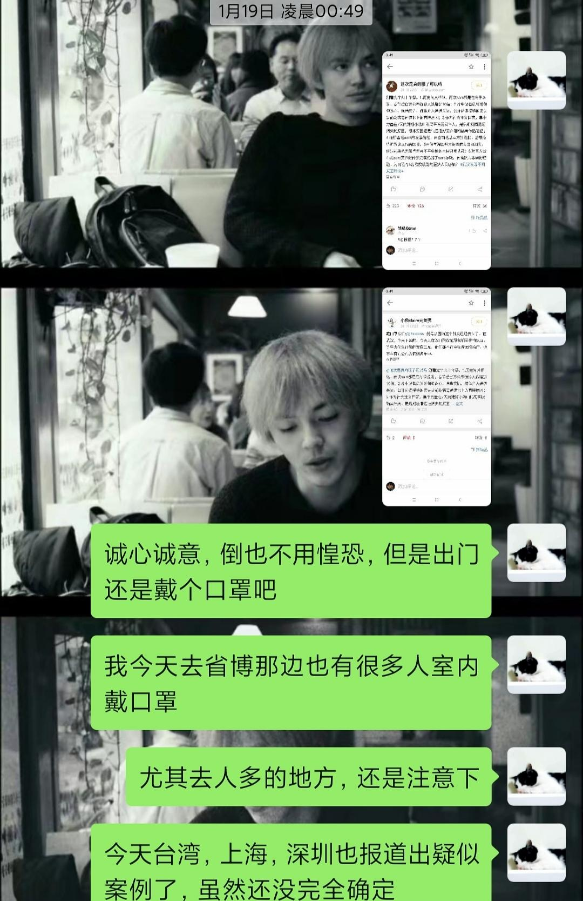

19号一早乘地铁去武汉站，出门时戴好了仅剩的一只口罩，地铁上的大多数人还是没有做任何防护，一个车厢期间只碰到三四个年轻人，和两个带小孩的家庭戴着口罩，一位妈妈还在小孩把口罩拉下露出鼻子呼吸时教育他要确保鼻子和嘴巴都被包住。

进了武汉站后，能够看到戴口罩的人就更少了，拖着行李箱走过大厅时，有注意到一些疑惑的目光看向我脸上的口罩，大概他们在想“这人真奇怪，在室内还戴什么口罩。”

上高铁后我下意识的环顾四周，只看到我的座位后面一排靠窗处的男生戴着N95，而在途中也一直没有摘下过。老实说，他的存在给了我莫大的勇气与认同感，让我感到自己不是一个人。除了喝水，吃东西，去车厢门口透风活动身体，我始终戴着那只在人群里显得格格不入的口罩，也第一次体会到原来要坚持做和大家不一样的哪怕是这么小的事情都这么困难。

而那时的我，还根本不知道一只口罩使用四小时后就会失去基本防护作用而需要更换。

四个多小时高铁到站后，走出高铁站出站口的那一刻，对于肺炎的事情终于感受到了放松。我那时想着，还好健康的离开了武汉而终于踏入一个安全的城市，真的太安心了，然后我摘下了那个使用了六小时以上的口罩扔进垃圾桶，从容地去坐地铁转大巴回家。

不曾料到，原来这才只是开始。

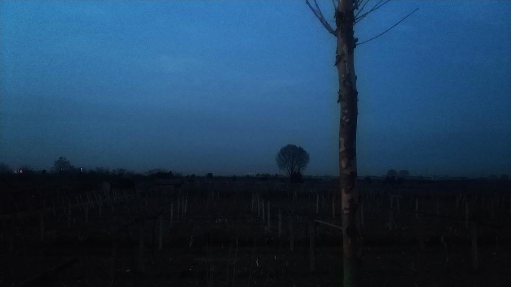

19号晚上到家后，没有口罩，衣物没有更换，更谈不上消毒杀菌，自我隔离，便与父母直接接触。当天晚上到20号上午，开始不断有新的消息出来，网上的讨论也逐渐增多。父母朋友问起，我还颇有自信地讲，自己早几天已经知道些情况，在武汉和回家的路上都有戴口罩做防护，肯定不会有问题。

回家前邻居奶奶把自己种的蟹爪兰包了一些让我带回家种，20号上午我跟妈妈清洗了花盆种好，然后我把照片发给奶奶，并提醒她在武汉注意防护。但奶奶却回复我“病毒性肺炎的流行期已经过去了”。看到奶奶的回复时，我突然觉得这句话十分可怕。奶奶是学校退休老干部，我八成可以猜到这句话是来源自某个退休干部的群通知，而发出这样一则意在安定人心的通知，则证明事情在某个我们所不知道的范围内，也许已经失控。

我又开始有些担心，担心实际情况，更担心自己及家人。

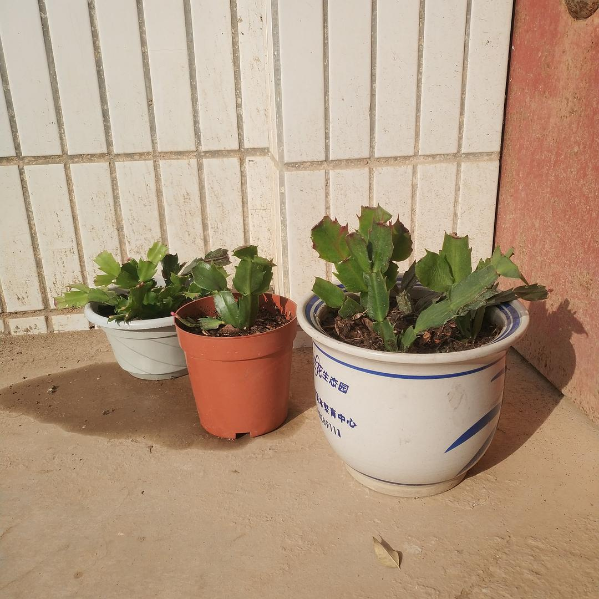

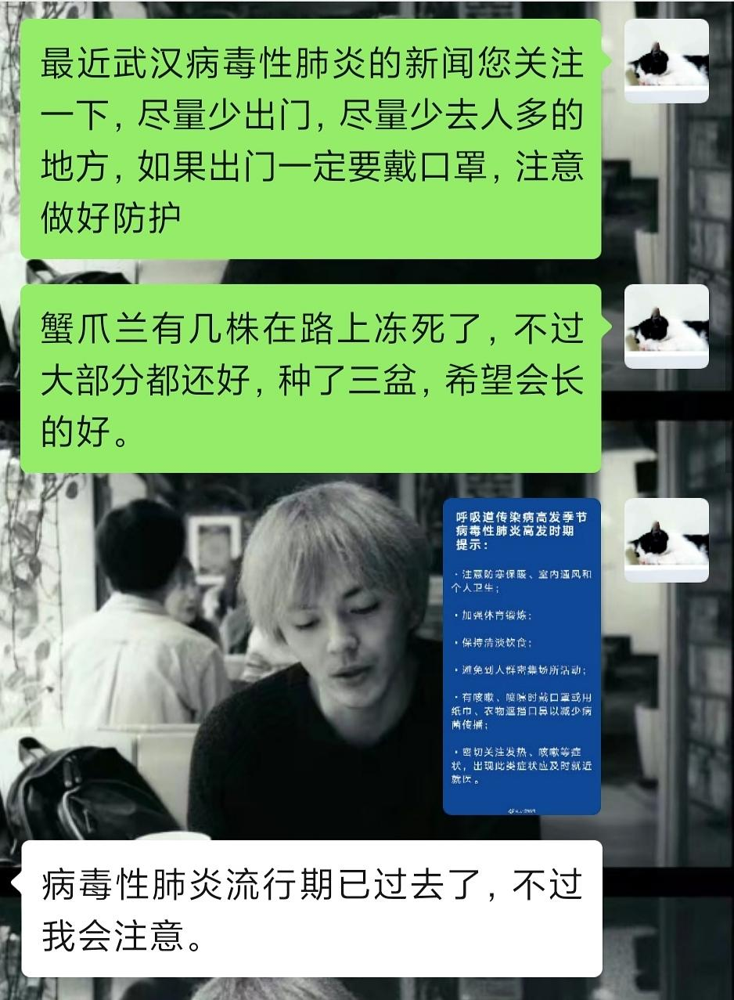

下午三点左右，姐姐带着女儿来家里，我犹豫着要不要戴上口罩，尤其是小外甥女才两岁，需要做最好的安全防护。但姐姐问了我的身体情况以及在武汉的情况后，便说应该没有事，让我放宽心。陪小外甥女玩了一下午后，我也渐渐放松下来，傍晚时分又带着刚买的茶叶礼盒，去了一趟外公家探望两位老人，并留着吃了一顿晚饭。

时间来到会被历史铭记的20号晚上，钟南山院士宣布病毒肺炎明确人传人，网络上迅速开始炸锅。冠状病毒，非典，人传人，潜伏期，口罩，发热咳嗽……这些词汇开始频繁出现在每一个人的微博首页。

回家两天，接触6位家人，其中两个老人一个小孩，这件事情开始成为我惶恐、担忧、内疚、以及焦虑情绪产生的主要来源。

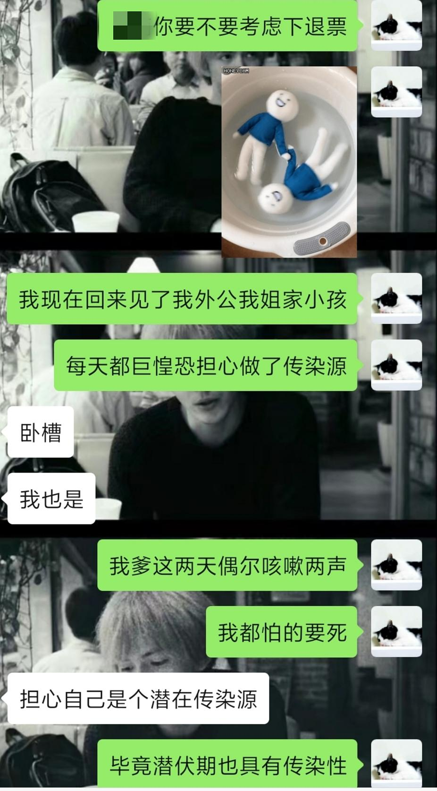

我开始频繁地翻看有关肺炎的消息，微博、豆瓣、公众号、朋友圈，口罩挑选、消毒方法、隔离手段，官方报道、小道消息、还有各种谣言，看关于事件时间线的整理，看社会人士或相关专家的评论，看武汉医疗资源紧张到各家医院陆续向社会求助，看一些个体无法确诊不被收治的苦诉，看到武汉乃至整个湖北封城，看到对政府的质疑看到对武汉及武汉人的恐惧，看到确诊病例数据的不断增加以及疫情涉及范围的不断扩大。

我的担心与惶恐逐步扩大，我没有一刻不在担心自己已经成为了感染源而不自知，我每时每刻都在关注着自己有没有发烧、咳嗽、四肢无力等症状，我担心我的家人们，担心我留在武汉的猫，担心隔壁奶奶，也担心我的朋友们和我自己。我试图让自己从关于肺炎的信息海洋中逃出来一时半刻，试图看看电影刷刷剧来稍作喘息，但我静不下来，什么都看不进去。

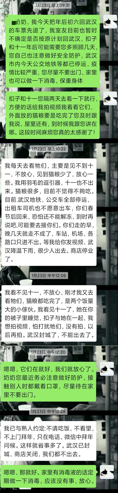

23号，回家前一起吃饭看电影的一位朋友告诉我们他出现发热已被隔离，抽血送检25号出结果，除夕夜也要独自在医院度过。他告诉我们在医院反倒异常平静，什么都不想等着结果就好。

我突然冷静下来，突然从心理上接受了焦虑惶恐都没有用，接受了冷静等待的态度，我一边安慰着朋友肯定不会有事，一边渐渐平复下来了各种焦虑。

我告诉妈妈这件事，原本认为我小题大做的她终于开始重视，毕竟我18号刚和这位朋友接触过。出门戴口罩，家里要消毒，不要聚会不要走亲戚这样的事情爸妈也开始逐渐接受认同。

我开始问候近期刚离开武汉以及尚留在武汉的朋友，问候12号离开武汉的小林，问候月初接触过的深圳的朋友，也频繁的被一些知道我在武汉的朋友问候。有时候他们在群里的调侃会让我觉得不舒服，但我我知道他们只是担心我而我自己又过于敏感。

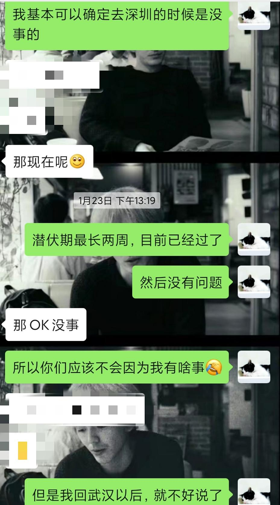

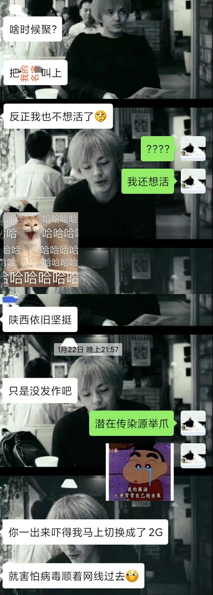

很多朋友都陆续陷入了小幅度的惶恐中，我们每天互相安慰，去消灭一些咳嗽感冒等小病状引起的焦虑，也讨论着疫情的严重与现实状况的各种糟糕。

25号，之前隔离的朋友血检出结果确认没有问题，而一天之后他的信息就在当地网络中传了个遍，连血检结果的图片都直接出现在各个群里。各地开始统计湖北返乡人员名单，室友所在的地区直接将统计的表格发出，其中电话住址身份证号等信息一个不漏。

我们担忧，我们质疑，我们愤怒，我们举报，我们最终一筹莫展。

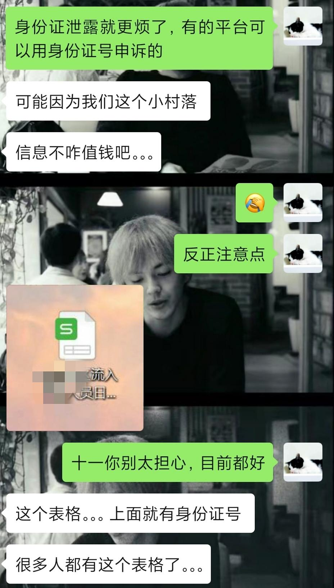

但我开始看电影了，先看了《非典十年祭》的纪录片，接着坚持每天看一部电影来打发时间并转移注意力。我每天早上起来关注关于肺炎的各种报道，但下午晚上看看电影写写短评，睡前再关注一下最新消息。我不希望自己陷入负面信息中去也不能允许自己不关注不质疑不发声。

我急切地希望着情况能够转好，然后能够在周末晴日里与好友相约再去武汉东湖绿道骑行，我们从武大凌波门出去，在绿道上哼着歌，然后遇到夕阳，遇到东湖边美好的夜晚。

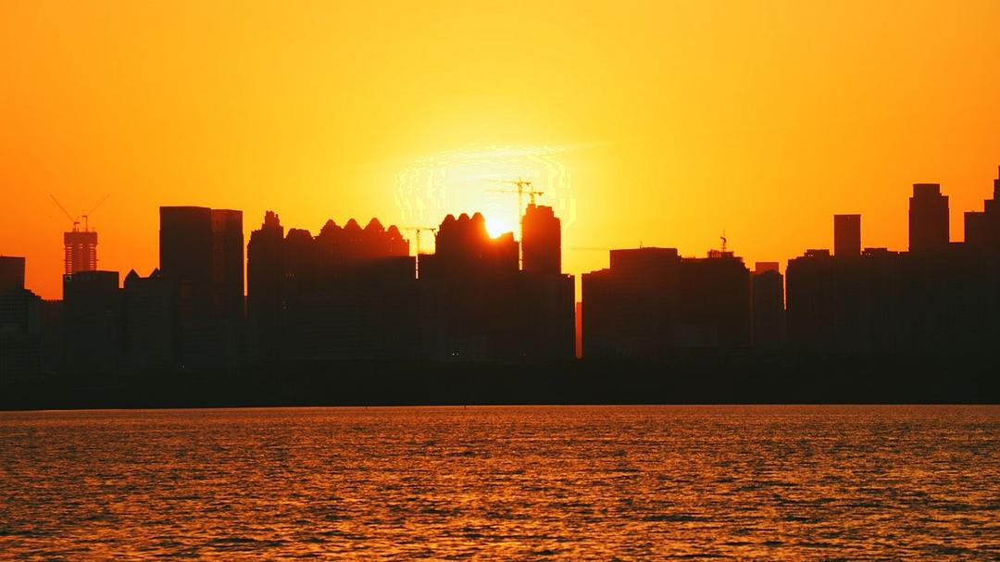

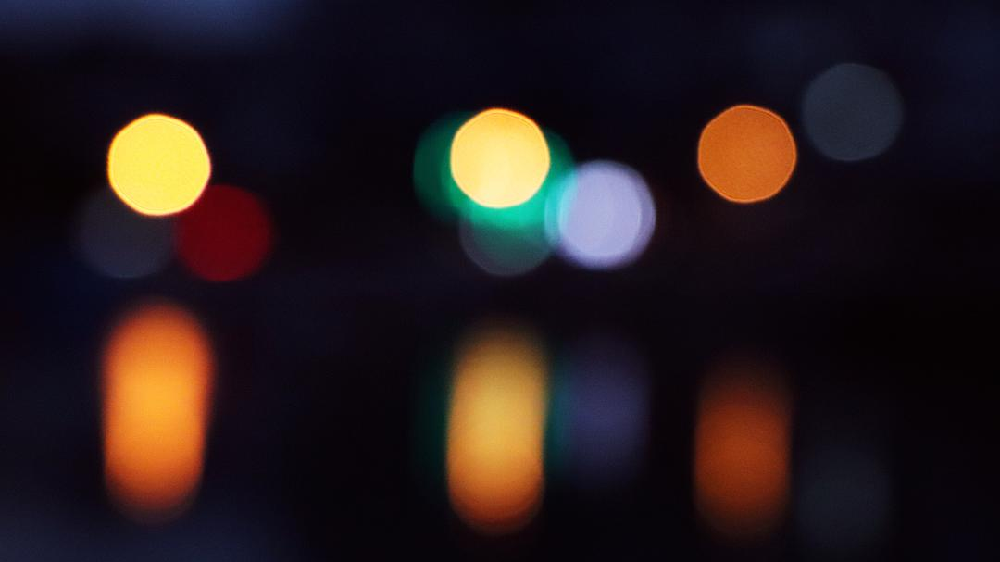

