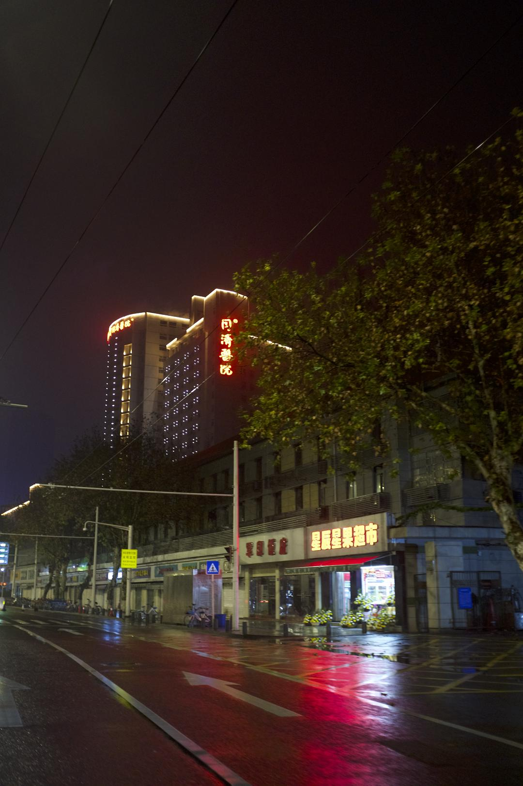

已获得作者转载授权。    
作者：[曉宇（来自豆瓣）](https://www.douban.com/people/30338291/)  
来源：https://www.douban.com/note/750228924/  

2020-01-28 13:17:13  

封城以后，唯一没有改变的，是姥姥每日清晨的遛狗。

她戴上口罩，五六点的时候出门，待到早饭，给我们新闻通报。今天又没有碰到一个人，她说。到了一月二十五日，大年初一，她说，今天我没走到桥就返回来，在桥上，红袖章的人，直晃晃地盯着我，我想，这是不让过去了吗。这一天，我们得知，封城加紧，各区隔断，江也不过去。邻居去亲人的小区，在门口被拦下。不一会，传来消息，中心城区禁止私家车。湖北的城镇，一个个封锁，沦陷。沙堆和路障出现在高速路口。有的乡镇，公路被生生挖断。

我们快要习惯这样的传播方式：先是传闻，再是辟谣，最后是证实。无法在第一时间，相信所有的传闻。它们像洪水，从早到晚，淹过头顶。庞杂，冲突，一团淤泥。我们时刻查看确诊和死亡的人数，往往隔上几个小时，等到一次更新。企业和街道在统计确诊病人的信息，职工每日上报身体状况。密切接触病人的，要仔细回忆见面的情景，十四天里记录体温。

一个消息，一个举措，拉扯出无穷问题。为什么凌晨两点通知封城？封城之后发热看病怎么去？中心城区禁行机动车，车主遵循短信通知，又是什么车禁止，什么车通行？小区安排车辆，应急和购物，谁来负责和使用？一天，在这样无效的追问里度过，像是在爬循环往复的螺旋梯。

禁行打乱了方兴未艾的自助运动。封城初始，公共交通停摆。志愿司机组成运输队，接送医护人员上下班，从城市边界接手捐献的物资，酒店为医院员工提供免费住宿，餐厅保持外卖畅通。现在，民间自助运动丢了腿，大街陷入与日俱增的静默。想要尽力的人，找不到可以施展的地方。官方说，待在家最负责任，轻症的病人也一样。

潮水般的信息询问，武汉状况怎样。没人知道，武汉人也一样。没人再敢轻易上街，没人敢轻易去医院。“当地”消失了。我们还活在这片土地上，又悬浮在空中，不着地。我们和外地人一样，要从社交媒体上，揣度真假，了解一公里外的事态。

当外界的愤怒，同情，漠然，隔空传来，本市的人们尽力把生活过出正常的样子。除夕当日，我们清点家里的余粮，统计大米和面粉，水果和蔬菜，把存货挪到冰凉的露台和地下室。起码够两周了，姥姥说。本来准备过年聚餐，亲戚都没来成，倒成了幸事。自从听说父亲工作的企业，有两百多回不去家的工人，姥姥每天在吃饭时，便念叨这些人过年的伙食。除此之外，她的心情尚好，北方老家的电话不断，多年未联系的亲戚，连她记不得的，都打来电话问候。她才相信，自己没有被忘。

家庭群内，大家分享年饭的照片，缩减了规模的饭菜。母亲说，我们的就别照了。父亲说，我们摆几个空盘子，给他们发过去。下午包饺子，姥姥说，拿两个花生来，看谁来年的运势好。我说，今年特殊，多放几个花生。姥姥说，那还有什么意思。坚持要按照往年的传统。

我和父亲自下午打赌，今晚能不能听到鞭炮。我们每隔一会，就像是怕对方忘了似的，就要再说一遍，我们看，今晚能不能听到鞭炮。母亲说，这样也好，已经很久，一家人没有在同样的空间里，待这么长时间了。电视里播放节目，大家密切地低头看手机。

讨论之后，家里决定，可以喝一点酒。母亲说，你去地下室拿酒。我换上拖鞋，走进黑暗的地下室。打开灯，灯的亮度不够，地下室仍是一片昏暗。杂七杂八的东西堆着，挪不开脚，这边是一箱白菜，那边是一捆蒜苗，我默默说，这都可以抵御核冬天了。怔地一刻，我想不起到地下室的目的。双脚焊在那里。一股奇怪的感觉从后背爬上来，我像是到错了地方，身处异地。昏暗无光，被打蔫的蔬菜和大米环绕的空间里，我意识到我们的不自由，生活在事实上的不正常。我们在坐监牢，看不见的狱吏，不择期的审判。等走到有光的台面上，生活又要恢复正常的样子。酒来了，我拿着酒走到饭桌前。家里没有为喝酒统一意见，每人开一瓶自己想喝的。

还是没能坐到春晚敲钟的时刻。

父亲一直说，开车去市里看看，不下车。趁着大年三十，人少，给车加油。家中的女性无一不反对这个想法。最终，母亲坚持要和我们一起，并对安娜说，我去监督他们两人不下车。父亲说，其实你是自己想来。往市区走，下着雨。是母亲先看见路边摆着的菊花。恐怕只是绿化的摆设，父亲说。越往市内开，路边的菊花越多，仍然亮灯的店铺是祭品和寿衣店。母亲说，这应该是湖北习俗，大年三十卖菊花。父亲说，我们说三十烧纸，很少上街买菊花。

我们转入加油站的门口，摆着整齐的一排排菊花。最中间，好像摆着一尊佛龛或是雕像。我和母亲努力地想在雨中看清，只见那佛龛缓缓地动了，抬起一把雨伞，底下蹲着守摊的人，穿羽绒服，戴着白口罩。我的冷汗直冒，车里也很沉默。父亲戴上手套和口罩，下车加油。武汉的夜，彻底失去了光。大楼黯淡，矗立高耸的黑铁盒子，冷峻寂静地杵在那里。我们回来的时候已经过了午夜，也想不起来，有没有听见鞭炮。

第二天早晨，起早，看到禁行令，武汉牌照车辆加油限制，不由觉得昨夜的行径，鬼使神差。听过姥姥的早报，我们决定去小区后的湖边绿道，透气。零星经过的路人，像是躲避动物，互相绕过。

路边冒出来许多猫狗，它们毛发整洁，不是流浪的那一群。听人说，家里主人走了，没来得及带走，自己出来寻找生计。宣布封城的凌晨两点，实际封城的早上之间，很多人匆忙出走。我们开始担心自家的狗。传言说，狗在传染这一场疾病。我们害怕它被证实，或是没有被证实之前的强制行动，让我们交出家庭成员。姥姥说，把剩的饺子都喂给它。

时间变得缓慢。封城三日，感觉过去了半个月。多余时间没被用来耕耘，我们好像进入了迟缓衰老的躯壳。武汉人失去了故乡，在汉和不在汉的人都一样。在地，打散成个体，斗室隔离，没有组织，没有集体，要借助媒介和传言，去了解方圆百里。在外的武汉人，开始全国的流亡。在祖国的土地上成为陌生人。一个城市，要为恶意隐瞒的少数人，背负长久的坏名声。湖北，武汉，中部省市不起眼的身份，成了困扰和污点。身份证，牌照，电话号码属地，一条不经意漏出的信息，诞生疏离和驱逐。

父亲说，你们公司似乎有病例了，你认识吗。我只听见母亲说了一句，不会吧。我们收到从昆明来的确认信息。为我们备年货的母亲同事，被认定疑似病例，随后确诊。她发来致歉的信息，要我们速速扔掉年货。母亲说，不要担心，这是天灾，保持心态。她转过身，自我埋怨说，防不胜防。母亲成了密切接触者，上午和下午要报告两次。我们扔掉了同事手工做的饼干和糖果。我说，这好像解释了我的感冒。母亲说，你这么说，我好像有嗓子疼。父亲说，我的四肢酸痛。安娜说，我也乏力胸闷。姥姥说，我要离你们都远一点。姥姥把做操的喇叭放在客厅，现在，也没人抱怨声音大。每个人在客厅做起健身操和拉伸。想起波兰作家卡普钦斯基，安哥拉内战，前线采访被围的游击队，在晨光中，走过无人镇，和疲惫的战士一起做健身操，朋友直起肩膀，说道，又活了一日。Another Day of Life。

  

  

  
