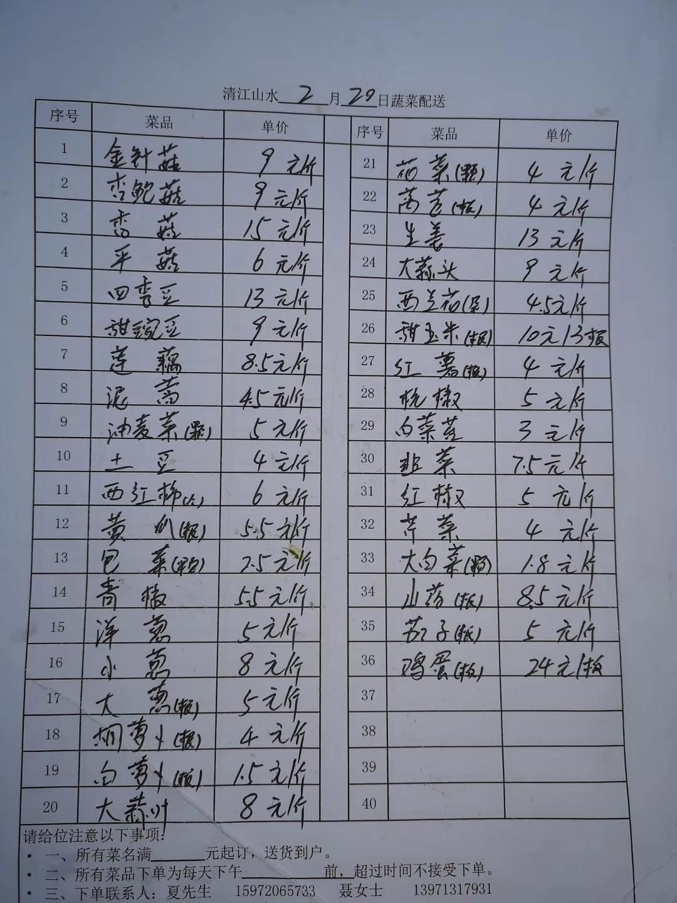

已获得作者转载授权。

作者：[小钻风（来自豆瓣）](https://www.douban.com/people/58982367/)

来源：https://www.douban.com/note/751476721/

2020-02-21 15:11:35

2月17号晚上8点物业发布了在业主群里团购接龙的链接，米乐超市购物团分成三期，每期一天，每天200户，可以购买蔬菜水果猪肉和日用品，剩下的两个商户，一个是卖菜，一个是卖面点熟食，物业谈判后的米乐菜价也达到了封城以来的又一个高峰，可以说和1月23日的价格不相上下。相比于同期的其他团购和超市的价格也高出来一大块，按每家平均300到400以上的购买价格来算，超市一天的流水大概在8到10万之间，当然他们也额外请来了十几个人捡货，但最后分发给业主这一步是由物业公司叫号，志愿者将货品提到门岗内交易的，自从政府强力封闭小区之后，清江终于有了志愿者团队。由此又多了一个维度可以参与这次的疫情之中。  

