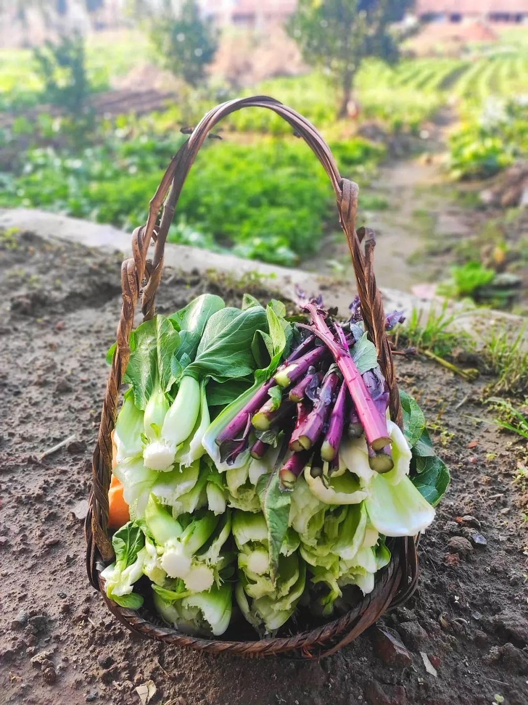
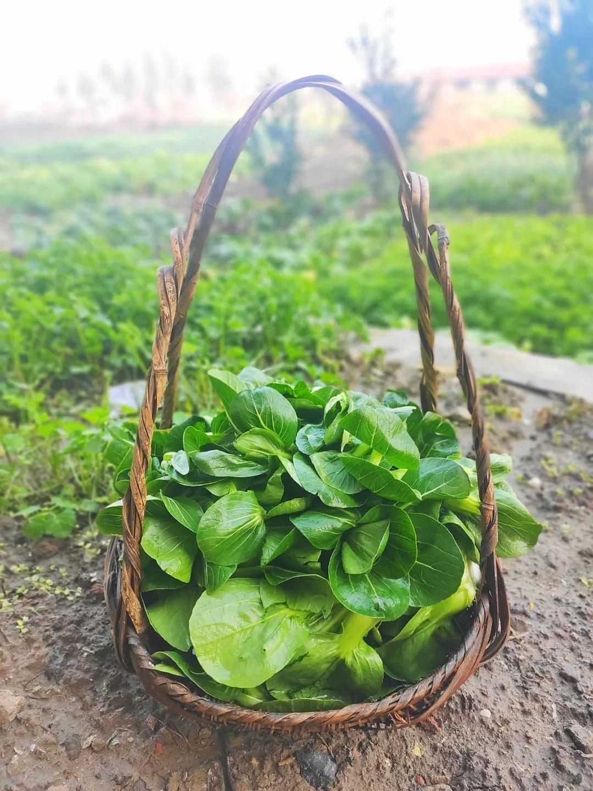

已获得作者转载授权。

作者：[邓安庆（来自豆瓣）](https://www.douban.com/people/renjiananhuo/)

来源：https://www.douban.com/note/751685600/

2020-02-23 09:26:41

说起来在老家待这么久，一直有外面的朋友问我：“你那边怎么样了？还好吗？”我回他们说：“别的我不敢说，菜是管够的。”的确，从未像今年这样吃了这么多的蔬菜：包菜、上海青、菜薹……每餐总有一样素的，另外搭配一些鱼肉。母亲总担心我吃得不好，因为我几乎没怎么吃那些荤菜。我让她不用担心，“我在外面天天吃那么大鱼大肉的，早就吃腻烦咯。还是屋里这些菜好吃。”  

母亲开始以为我是在哄她，不过看到我喝青菜汤可以连喝两碗，她就放下心来了。倒不是说在北京不吃蔬菜，只是那些菜一吃就知道不新鲜，也不好吃。母亲又笑道：“小时候你根本就不爱吃青菜，现在却每顿都要，也是蹊跷！”我喝完了最后一口汤，把碗筷放下，“有对比才有感觉，在外头吃了这么多年，再吃屋里的，就是好吃嘛。”  

疫情如此严重，大家都不能出门。唯有屋后头的菜园，无事时去转转，也算是放放风。尤其是清晨，雾气散去，上海青椭圆的叶片上露珠在微风中轻颤，虫子在菜根下爬来爬去，白萝卜拔起来时土坷垃掉落一地……心情就会莫名好很多。想想哥哥一家在城里，想吃点儿青菜，还得拿着采购物资出入证到超市排两个小时的队才能够买的到。而我们在乡下老家，想吃就去菜园摘，最新鲜，也最水灵，吃起来也最清爽。母亲其实已经准备好了很多菜想带给哥哥一家，但因为现在限制人出入，只好作罢。

蔬菜虽然好吃，但吃着吃着我担心起来，“要是菜园里的菜都吃完了，么办？毕竟咱们菜园就那么大。”母亲说：“那不会的，我们要抓紧时间吃，再不吃，你看这都要起心长老咯。再说哪怕是吃完了，也不怕，我在湖田地里还栽了两厢。”我问母亲为何栽这么多，母亲笑道：“反正种地也不值钱，不如多种点菜。现在青菜几贵哩，俺吃自家的，几撇脱，几方便。”  

之前为了照顾在市区读书的两个侄子，家人在一个小区一楼租了一间房，父母亲平常时都是住在那里。父亲无事就去公园溜达，母亲记挂着家里的几亩地，时常趁着侄子们上学时回来忙活。自那时起，母亲便在地里多种些菜，这样就不用去菜市场花钱了。菜种得好，收成也不错，母亲一大袋一大袋往城里带，不仅自家吃，也会把萝卜、青椒、青菜、南瓜等分给周遭同样来租房的邻居们。那些邻居反过来对母亲也很好。母亲哪里不舒服了，有邻居就送药来；电器坏了，前面的有人就过来帮着修；有时候还一起包饺子，母亲不会，右边的奶奶就来教母亲如何擀皮儿，如何包起来好看……这些租房的人，多是为了小孩子读书从乡村来的，所以跟母亲都谈得来。  

母亲这段生活，我没有经历过。我在北京的生活，母亲也无缘亲见。想想北京前几天还在下大雪，满目萧索，绿色无从得见。倒不如我现在留在老家，等着春天到来的好。绿色，满眼的绿色，是我最喜欢老家的地方吧。可惜每一次过年，都来去匆匆。而且几乎只要是拜年那几天，都是凄风苦雨。现在淹留在家如此长久的时间，渐渐看到春天真的来了，过不了多久油菜花也该开了。  

**（每日从菜园里摘的蔬菜）**  

