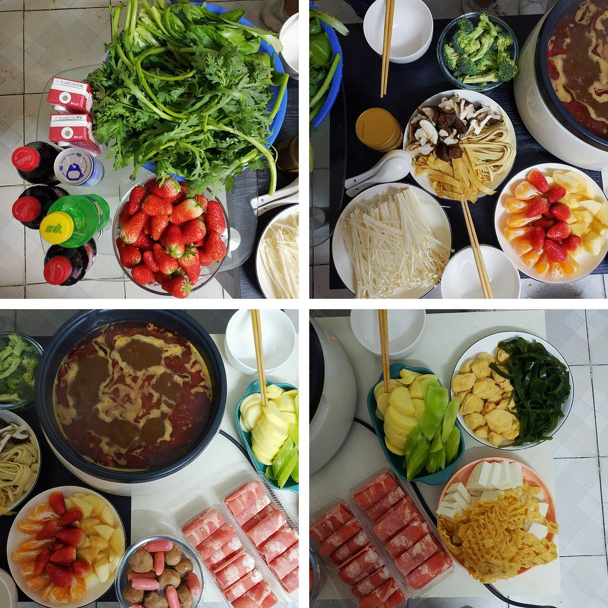
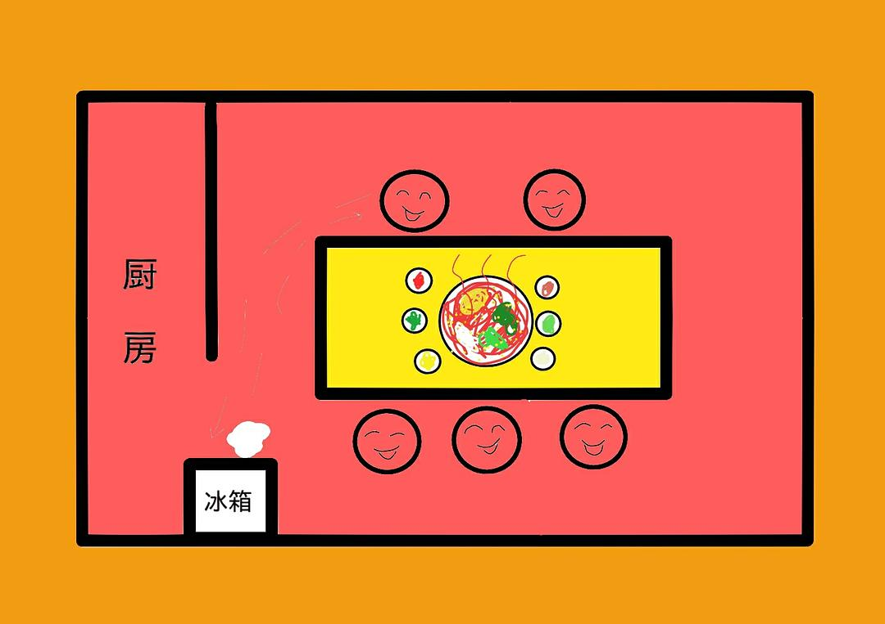

已获得作者转载授权。

作者：[kaiba（来自豆瓣）](https://www.douban.com/people/137612465/)

来源：https://www.douban.com/note/756412427/

2020-03-28 23:55:18

1.一群人在家里吃火锅，进行到后半程时，老姐去冰箱拿冰淇淋。冰箱的冷冻层太久没清理，结了很厚的冰块，于是老姐火锅也不吃了，果断去厨房抄起菜刀，然后就蹲在冰箱前开始“砰砰砰”地猛砸冰块。  

我们其余四个人先是直接看傻了，然后就开始笑，边笑还要边夹锅里烫嘴的豆腐吃。  

“砰砰砰砰砰……”  

“豆腐好烫哈哈哈……”  

“快别砸了，我要笑死了，哈哈哈……”  

“砰砰砰砰砰……”  

“砸出来给你们做草莓冰沙！”  

“疯了哈哈哈……”  

冰箱里的冰块被老姐砸成碎冰，用菜刀刮到地板上堆着，然后她又来继续吃火锅。表姐坐在离冰箱不远的位置，嗖嗖的凉意从冰块上不断传到她的裤腿里。  

“握草！我要被这个冰块冻死了！”  

我们几个人立马又笑作一团哈哈。  

想想看这个场面的人物关系也很有趣，已婚生女的老姐（火锅期间我可爱的小外甥女发过来了视频通话），单身直女的老姐同事，已出柜的表姐和她女朋友，以及跟表姐出柜但瞒着老姐的我。  

2.出门的时候忘戴口罩，刚锁了门又打开回去特意拿了戴上。  

出门打车时要扫司机车窗上贴的二维码，司机看过手机显示是绿码以后，才会打开车门锁。  

车里前后座之间被乳白色的塑料纸封挡起来，车里放着小瓶的消毒水喷壶，司机也戴着蓝色口罩，车载广播还是照样放着歌。  

这样的场景放在电影开头，不知道再过十年有人看到，会不会觉得十分无厘头？  

（持续更新吧🤔）  

