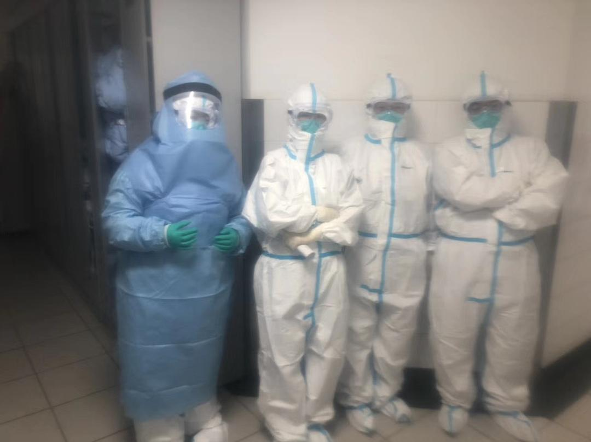
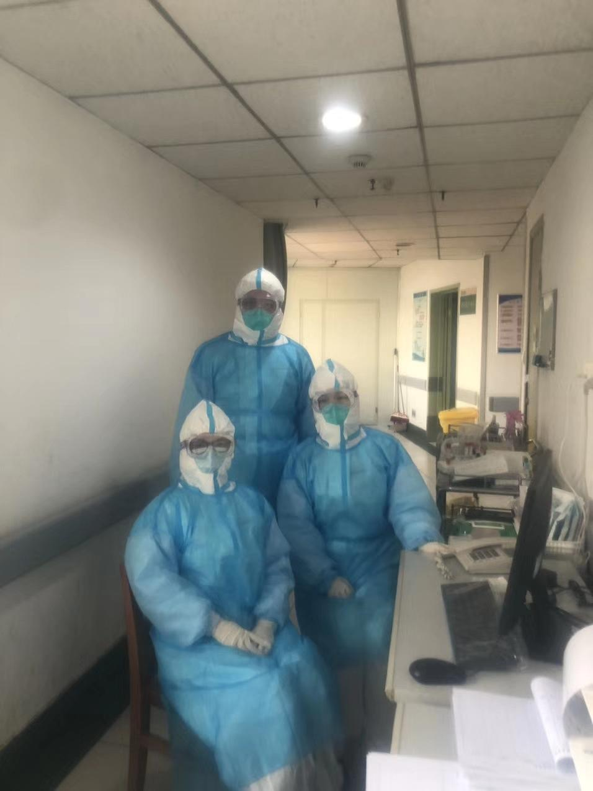
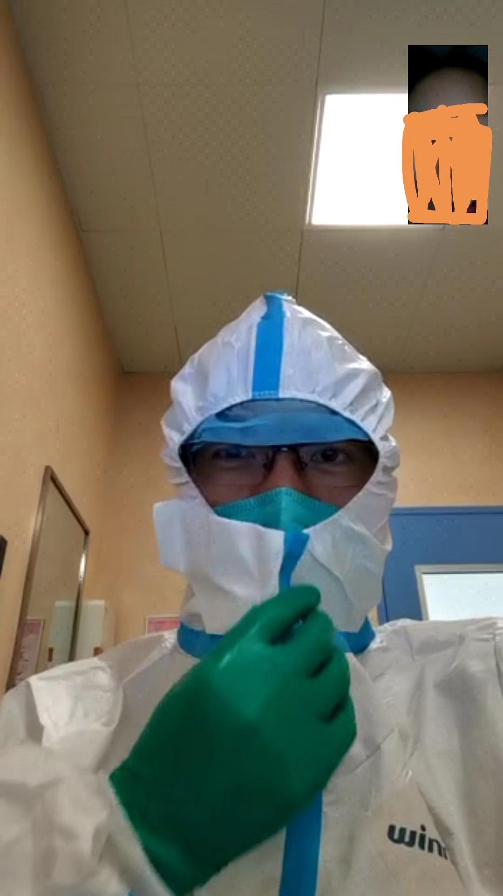

来源：[磁凝胶（来自豆瓣）](https://www.douban.com/people/2246961/)的[广播](https://www.douban.com/people/2246961/status/2772733945/)

2020-01-25_03:40:31

最近半个月朋友圈图片集锦。作为在武汉疫区最核心医院工作的人，眼看着一个个同事都去了一线。

其实医生也是普通人，也是父母的宝贝孩子，也是另一半眼中最美的她/最帅的他，也是孩子心中的顶梁柱。

其实医生也会害怕，参加发热门诊前每个人都会怕都会紧张甚至会犹豫焦虑。都是任务下来每个人不都是毫无犹豫勇往直前。因为很简单，他们不去谁去呢？

其实医生也会崩溃也有感情，即使裹着密不透风的防护服，仍然也会想着自拍。即使死亡对医生司空见惯，但面对近乎无穷的感染者他们也会崩溃。

其实何止是医生，在这场疫情里面，有无数中国人奋战在一线。武汉封城下超市的员工、警察、消防、快递和外卖小哥、环卫工人、物业、电力保障人员、铁路职工、空乘和机场人员……还有口罩防护服的生产工人、运输司机，正是这千千万万中国人保护、保卫、保障了我们所有人。

所以为什么要办春晚，为什么要搞出一堆无聊的节目，明明镜头应该对准这些坚守岗位的人啊，他们才真心值得我们祝福和歌颂。
  

  

  

  

  

  

  

  

