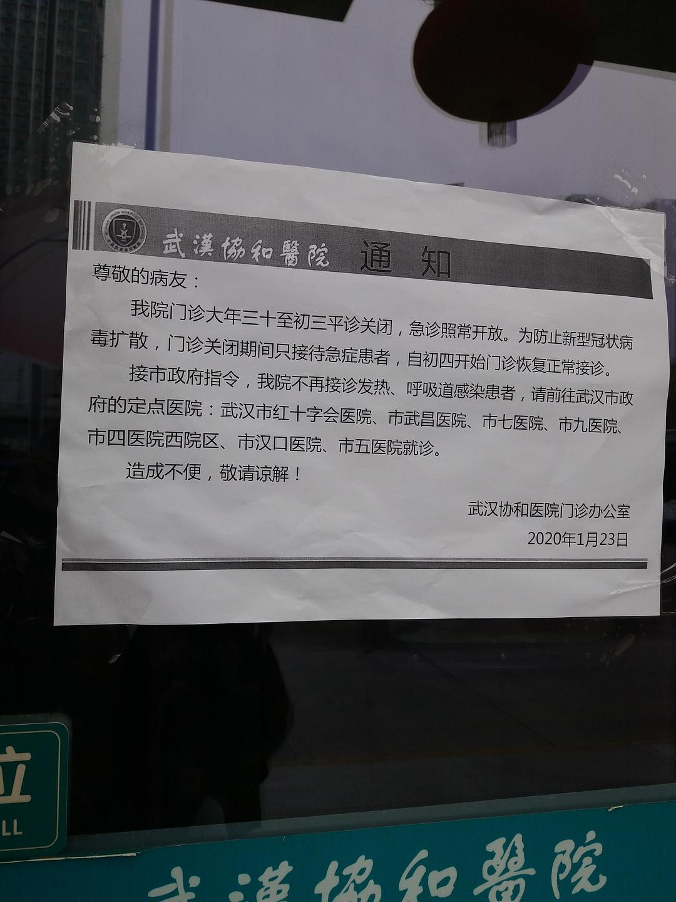
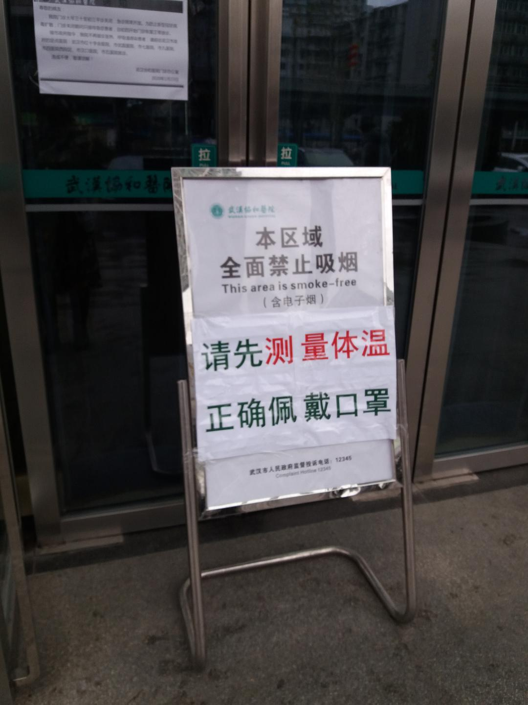
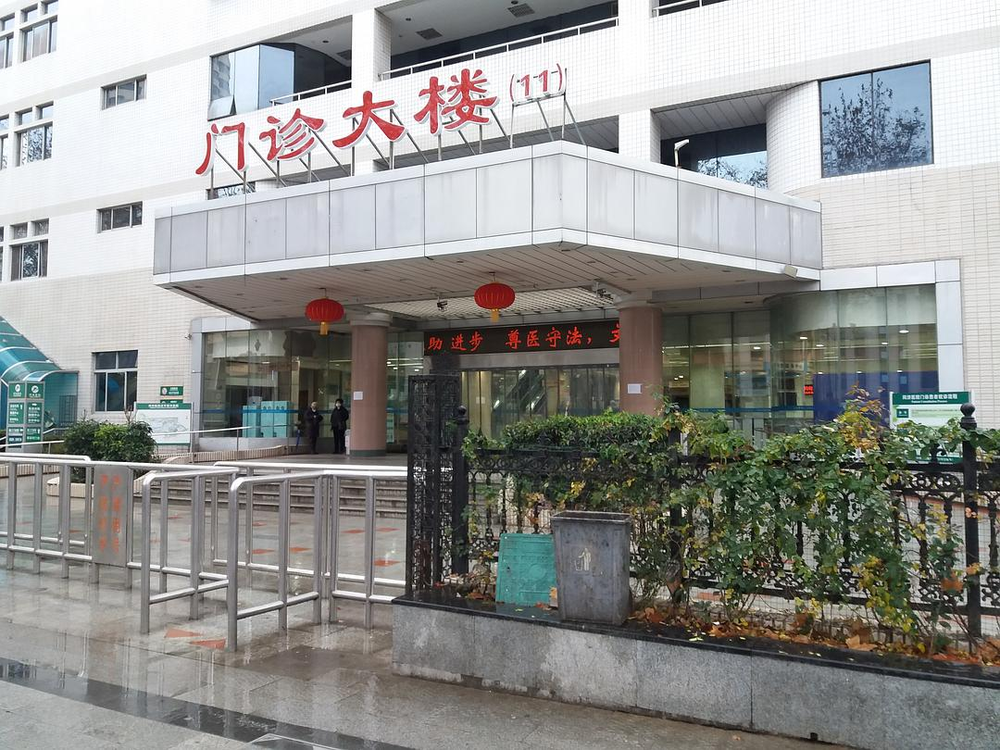
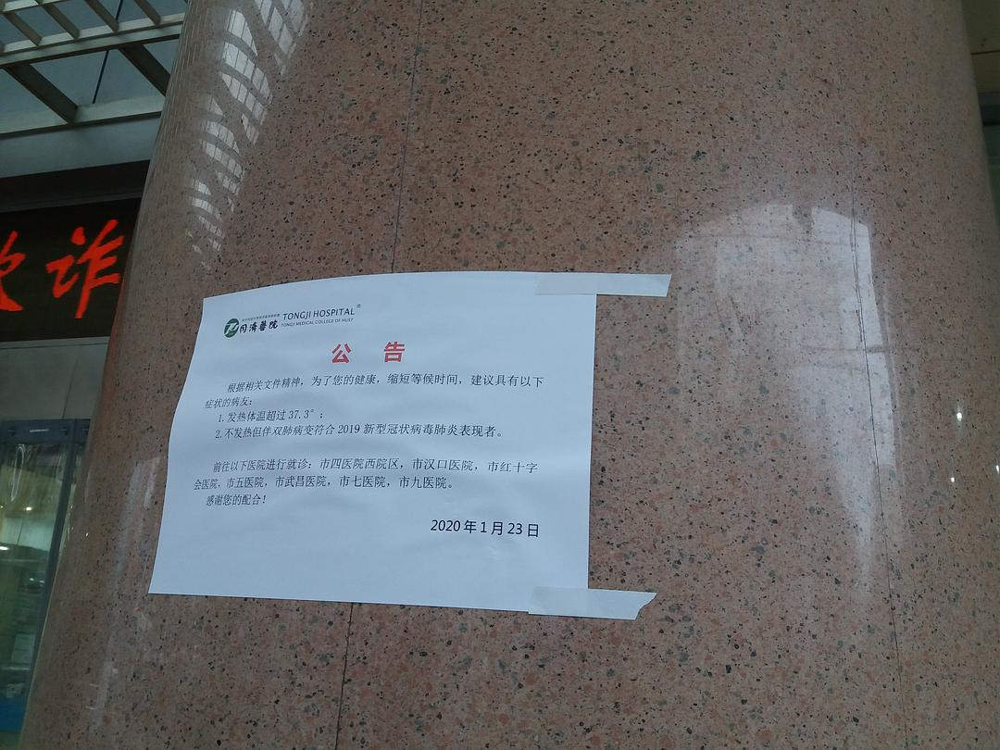

来源：[邓莹（来自豆瓣）](https://www.douban.com/people/1502959/)的[广播](https://www.douban.com/people/1502959/status/2773265067/)

2020-01-25_17:48:48

实地考察现在安全到家，路上一共2个小时，路过了亚洲心脏病医院，协和医院，同济医院，从我看见的现象似乎一切都很平静，医院门诊的人数甚至比一般过年期间都要少得多，两个小时一共看见5辆急救车往医院方向行驶，平均25分钟有一位急诊患者往同济或者协和医院送，门诊部看不见排队的现象，可能也存在大多数的感冒发烧以及肺炎疑似病例都在家中自行隔离。

同济和协和虽然是武汉最好的医院，但并不是新冠肺炎的主力医院，它们都不约而同的张贴出了公告，只接待重症或者确诊病例，对于这两家比较好的医院来说，医生和护士的主力应该都在重症病房，剩下的情况就是专业记者的工作了。

稍有遗憾的是，我们的防护工具不太专业，所以不敢进门诊大厅，对于武汉市民来说，即便是没有车坐，身体好的年轻人不妨出来走走路，怕什么就要面对什么，外面的空气很清新，很安静，听得见鸟叫，带好口罩祝你费翔
  

  

  

  

  

  

  

  

  

