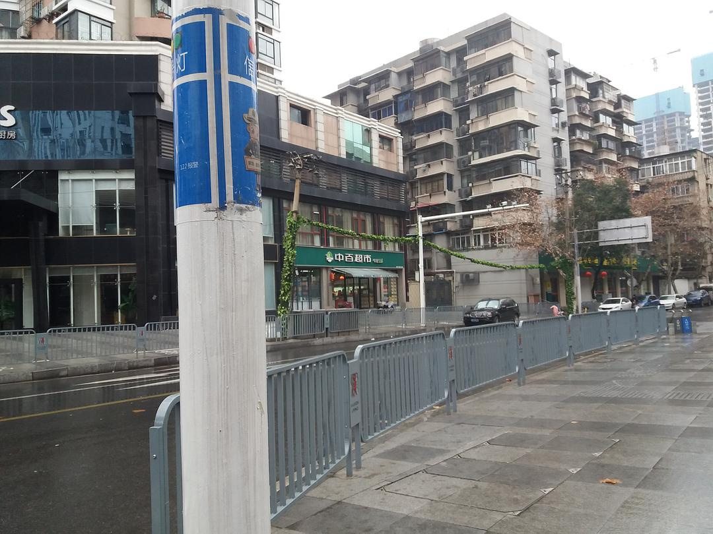
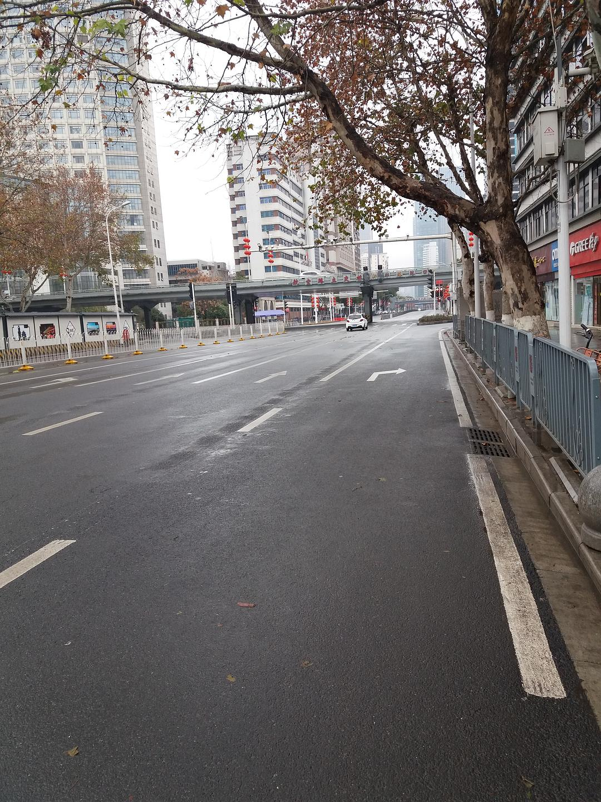
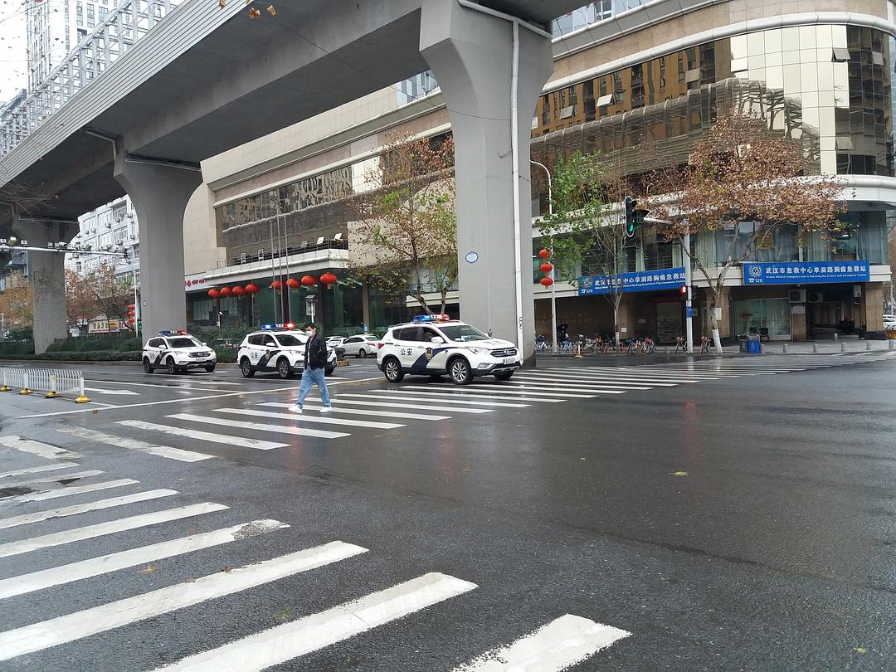

来源：[邓莹（来自豆瓣）](https://www.douban.com/people/1502959/)的[广播](https://www.douban.com/people/1502959/status/2773278440/)

2020-01-25_18:00:23

住在江汉路，新华路，航空路附近的武汉市民不用天天在家里吃泡面，一般的便民超市，水果摊，面包房都还在营业，路上人很少，城市秩序还是稳定的，可以下楼来换换口味
  

  

  

  

  

  

