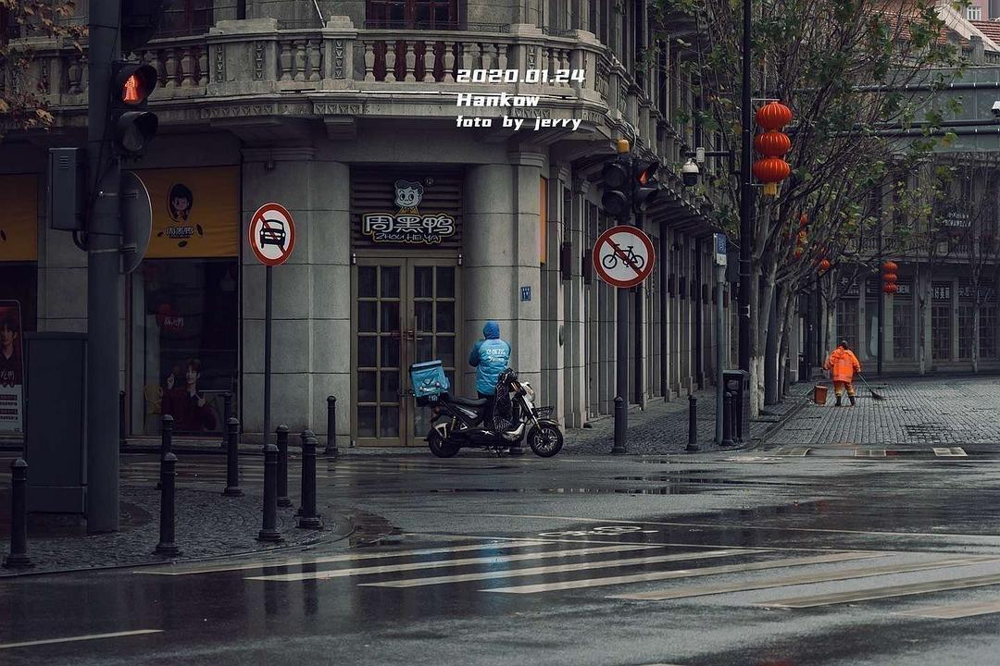
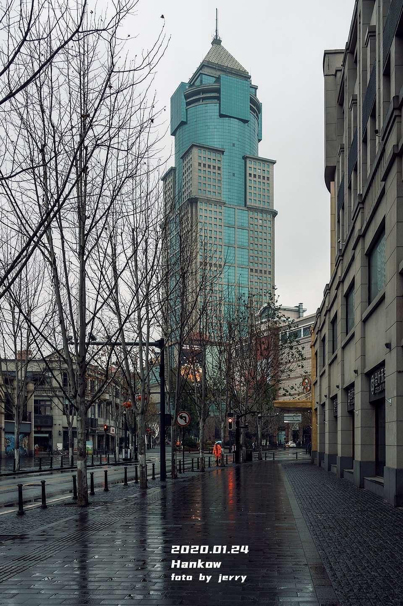
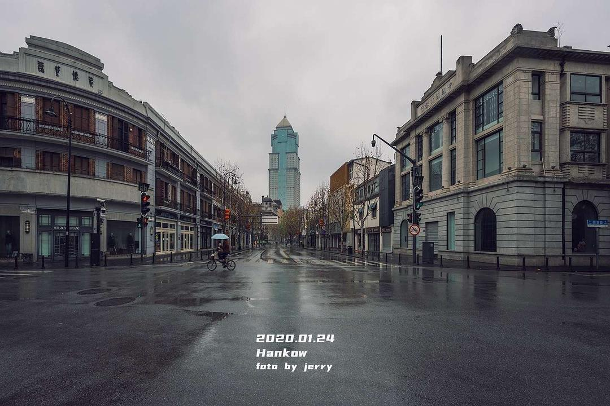

来源：[天籁💤（来自豆瓣）](https://www.douban.com/people/libramao/)的[广播](https://www.douban.com/people/libramao/)

2020-01-26_10:46:06

武汉城中扫街

图6789是中山大道江汉路步行街一带，往常人山人海的地方。

（转自武汉朋友，图源见水印）
  

  

  

  

  

  

  

  

  

