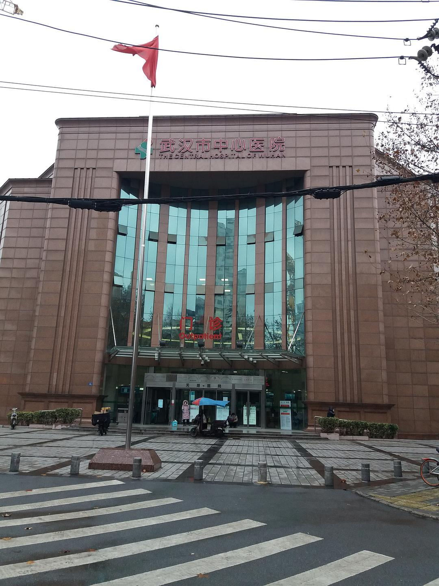
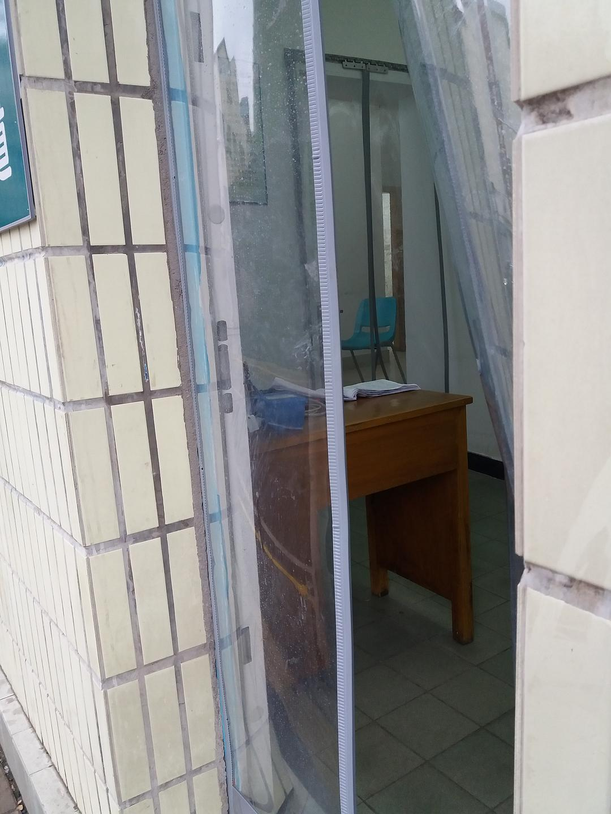
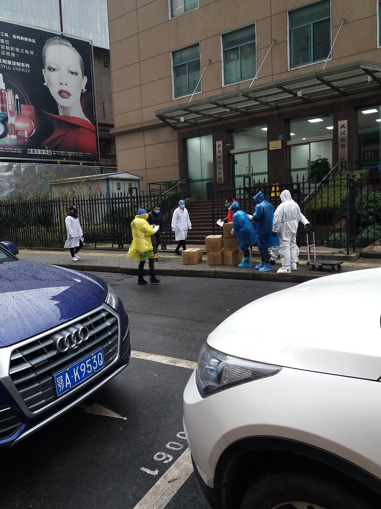
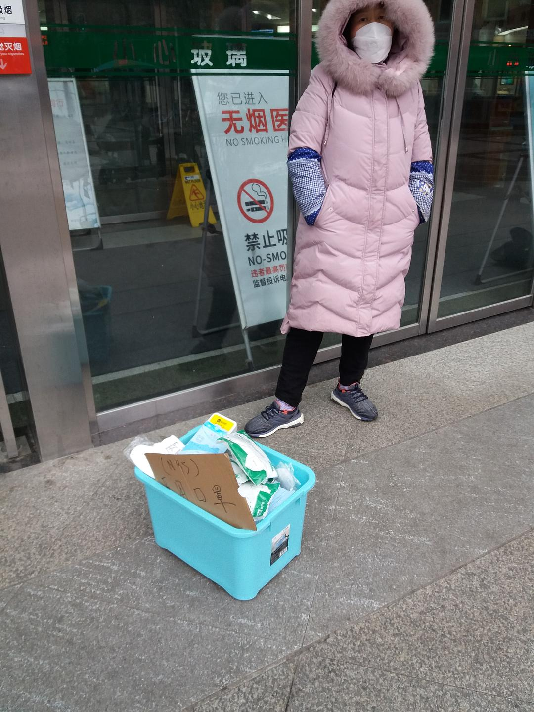

来源：[邓莹（来自豆瓣）](https://www.douban.com/people/1502959/)的[广播](https://www.douban.com/people/1502959/status/2774607750/)

2020-01-26_18:01:51

今天又出克晃了一个小时，人生来就是自由的，不出去晃心里就会发慌。今天我们穿过江汉路的步行街，来到位于南京路的武汉市中心医院，中心医院也是武汉市指定的发热门诊之一，医院附近的药房关门了，有人在敲打药房的橱窗，买不到他需要的药材，医院门口有一位嫂子装了一篮子的口罩在卖，这是叫人敢买还是不敢买呢？这比较讽刺，一边是医生在抱怨医药物资不够，一边是来路不明的口罩在医院门口叫卖。和昨天一样，医院的外观整洁，平静，几个流浪汉在侧门外面的走廊过道内和环卫工人聊着天。医院侧门专开的发热门诊都空无一人，既看不见病人，也看不见医生，但是在医院门诊内部的走廊上，可以看见很多人，还有穿防护服的医生。再次抱歉，我们的装备不够专业，不能够近距离拍摄，离开医院，往江汉路方向，几个医生和穿着雨衣的人正在拍照留影，走近一看，才知道是物资到了，医生们都很高兴。拿相机的运货员说，电话一打就想要，哪有勒快咧!

回到步行街，一群城管工作人员正聚在一起誇天，不时发出爽朗的笑声，几个环卫工人聚在一起讨论前几天的见闻，隐约可以听见“黑死人”“瞎叫”“现在克医院当护工是要钱不要命”。。。。。

街上的人比昨天要多，有拍照的，有遛狗的，有抱着一箱箱方便面的，有个流浪汉蜷缩在新世界百货的台阶上，现在餐饮都关门了，可能他们的饮食也没有来源。

网上还是不断传出需要确诊和住院的诉求，可能现在的三甲医院存在拒收病人的情况，图片中那位要救老公的妻子说，自行隔离不应该变成“见死不救”。我想的话，可能是直到现在医院对重症患者并没有太好的治疗方案。实际存在的病人，肯定比我们通过医院的外观看到的要多。

情况就是勒个情况，很平静又很严峻，但是人不应该活在恐惧里，更不应该让恐惧主宰你的内心。你行的，你很强大!
  

  

  

  

  

  

  

  

  

