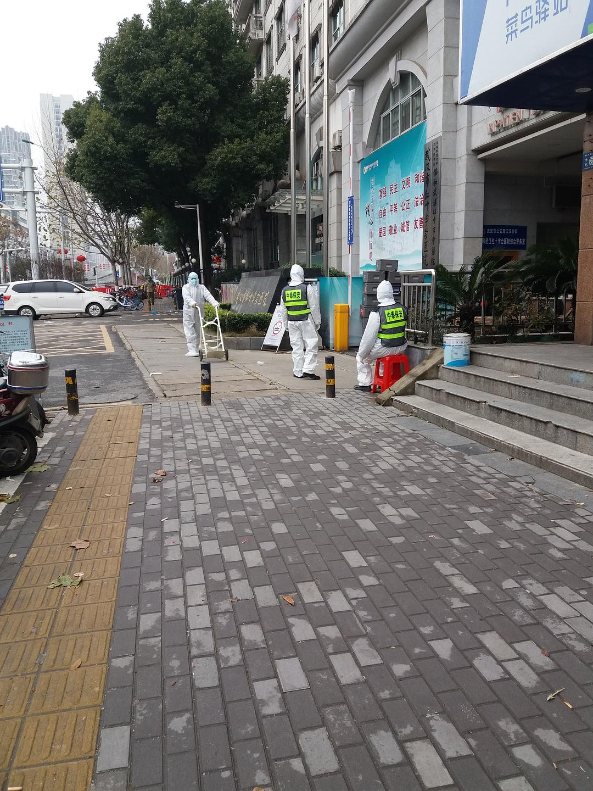
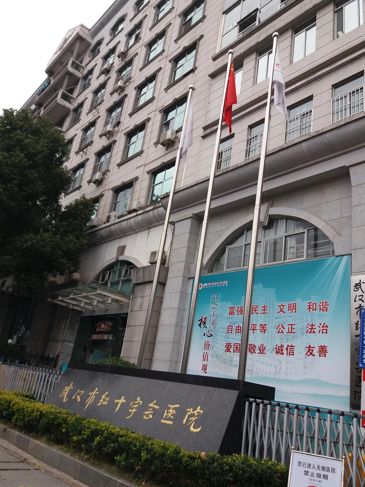
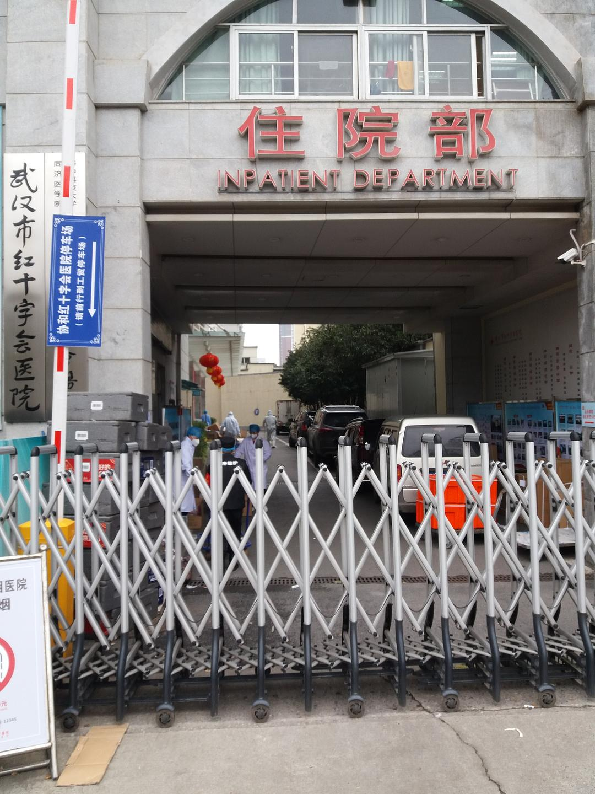
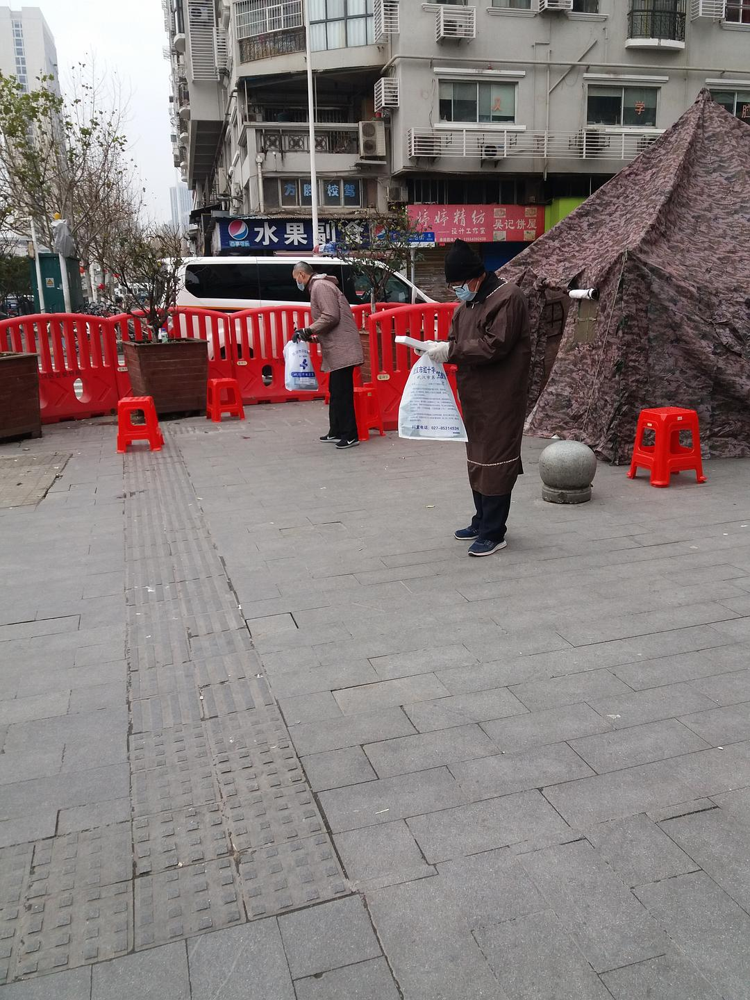

来源：[邓莹（来自豆瓣）](https://www.douban.com/people/1502959/)的[广播](https://www.douban.com/people/1502959/status/2776174729/)

2020-01-27_18:37:03

1月27日散步游记三：走到一片开阔地，我们都把口罩解了下来，欢喜陀还忙里偷闲的抽了一根烟，他说：武汉还是很好的，至少还没有发展成像广东精英要求的那样，由军方来组织社会秩序，否则把口罩打开抽烟，估计要被他们打得头破血流。

继续向前，路上的急救车数量多起来了，我们今天一共来去4个小时，路上至少看见8辆急救车，平均半小时一趟，也不知道是从哪个宿舍，哪个社区送过来的，终于，前面车辆突然变得拥挤起来，看见两个穿着防护服的保安在运送垃圾，垃圾车装得非常满，路上还一路掉下医用垃圾，医护人员围着垃圾车运送。我抬头一看，到了武汉红十字会医院，这家医院的普通门诊停了，全部用于治疗体温高于37.3度的发热病人，是这次疫情的主力医院，也是重灾区，医生，保安全都穿着防护服，非常繁忙，门口的垃圾多得无法及时清倒，有的用垃圾袋装着放在门口，有的散落在地上，急诊室门口排列着氧气瓶和吊瓶，咳嗽的人，排队看病的人，还有在医院门口着急打电话的人，空气中仿佛都有病毒的味道。。。。门诊全部变成了急诊室，电子显示屏上用红色字体提示：“发热患者定点诊疗医院”，门口专门设有两个临时帐篷，有一个医护人员看守，估计是忙的时候用来临时安放病人或者家属的，门诊大厅人非常多，门口挤满了车辆，这是第一次我在露天远离人群的情况下不敢脱口罩

站在医院对面的空旷地，一个拾荒的疯子笑嘻嘻的向我走过来，不时的还用手指指向医院的方向，发出呵呵呵的笑声，这能怪谁呢？诚如武汉市的市长所言，人民不理解我，上报需要走流程。
  

  

  

  

  

  

  

  

  

