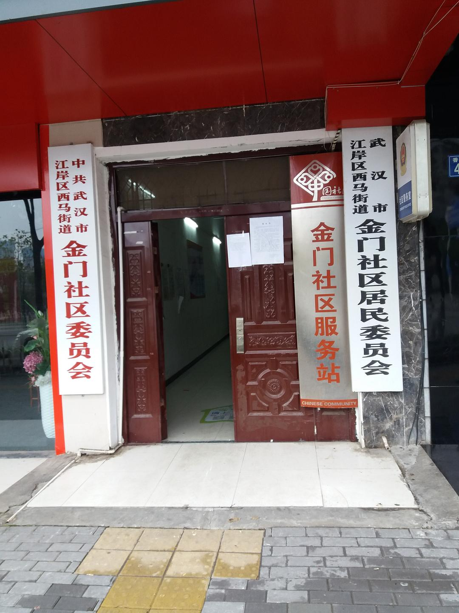

来源：[邓莹（来自豆瓣）](https://www.douban.com/people/1502959/)的[广播](https://www.douban.com/people/1502959/status/2776294705/)

2020-01-27_19:57:38

1月27日散步游记二：现在武汉的情况是，发热病人的初诊由社区负责进行统计和报送。我从黎黄陂路出来，途经车站路，球场街，往苗栗路方向步行，看见辅仁社区，车站街社区，球场北社区，西马街金门社区，也同样是空空如也，这和网络上反馈的江岸区很多病患无法得到社区排号机会形成鲜明对比。尤其是球场北社区的卫生服务中心，里面的铁门已经锁上了，我走进去，外面一个老头在对我喊：里面没人!里面没人!分别用武汉话和普通话各说了一遍。

在路上补充了新的口罩，一个男人骑着自行车正在跟他的家人打电话，说，亲爱的，买到了莲花清瘟，板蓝根，口罩，不过现在N95卖的蛮黑啊，要25块一个。。。。然后他听了一下话筒，突然勃然大怒：这是什么时候了?你还要我积分!积你妈的分!

我还能怎么办呢？我只好两眼望天了，装作冒听见滴。

再往前走，我们就到了武汉市六医院，门口贴有六个大字：暂停普通门诊。顺着六医院的正门左手边走，可以看到发热门诊，外面有部分人在排队，医护人员穿着防护服，有些护士从侧门出来，可能是去吃饭，我走上前，谨记美国战地记者的忠告，拿着手机在人群中闪转腾挪，心里一直在反复背诵：只要没有肢体接触，我就是安全的!题外话，美国记者还说了一段令中国人无法直视的话：口罩没有多大用处，手套才是最重要的。

发热门诊的窗口上贴着一个告示，只接受体温低于37.3度的患者。走出六医院，一对年轻夫妻在自行车道上吵架，男的说，如果确诊了怎么办？女的说，确诊了就不来了吗？你还是个人吗？
  

  

  

  

  

  

  

  

  

