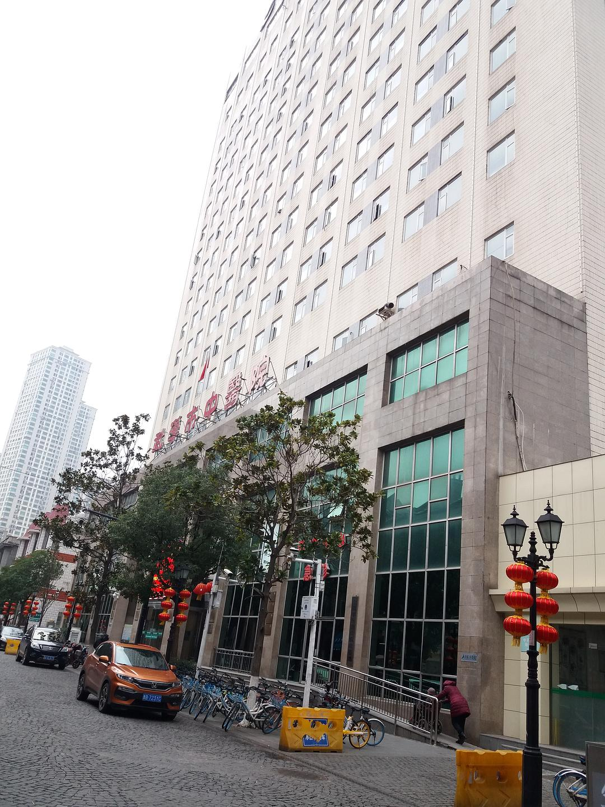

来源：[邓莹（来自豆瓣）](https://www.douban.com/people/1502959/)的[广播](https://www.douban.com/people/1502959/status/2776307709/)

2020-01-27_20:05:38

1月27日散步游记一：今天我们从江汉路穿过吉庆街，先来到了黎黄陂路的武汉市中医院，整体情况和前两天看到的情况类似，比较特别的是，他们的发热门诊看起来就像一个桑拿房，笼罩在绵绵不断的蒸汽之中。今天的武汉人，搞不清楚武汉的状况，就像我们在发热门诊之外，无法透过这团迷雾看到真相。一个医生看我往发热门诊的门口走，机警的连退三步，师父，你怎么了？滚开，劳资中了五毒!

从吉庆街到黎黄陂路有很多武汉美食，这家吉庆街上的牛骨头我经常吃，味道好，除了老板总是放央视新闻看得让我毛焦火辣之外，没有什么缺点，牛骨头还可以做火锅，味道好极了。郑记牛肉面是三十年的老店，他的牛肉是甜辣味的，也很好吃，我十月份在这里第一次听到了武汉人一人一口痰可以淹没某港，现在终于成真了，今天的武汉人可不可以理解某港的心情?
  

  

  

  

  

  

  

  

  

