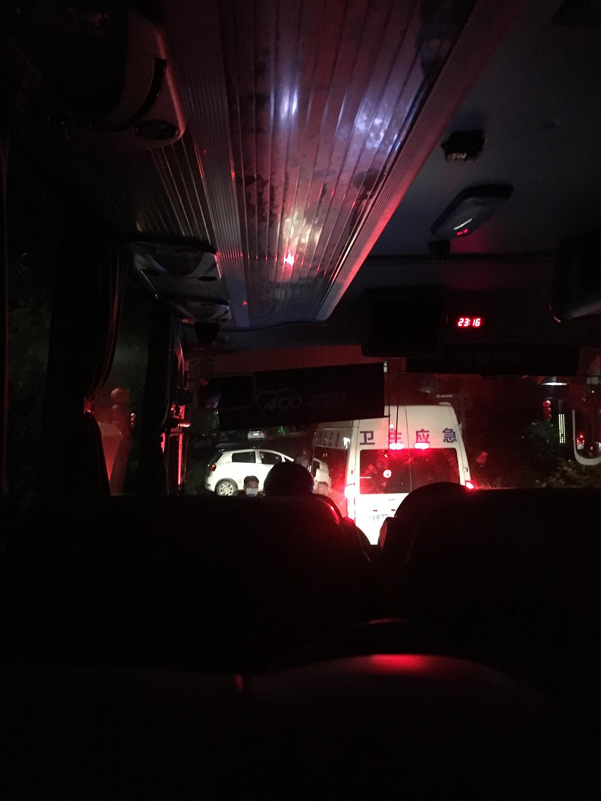
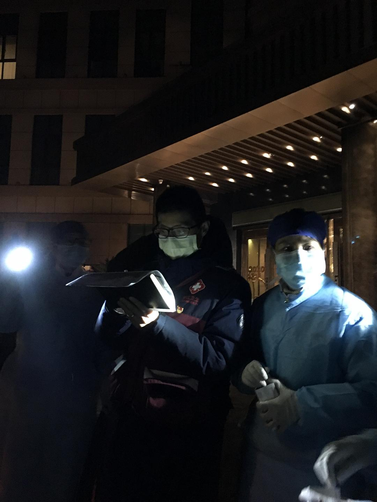

来源：[陈维佳（来自豆瓣）](https://www.douban.com/people/58149581/)的[广播](https://www.douban.com/people/58149581/status/2776891617/)

2020-01-28_01:38:29

22日回杭州的高铁上同一个车厢有一人确认感染，于是今天我被强制隔离了，杭州市疾病控制中心晚11点半把我用旅游大巴拉到了富阳的一个酒店，下车的时候很多医护人员戴着口罩站着大手电筒拍我们并记录单人间号码，每人一只温度计，酒店是标间，只能一人一间，不能出门，于是我要在这里孤独地被软禁10来天了，明天播报一下吃食，有兴趣的记得收看.....
  

  

  

  

