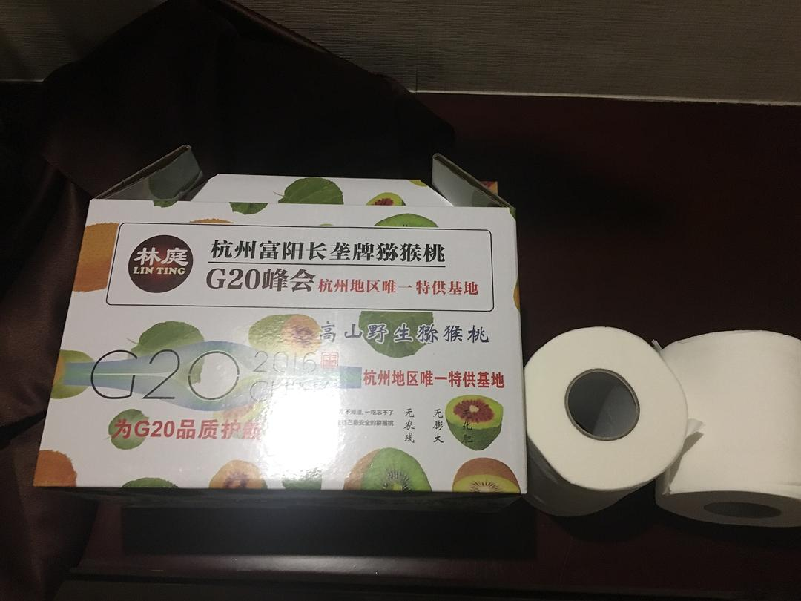
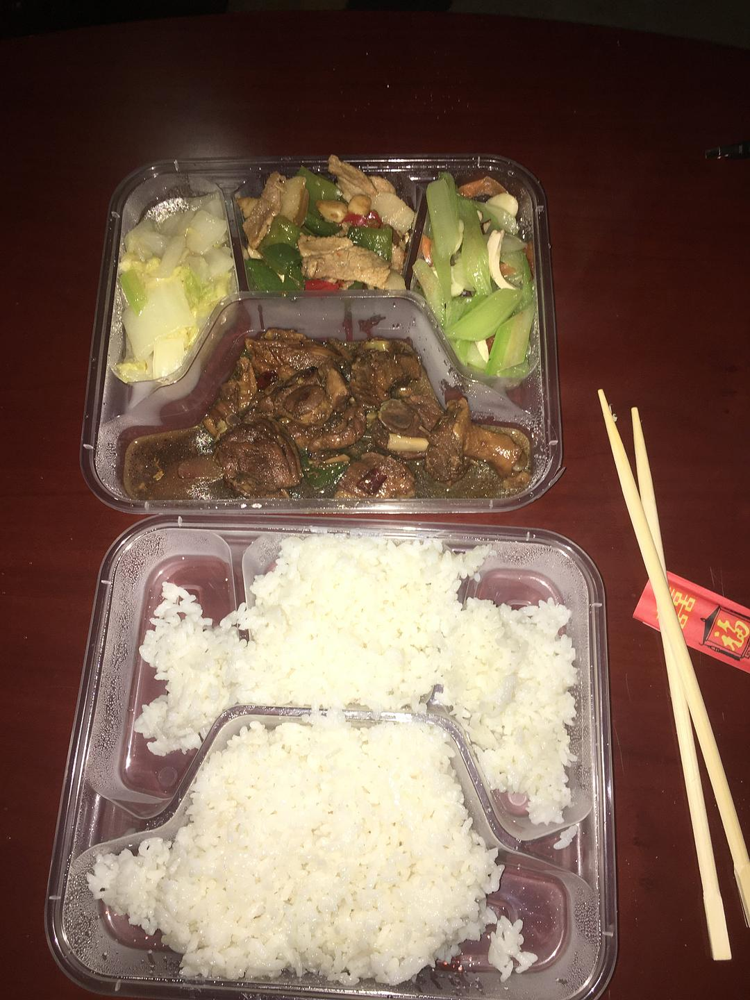
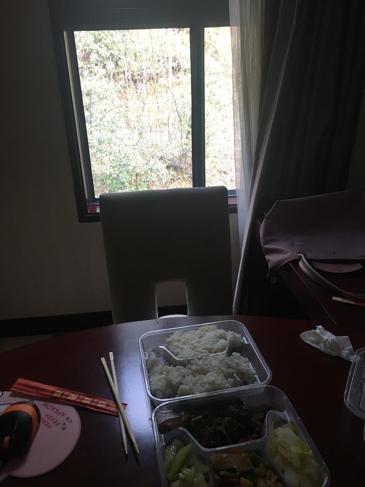
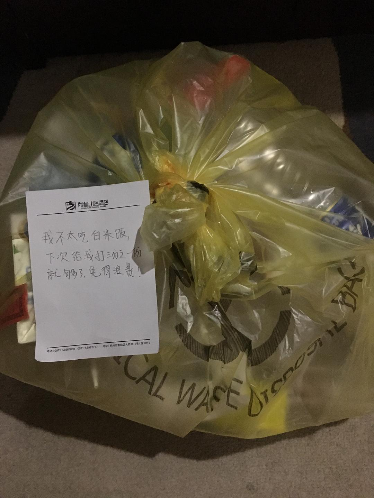

来源：[陈维佳（来自豆瓣）](https://www.douban.com/people/58149581/)的[广播](https://www.douban.com/people/58149581/status/2780190536/)

2020-01-30_00:23:37

记录：被集中隔离的第二天。昨天头痛欲裂的睡着了，今早带着微弱的余痛醒来。8点钟穿着防护服的医护人员送来早餐，为避免交叉感染我让他放到了地上，惊喜的发现了一箱猕猴桃，可能是因为这里有孩子的家长反映孩子营养跟不上吧。于是蒙头继续睡。上午依旧和昨天一样，不断的被电话和隔壁电话的铃声惊醒然后又睡去。到了11点终于下决心起床，感觉浑身酸痛，于是跟着视频做了下健身操终于恢复正常，头也不痛了。整个下午都在电脑里整理资料图片，做创作草图，看了两场周杰伦的演唱会。我觉得人是需要狂欢的，我们都需要表现自我获得真实的存在感，狂欢的代入感帮我们实现了这些，让我们暂时遗忘了停顿、空洞带来的压力。今天外面阳光很好，我特别想去晒一晒，无奈阳光如何也照不进房间。我所有的生活垃圾都被装进了医疗垃圾袋里。晚饭奇迹般的送来了帝王蟹蟹腿，虽然肉质不太新鲜，但是也是我第一次吃帝王蟹了，没有想到以这种方式吃到，命运真的难以捉摸。
  

  

  

  

  

  

  

