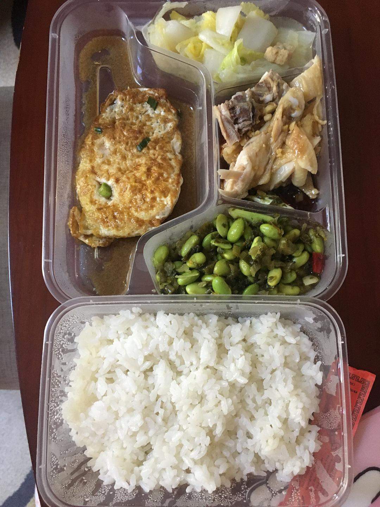

来源：[陈维佳（来自豆瓣）](https://www.douban.com/people/58149581/)的[广播](https://www.douban.com/people/58149581/status/2785729285/)

2020-02-02_00:41:24

记录：被集中隔离的第5天。今天是个混沌的一天，从早上起床就发现视力突然变模糊了？可能是因为终日拉上遮光窗帘，盯着显示屏。所以明天要恢复正常一点了。/昨天有人打来电话，说自己是心理咨询师，问：“你是否接受现在这个境况？”我回答：“是”，然后他就把电话挂了。原来这个就叫心理咨询。/今天发现了一张专辑，是XXXTentacion的《？》，歌曲让人特别入迷，沉浸在一种悲伤的漩涡里无法自拔的感觉，并且是用最简单的旋律。导致我一整天加剧了沉迷感。/后来在哔哩上看了Netflix《街头美食》，都是生活极其不幸的人靠着研究做小吃支撑起了整个家庭。/我妈说他的同事告诉他认识的一对老夫妻70来岁开始相继10天去世了，在12月底大家连这个病毒都不允许发布消息的时候，所以他们也并不在确诊人数里，更不在死亡人数里。这些人的数据我们可能永远都不会知道了。
  

  

  

  

  

