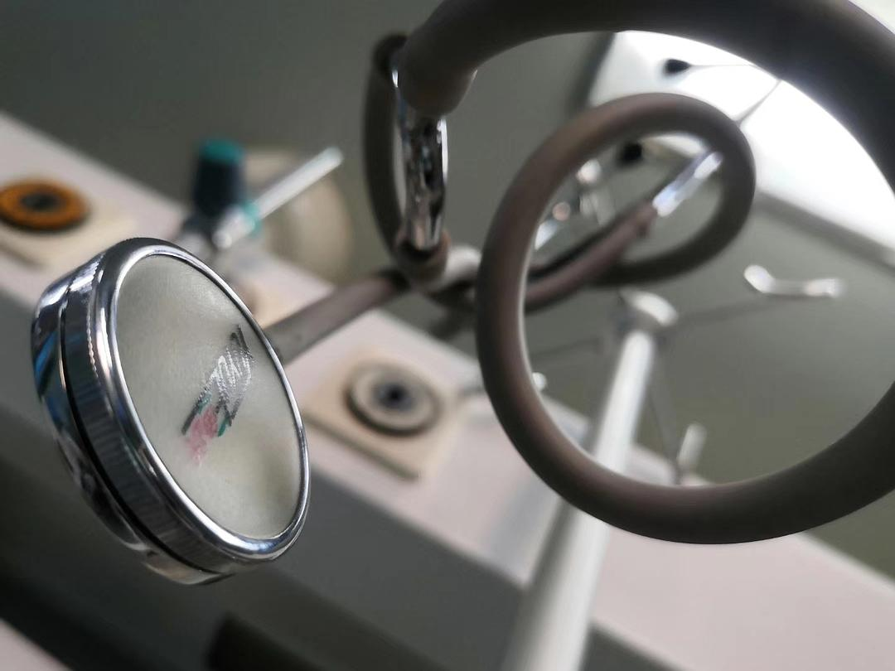

来源：[二手时间（来自豆瓣）](https://www.douban.com/people/198700809/)的[广播](https://www.douban.com/people/198700809/status/2787170806/)

2020-02-02_21:23:27

我是山西省首例确诊新冠肺炎，已经出院了。
在医院里住了一周多，每天都在想一些，做一些能做的事情，想要每天记录一些事情，想法，人，话。
其实并没有准备好要发出来一些什么，只是把已经经历的东西一点一点的整理一下，留作纪念吧。

我的一百二十分之一
在负压隔离病房，除了独立卫生间的门，通向缓冲间，通向走廊的门不允许我出去，唯一的窗户也贴满了窗户纸，只有光，没有景。
从我转进这个密闭的病房开始我的心情就一天比一天糟糕，我知道我现在拥有的医疗条件是湖北疫区的很多倍，但是自己在这个环境还是想要更好一点点，最起码有个窗户。
除当天负责我的护士姐姐之外，在隔离区的其他护士姐姐是不被允许进入我的隔离病房的，但是所有的护士姐姐都会用心照顾我，毕竟当时山西的确诊病例还没有现在这么多，隔离也就几个人，还有的是疑似。
一个护士姐姐在窗户外面为了能看到我，为了我能看到外面一点点的高楼，在窗户纸上划了一个小口，撕了正方形的小缺口，这样她就可以不进门就看到我的状态，我也可以通过这个小窗口看看走廊里的那两盆花，和对面的高楼。
这个小正方形是整扇窗户的一百二十分之一。
是我的一百二十分之一，是我昏暗的心情里直接照亮的我的那一束光。

“姐姐你在干什么啊”
“我在破坏公物！”
  

  

  

  

