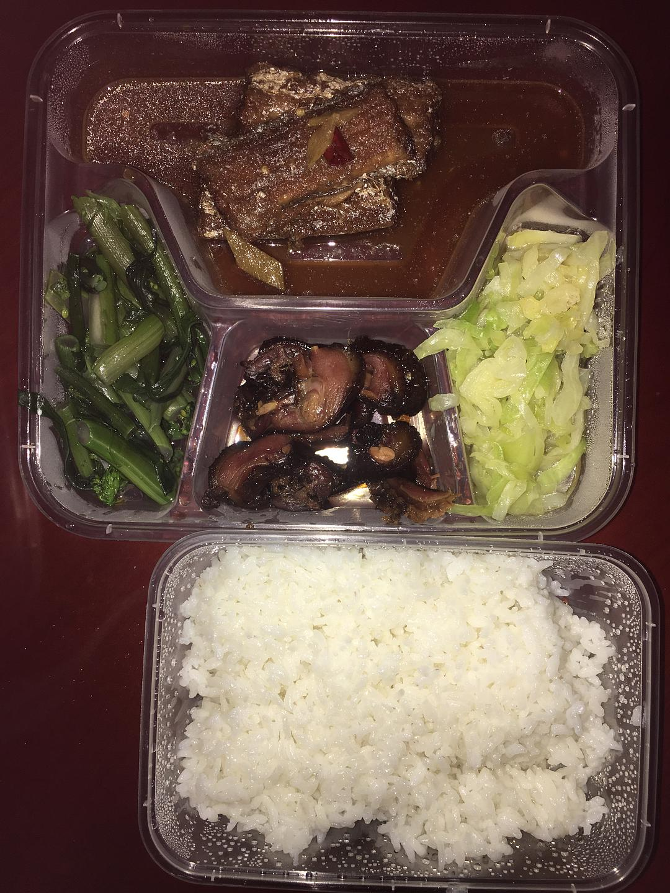

来源：[陈维佳（来自豆瓣）](https://www.douban.com/people/58149581/)的[广播](https://www.douban.com/people/58149581/status/2787541640/)

2020-02-03_01:11:10

记录：被集中隔离的第六天。今天居然能不断被电话铃声吵醒依旧坚定的睡到了11点。终于把窗帘拉开，看看窗外的树和山，光线，这才是正常生活的状态。/今天微博上的信息明显被筛选过了，很多第一时间的爆料都在几分钟内被删除。/以前没有想过要犯罪，会坐牢。但对于特别缺乏耐心的我而言，这次的确是把我给逼上了。跪着用消毒水在酒店擦了下地板，门，看书做笔记，做创作草稿，继续坐牢.......
  

  

  

  

