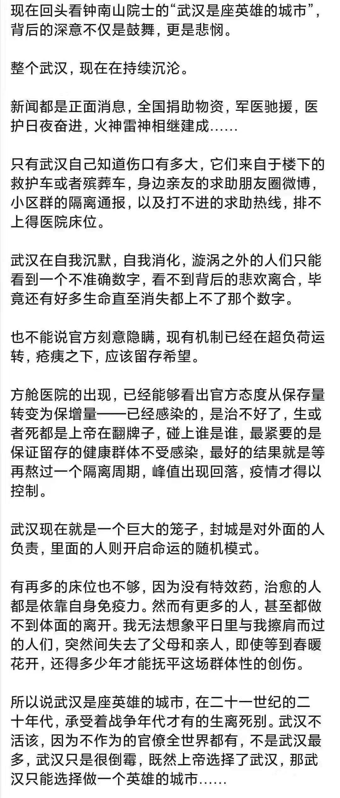

来源：[苏瑾宁（来自豆瓣）](https://www.douban.com/people/bamboo0602/)的[广播](https://www.douban.com/people/bamboo0602/status/2792629158/)

2020-02-05_20:53:46

觉得自己是捡了很大的便宜，专门在默默爆发的时候跑回武汉，办了场婚礼没有人中招，封城发生的时候不在武汉，而是在洪湖乡下和家人在一起。
无论走到哪都不会忘记自己是个武汉伢。
江滩和过早，红中赖子杠。
武汉不会倒下。
  

