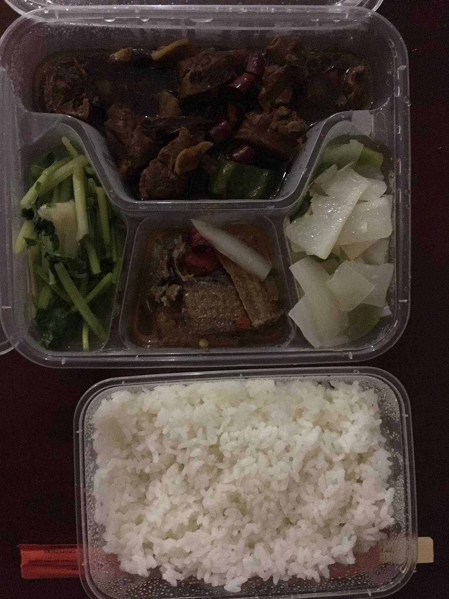

来源：[陈维佳（来自豆瓣）](https://www.douban.com/people/58149581/)的[广播](https://www.douban.com/people/58149581/status/2793238971/)

2020-02-06_01:34:24

记录：被集中隔离的第九天。其实最难过去的时间已经过去了，第一天最难，因为恐惧未知和头痛，第七天最难，因为接近胜利的时候往往是最容易崩溃的时候。今天医护人员提取了我喉咙的细胞拿去核酸测试。因为在酒店集中隔离之前我已经在家里自行隔离了6天，所以不出意外的话，明天6号就是满15天可以回家了。回家对我最大的意义不是获得自由，而是终于能有自己喜欢并且擅长的方法去表达自己。我总是觉得自己有溢出来的东西想要去表达，绘画可以说是目前我能实现的最棒的方式了。今天早上我又梦见我很痛苦的在做数学题，并且我永远只会写X=..这几个符号，我一度觉得我的智商一定有问题，或者上帝对我太不公平了让我这么笨，但一旦我能用绘画来表达，就变得非常多的点子和激情。集中隔离的九天里面，我一共在ps里面制作了8张创作草图，我要记住这种危机的感觉下创作的感觉。这一次经历也让我知道整个社会和我们个人都在发生关系，我们永远也不可能自私地沉醉在光怪陆离的消费娱乐文化里面安度一生，记住灾难，是我们对待灾难唯一能做的事情。
  

  

  

  

  

