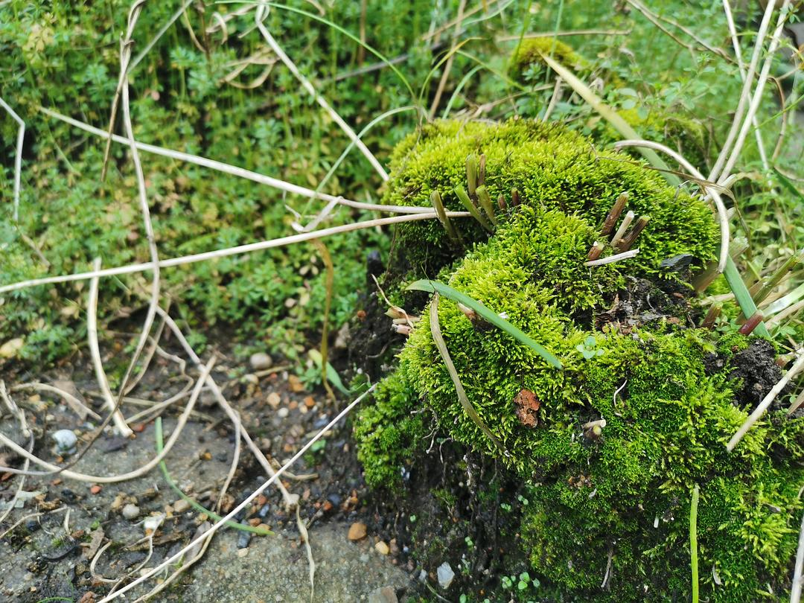

来源：[shane（来自豆瓣）](https://www.douban.com/people/37164735/)的[广播](https://www.douban.com/people/37164735/status/2794556379/)

2020-02-06_20:34:59

疫中日记4

今日八点多便起床了，开启了一日三餐的正常作息。

早餐是八宝粥和武汉热干面。

午餐给女儿用一片腊肉，一片新鲜瘦肉，一只小胡萝卜，三个鹌鹑蛋，做了个盖浇饭。

晚饭是将三个炸好的肉丸子切丁，加半片大白菜，些许洋葱粒，炒好拌饭。另外尝试用小虾米和鹌鹑蛋液搅拌均匀，炒香。加进了饭里。

每日开动脑筋，运用家里有限的食材，为女儿下厨做个小菜，成为了这几日我最大的快乐。

今日早起时，听说镇里开始封路了。原本已经到了一公里外快递站的两个包裹，被告知因为封路送不出来了。

老妈打开冰箱，盘点了一下蔬菜的库存——半颗大白菜，少许大蒜，芹菜，青椒，似乎有些严重不足了。

原本住在冲里的堂叔说可以采摘好蔬菜用车送出来，可如今各个村都开始封路，怕是此路不通了。

妈妈打电话给住得不远表哥，问他能否向种了菜的人家田里买一点送过来，也被告知封村了。但农贸市场其实还有人卖菜，可以去采购。

妈妈当即安排我明日做好防护，出门采购。并决定今晚吃一顿冰箱里的大白菜。想到出门采购麻烦，蔬菜可能会紧缺，她又跑去隔壁看房子的屋顶，割了一下几个月没有搭理的韭菜。

于是，我今日也登上了老房子的屋顶。这里曾是我儿时的乐园，很长一段时间，我们在这里用一个个花盆、脚盆、水缸种了辣椒，茄子、苦瓜、丝瓜、西红柿、秋葵、大蒜、香葱等蔬菜。我还在那里开辟出了一小片草莓园。当时楼顶的野草都能吃——到处长满了马齿苋，我们隔三差五便能割一碗吃，一开始我总觉得这个野菜有一股洗不干净的泥土味，后来竟也喜欢上了这个味道。

如今，爷爷行动不便多年，老爸近年也无心打理这儿，于是一年比一年不在状态，除了几盆生命旺盛的韭菜还能被端上餐桌，四处长满了“猪草”（老妈说的）。可我还是挺喜欢这个楼顶的，很多过去我看不上的花盆，水缸，现在都显得那么亲切和可爱。真想找个时间，一样样搬上新房的楼顶。

这几日愈发觉得生活充实。除了作息更偏规律，每日下厨做了菜以外，每晚在手机上写这些日记，记下一些回忆，也让我觉得没有虚度时光。

另外，近日喜读唐诗，古籍，爱上这些简约有力的文字。每日对女儿诵读，教她几首简单的古诗，也十分有意思。

昨日女儿睡前，我尝试一边播放音乐app里的古琴音乐，一边为女儿朗读古诗，直到她睡着。第二天，她说这是“妈妈美美的声音”，也让我内心有些许得瑟。

今日不再拖到睡前写日记了，写完东西容易失眠。最近入睡困难，不知今日换一个高一些的枕头看能否改善。

希望高枕就能无忧吧。期待明天菜市场采购——我从来没有这么期待过去买菜。
  

  

  

