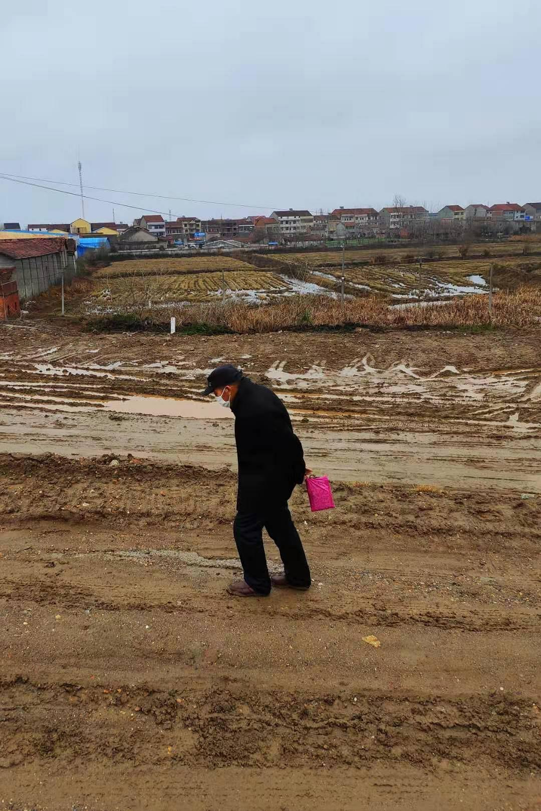

来源：[邓安庆（来自豆瓣）](https://www.douban.com/people/renjiananhuo/)的[广播](https://www.douban.com/people/renjiananhuo/status/2796596271/)

2020-02-07_20:19:59

父亲的胰岛素打完了，早上陪他到镇上去买。大路上设置了路障，车子开不过去。父亲让我留下看车，他走到镇上去买药。我说我去，他不让，说那些药我搞不清楚。等他回来时，远远地看到他迟缓无力的步伐，我就知道没有买到药。所有的药店都关门了。镇上空空荡荡。我永远也忘不了他走路的这个样子，那种痛楚的感觉久久不去。
  

[
邓安庆](https://www.douban.com/people/renjiananhuo/) 转发:

> 谢谢各位友邻！胰岛素刚才已经在熟人的帮助下解决了。现在这种封路封城的情况下，很多像我父亲这样有慢性病的人，买药的确是相当困难的。还有那些需要去医院就医的人，也面临着无法去不能去的状况。现实中这些隐形的困难无处不在，他们也无法发出声音，只能默默忍耐。 